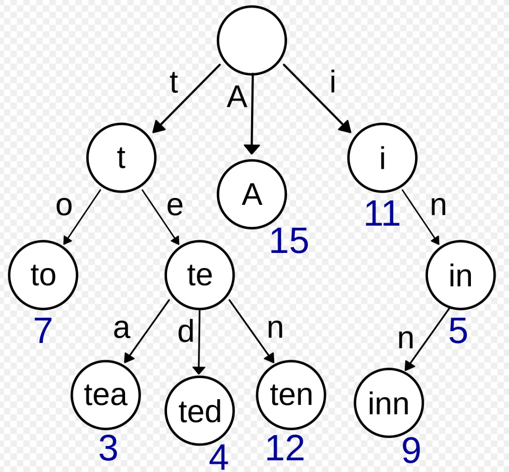
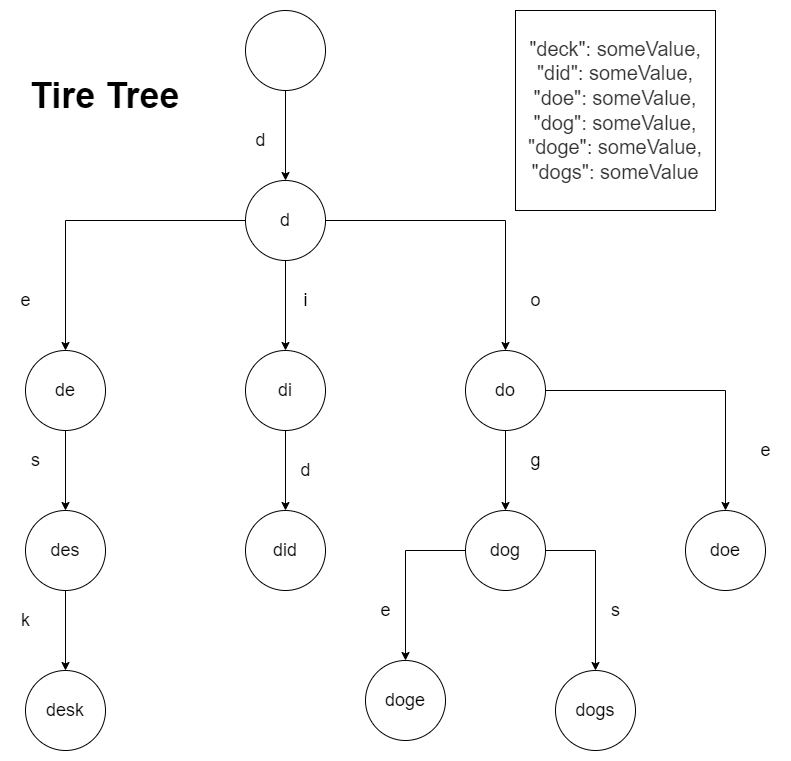
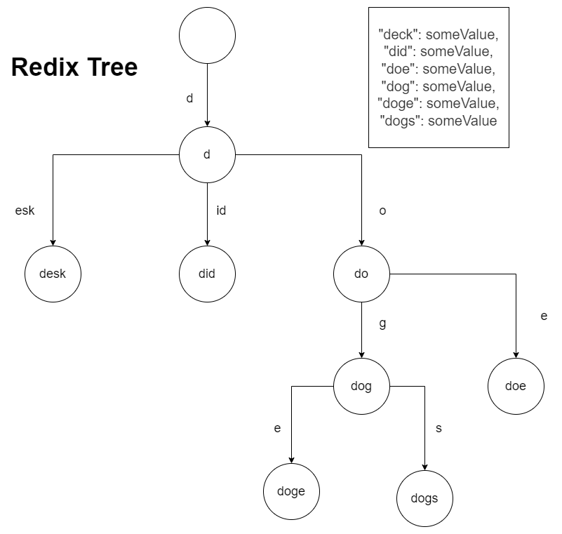

# Redix Tree / Trie Tree

Redix Tree 的应用场景就在于是通过 key 来查找 value。hash map 在处理大量的 key 的时候，如果 key 的 hash 值相冲突了，那么使用红黑树（之前用的是链表）来解决冲突问题。如果 key 的量过大，则必须要进行 rehash，这样就会有性能问题。所以 Redis 的大佬们就发明了 Redix Tree，来处理大量 key 需要存储和检索的情况。

Redix Tree 的前身就是 Trie Tree，先介绍 Trie Tree。

## Trie Tree 前缀树

> 搜索时间复杂度：O(k)，k 为字符串长度。
> 
> 插入时间复杂度：O(k)，k 为字符串长度。
> 
> 空间复杂度：（如果大量字符串没有共同前缀时很耗内存）

Trie Tree 字典树。Trie Tree的原理是将 key 拆分成**单位长度字符**，然后对应到节点之间的边上，节点的值就是：将从根节点到当前节点路径字符拼接起来形成的值。

Trie Tree 结构如图所示：



Trie 把公共前缀已经独立出来了，这样避免了很多重复的存储。但是在实际的项目中，随着 key 的数量的增加，Tire Tree 仍然会占用大量的内存空间。以下例子就能表明 Trie Tree 是如何浪费内存空间的：

```json
{
  "deck": someValue,
  "did": someValue,
  "doe": someValue,
  "dog": someValue,
  "doge": someValue,
  "dogs": someValue
}
```



## Redix Tree 压缩前缀树

> 搜索时间复杂度：O(k)，k 为字符串长度。
> 
> 插入时间复杂度：O(k)，k 为字符串长度。
> 
> 空间复杂度：（相比于前缀树开销减小）

比如"deck"这一个分支，有没有必要一直往下来拆分吗？还是"did"，有必要d，然后i，然后d吗?像这样的不可分叉的单支分支，其实完全可以合并。这就是 Redix Tree（压缩前缀树），如下图：


