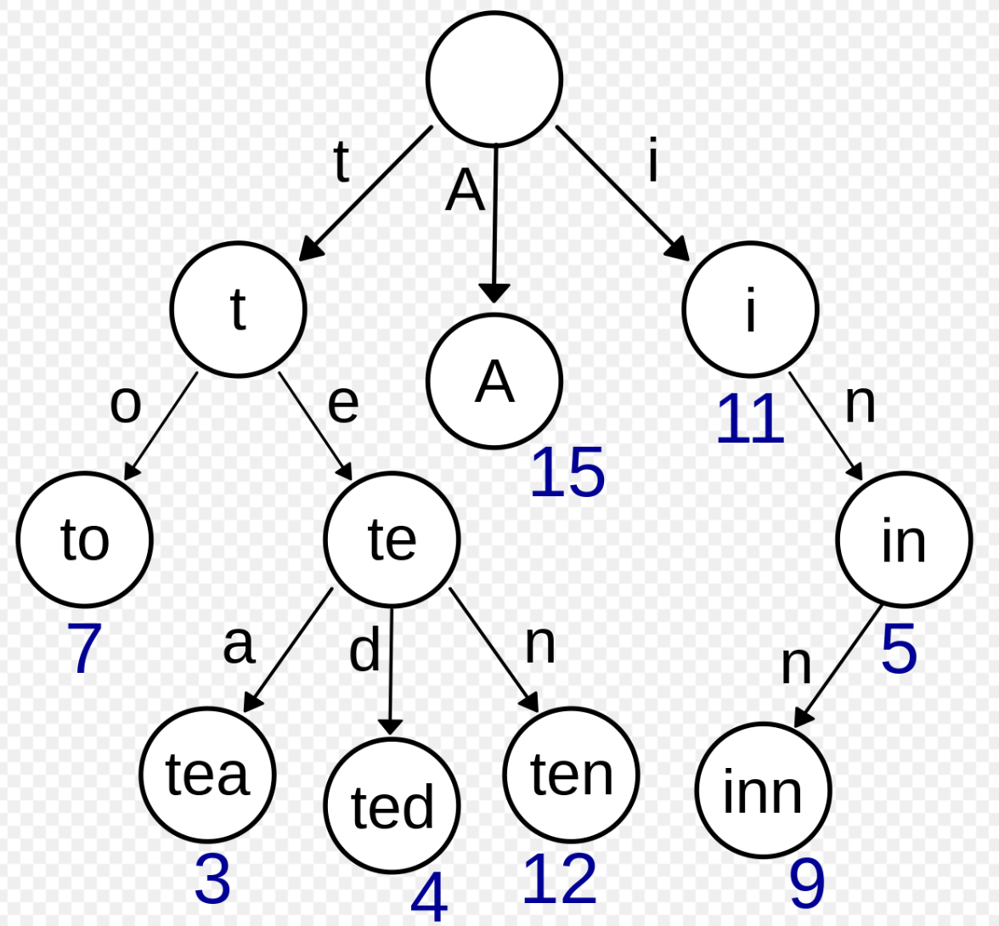
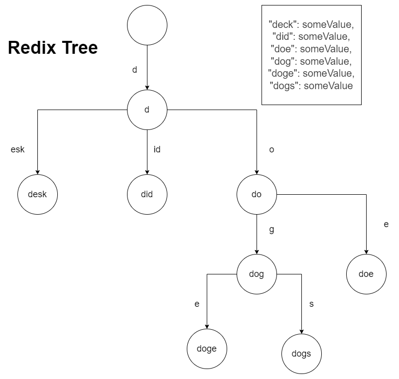

## 二叉搜索树

二叉排序树（Binary Sort Tree）或二叉搜索树。二叉排序树或者是一棵空树，或者是具有下列性质的二叉树：

左子树上所有结点的值均小于它的根结点的值；右子树上所有结点的值均大于或等于它的根结点的值；没有键值相等的节点。

对二叉搜索树进行中序遍历，那么会得到一个有序序列。

**复杂度：**

如果二叉搜索树是平衡的，那么一个n节点的二叉树的树高为 log(n+1)， 查找时间复杂度为 O(logn)。如果二叉搜索树不完全平衡，那么有可能退化成为一个链表，这时查找效率就变为 O(n)。因此，为了获得良好的性能，需要构建一棵平衡的二叉查找树。

> 时间复杂度中的 logn 都是以2为底，n的对数。

**二叉搜索树插入过程：**

1. 如果当前的二叉搜索树为空，那么直接插入。

2. 采用递归：如果插入的元素值小于根节点值，将元素插入到左子树中。如果插入的元素值大于根节点值，则插入右子树中。如果插入的元素值等于根节点值，则更新根节点。

**二叉树的删除过程：**

略。

## 平衡二叉树之--AVL树

AVL 树是最早发明的平衡二叉树，AVL 树任何节点的两个子树之间的高度差都小于等于1。

**复杂度：**

这个方案很好的解决了二叉查找树退化成链表的问题，把插入，查找，删除的时间复杂度最好情况和最坏情况都维持在O(logN)。

**AVL树的自平衡操作--旋转**

略。

## 平衡二叉树之--红黑树

**复杂度：**

它可以在 O(logn) 时间内做查找，插入和删除，这里的n是树中元素的数目。

**红黑树的性质：**

1. 节点是红色或者黑色

2. 根是黑色的

3. 所有的叶子都为 nil，且都是黑色

4. 每个红色节点必须有两个黑色节点（两个红色节点不能成为父子节点）

5. 从任一节点到叶子节点的所有路径都包含相同数目的黑色节点。


这些约束保证了红黑树的关键特性：从根到叶子节点的最长可能路径 <= 从根到叶子节点的最短路径 * 2

性质4导致了路径不能有两个毗连的红色节点。最短的可能路径都是黑色节点，最长的可能路径有交替的红色和黑色节点。因为根据性质5所有最长的路径都有相同数目的黑色节点，这就表明了没有路径能多于任何其他路径的两倍长。

**红黑树的自平衡操作：**

为每一个红黑树也是一个特化的二叉查找树，因此红黑树上的只读操作与普通二叉查找树上的只读操作相同。然而，在红黑树上进行插入操作和删除操作会导致不再符合红黑树的性质。恢复红黑树的性质需要少量(O(logn))的颜色变更(实际是非常快速的)和不超过三次树旋转(对于插入操作是两次)。虽然插入和删除很复杂，但操作时间仍可以保持为O(logn) 次。

**我们首先以二叉查找树的方法增加节点并标记它为红色。如果设为黑色，就会导致根到叶子的路径上有一条路上，多一个额外的黑节点，这个是很难调整的（违背性质5）**

但是设为红色节点后，可能会导致出现两个连续红色节点的冲突，那么可以通过颜色调换（color flips）和树旋转来调整。下面要进行什么操作取决于其他临近节点的颜色。同人类的家族树中一样，我们将使用术语叔父节点来指一个节点的父节点的兄弟节点。注意:

- 性质1和性质3总是保持着。
- 性质4只在增加红色节点、重绘黑色节点为红色，或做旋转时受到威胁。
- 性质5只在增加黑色节点、重绘红色节点为黑色，或做旋转时受到威胁。

## Redix Tree / Trie Tree

Redix Tree 的应用场景就在于是通过 key 来查找 value。hash map 在处理大量的 key 的时候，如果 key 的 hash 值相冲突了，那么使用红黑树（之前用的是链表）来解决冲突问题。如果 key 的量过大，则必须要进行 rehash，这样就会有性能问题。所以 Redis 的大佬们就发明了 Redix Tree，来处理大量 key 需要存储和检索的情况。

Redix Tree 的前身就是 Trie Tree，先介绍 Trie Tree。

### Trie Tree 前缀树

> 搜索时间复杂度：O(k)，k 为字符串长度。
> 
> 插入时间复杂度：O(k)，k 为字符串长度。
> 
> 空间复杂度：（如果大量字符串没有共同前缀时很耗内存）

Trie Tree 字典树。Trie Tree的原理是将 key 拆分成**单位长度字符**，然后对应到节点之间的边上，节点的值就是：将从根节点到当前节点路径字符拼接起来形成的值。

Trie Tree 结构如图所示：



Trie 把公共前缀已经独立出来了，这样避免了很多重复的存储。但是在实际的项目中，随着 key 的数量的增加，Tire Tree 仍然会占用大量的内存空间。以下例子就能表明 Trie Tree 是如何浪费内存空间的：

```json
{
  "deck": someValue,
  "did": someValue,
  "doe": someValue,
  "dog": someValue,
  "doge": someValue,
  "dogs": someValue
}
```


### Redix Tree 压缩前缀树

> 搜索时间复杂度：O(k)，k 为字符串长度。
> 
> 插入时间复杂度：O(k)，k 为字符串长度。
> 
> 空间复杂度：（相比于前缀树开销减小）

比如"deck"这一个分支，有没有必要一直往下来拆分吗？还是"did"，有必要d，然后i，然后d吗?像这样的不可分叉的单支分支，其实完全可以合并。这就是 Redix Tree（压缩前缀树），如下图：


