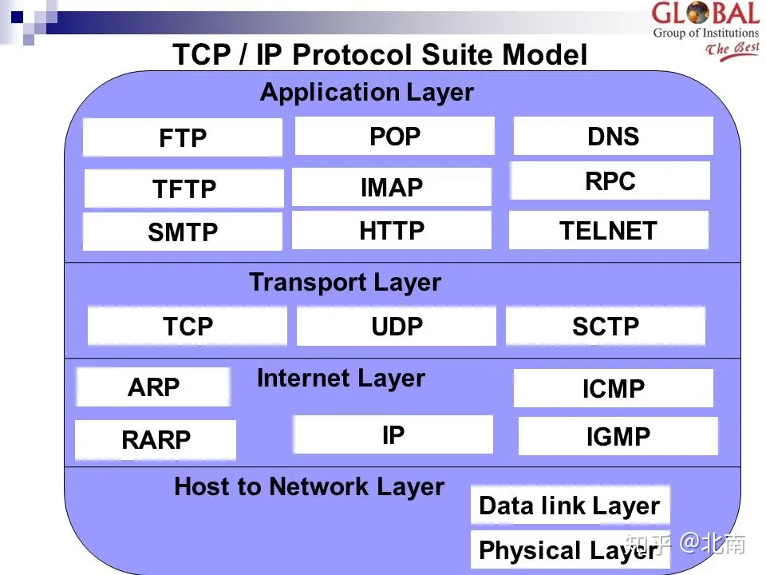
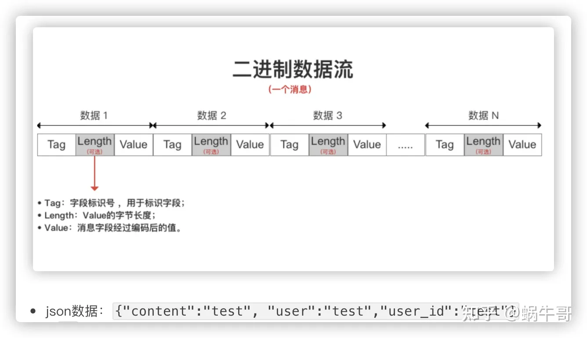

# gRPC

## gRPC 比 HTTP 的优势

可以看出 rpc 协议是一个应用层协议，rpc 可以建立在 TCP 上，也可以建立在 HTTP 上。对于rpc来说，这都是一样的，只要把通讯的内容塞进不同的报文理好了。其实http是最常用的承载RPC的通信协议之一。而且我们可以在http 上传输xml和json这样的文本协议，也可以是protobuf和thrift这样的二进制协议。

gRPC 用的就是 HTTP 2.0

### gRPC 性能高

1. 什么是protobuf？

Protobuf是由Google开发的二进制格式，用于在不同服务之间序列化数据。是一种IDL（interface description language）语言。

2. 它比 json 快多少？

快六倍，[参考链接](https://link.zhihu.com/?target=https%3A//auth0.com/blog/beating-json-performance-with-protobuf/)

3. 为什么比 json 快？

- **对比json数据和protobuf数据格式可以知道**
- **体积小-无需分隔符**：TLV存储方式不需要分隔符（逗号，双引号等）就能分隔字段，减少了分隔符的使用
- **体积小-空字段省略**：若字段没有被设置字段值，那么该字段序列化时的数据是完全不存在的，即不需要进行编码，而json会传key和空值的value
- **体积小-tag二进制表示**：是用字段的数字值然后转换成二进制进行表示的，比json的key用字符串表示更加省空间
- **编解码快**：tag的里面存储了字段的类型，可以直接知道value的长度，或者当value是字符串的时候，则用length存储了长度，可以直接从length后取n个字节就是value的值，而如果不知道value的长度，我们就必须要做字符串匹配
- **细化了解protobuf的编码可以去看**：varint 和 zigzag编码方式
