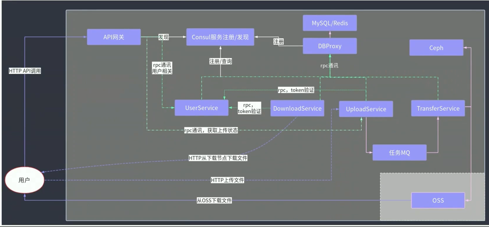

## 多用户

### 怎么判断用户身份？

使用装饰器模式拦截请求！

```go
http.HandleFunc("path", handler.HTTPInterceptor(handler.XXXHandler))
```

```go
func HTTPInterceptor(h http.HandlerFunc) http.HandlerFunc {
    return http.HandlerFunc(    // 类型转换
        func (w http.ResponseWriter, r *http.Request) {
            // 拦截逻辑
            h(w, r) // 调用输入的HandlerFunc
        }
    )
}
// 就是最后执行需要这个类型的函数，装饰器就是输入函数，返回函数
// 然后在输入的函数前或后加上要执行的逻辑。
// 这就是装饰器模式！
```

拦截 Token 后，可以解析出其中的负载，并判断 Token 是否有效

1. Token 是否被修改（取出负载加密后与Token中的密文比较）

2. Token 是否过期（负载中可以存放过期时间）

3. Token 是否在Redis中存在（为了实现单设备登录）

都通过以后就执行以下操作：

1. 将解析出的负载中代表User身份的信息，比如UserID写入到Form中, 便于后序调用。r.Form.Set("userId", UserID)

### Token 在 Redis 中怎么存放的？

使用 hash 表

hash：subkey：UserID；value：token

### 怎么判断用户在线或者离线？

无所谓在线离线，项目没有这个需求。只要调用接口就在线，不调用接口的时候在线或者离线我不关系。


## 秒传接口

### 具体实现：

1. 在请求参数中解析出文件的hash

文件hash是从客户端传递给服务器端的，这个以后可以实现在服务器端判断hash的功能。

2. 从文件表中查询相同hash的文件记录
   
   * 如果查询到了，直接更新用户文件表就行。
   
   * 如果没有查询到，说明这个文件不在后端存储中，需要用户上传。然后再更新用户文件表。

### 文件表是怎么设计的？

文件表具有一个主键id，一个unique key -- filehash，代表着文件的hash值，不同的文件hash值不同。如果hash值相同，代表着文件相同。还有其他关于文件的信息：file_address，file_size，文件创建时间，文件更新时间（主要是更新文件的元数据，不是文件内容），状态（0删除1可用），被用户引用次数。

### 用户文件表怎么设计的？

用户文件表有一个主键id，username，filehash，和其他关于文件的信息：file_name，上传时间，更新时间，状态（0删除1可用 ）。

### 不同用户上传相同文件的时候怎么办？


可能会出现的问题：幻读，幻读的意思就是事务在开始以后，其他事务

### 用户在删除文件的时候怎么做的？


### 用户想要更新文件怎么办？


## 分块上传与断点续传

> 注意：分块上传，秒传，都需要在客户端计算文件的MD5.

分块上传：文件切分成多块，独立传输，上传完成后合并。

断点续传：传输暂停或异常中断后，可基于原来进度重传。


### 接口设计？

1. 初始化分块上传

2. 分块上传（多个分块同时上传）

3. 客户端通知服务器分块上传完成

#### 初始化分块上传？

1. 在客户端生成文件的MD5哈希值，先使用秒传接口。如果服务器没有这个文件，那么继续分块上传。

2. 服务器生成唯一uploadID：（可以使用UserID+当前时间戳来作为ID）

3. 生成初始化信息，包括分块大小，分块数量等，filehash，filesize，uploadID。

4. 将初始化信息写入缓存：使用HASH来存储初始化信息（对象存储）。Hash Key 为 uploadID。

5. 将初始化信息返回给客户端。

#### 分块上传

1. 获取uploadID，chunkIndex（块偏移量），userID（用户身份）。

2. 使用特定规则获取文件句柄.比如使用 /data/ + uploadID + / + chunkIndex。

3. 然后将文件分批（1MB每次）写入到磁盘上（os）然后将信息存储到 Redis Hash中。Hash Key 为 uploadID，Subkey 为 chunkindex，Value 为 1，表示这个分块已经上传完毕。

#### 通知上传合并

1. 通过uploadID判断是否所有分块都上传完毕。

2. 通过判断 Hash 中 subkey 的数量，来判断和初始化分块上传的文件块数是否相同。如相同，那么都上传成功；如不相同，返回客户端没有上传的文件块。

3. 合并各个分块。

4. 更新文件表和用户文件表。

#### 上传取消

1. 删除已经存在的分块文件

2. 删除Redis缓存

#### 上传状态查询

1. 从 Redis 中获取以及上传的块

#### 断点续传

1. 从 Redis 中查询已经上传的块，返回给客户端没有上传的块的序号

2. 客户端继续上传没有上传的块。

### 超大文件怎么计算MD5？

MD5算法本身是分块的，其他很多类似的算法比如SHA-1也是的，所以可以支持流式计算，读一块算一块，最后再一次性生成完整hash。MD5为什么支持流式计算？--- 看MD5算法原理笔记。

## Ceph 分布式存储


UploadService 使用 RabbitMQ 传输文件在本机的信息（包括位置信息），然后将这个信息发布到 RabbitMQ 上，TranferService 这个微服务监听 RabbitMQ，然后取出其中的信息，将其传输到阿里云和Ceph上。有一个条件：UploadService 和 TransferService 必须在一台机器上，这样就不需要网络传输文件了。这里可以使用 kubernetes 标签的方式将这两个 Pod 部署在一台 Node 上。

文件下载：查表，看文件的位置在 OSS，Ceph，还是临时存储上。如果在 Ceph 上，就从 Ceph 上下载，如果在 OSS 上，就生成了一个 OSS URL 来供下载，如果在临时存储上，那就直接下载就好。

## 异步逻辑


### RabbitMQ

#### AMQP高级消息队列协议

`AMQP(Advanced Message Queuing Protocol)` 高级消息队列协议：高级消息队列协议。它是应用层协议的一个开放标准，为面向消息的中间件设计，基于此协议的客户端与消息中间件可传递消息，并不受产品、开发语言等条件的限制。

AMQP中增加了Exchange和Binging的角色。生产者把消息发布到Exchange上，消息最终到达队列并被消费者接收，而Binding决定交换器的消息应该发送到哪个队列。

#### 架构图和解释


* Broker : 标识消息队列服务器实体 *rabbitmq-server*

* v-host : `Virtual Host` 虚拟主机。标识一批交换机、消息队列和相关对象。虚拟主机是共享相同的身份认证和加密环境的独立服务器域。每个vhost本质上就是一个mini版的RabbitMQ服务器，拥有自己的队列、交换器、绑定和权限机制。vhost是AMQP概念的基础，必须在链接时指定，RabbitMQ默认的vhost是 /。

* Exchange: 交换器用来接收生产者发送的消息并将这些消息路由给服务器中的队列。

* Queue : 消息队列，用来保存消息直到发送给消费者。它是消息的容器，也是消息的终点。一个消息可投入一个或多个队列。消息一直在队列里面，等待消费者连接到这个队列将其取走。

* Banding : 绑定，用于消息队列和交换机之间的关联。一个绑定就是基于路由键将交换机和消息队列连接起来的路由规则，所以可以将交换器理解成一个由绑定构成的路由表。

* Channel : 信道，多路复用连接中的一条独立的双向数据流通道。信道是建立在真实的TCP连接内地虚拟链接，AMQP命令都是通过信道发出去的，不管是发布消息、订阅队列还是接收消息，这些动作都是通过信道完成。因为对于操作系统来说，建立和销毁TCP都是非常昂贵的开销，所以引入了信道的概念，以复用一条TCP连接。

* Connection : 网络连接，比如一个TCP连接。  

#### Exchange 工作模式

网上查了很多资料有的说是五种，有的说是四种，看了一下官网一共有七种，这里只讲解常用的常见的五种模式

官网 ：[RabbitMQ 官网](https://www.rabbitmq.com/getstarted.html)

## 微服务化




## 总结】
