## 分布式事务简介

### ACID

ACID 是数据库事务正确执行的四个基本要素。

- **原子性（Atomicity）**
  - 事务被视为不可分割的最小单元，事务中的所有操作要么全部提交成功，要么全部失败回滚。
  - 回滚可以用日志来实现，日志记录着事务所执行的修改操作，在回滚时反向执行这些修改操作即可。
- **一致性（Consistency）**
  - 数据库在事务执行前后都保持一致性状态。
  - 在一致性状态下，所有事务对一个数据的读取结果都是相同的。
- **隔离性（Isolation）**
  - 一个事务所做的修改在最终提交以前，对其它事务是不可见的。
- **持久性（Durability）**
  - 一旦事务提交，则其所做的修改将会永远保存到数据库中。即使系统发生崩溃，事务执行的结果也不能丢失。
  - 可以通过数据库备份和恢复来实现，在系统发生奔溃时，使用备份的数据库进行数据恢复。

**一个支持事务（Transaction）中的数据库系统，必需要具有这四种特性，否则在事务过程（Transaction processing）当中无法保证数据的正确性，交易过程极可能达不到交易。**

- 只有满足一致性，事务的执行结果才是正确的。
- 在无并发的情况下，事务串行执行，隔离性一定能够满足。此时只要能满足原子性，就一定能满足一致性。
- 在并发的情况下，多个事务并行执行，事务不仅要满足原子性，还需要满足隔离性，才能满足一致性。
- 事务满足持久化是为了能应对系统崩溃的情况。

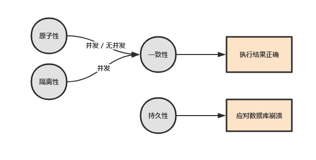

### 本地事务和分布式事务

学习分布式之前，先了解一下本地事务的概念。

事务简单来说：**一个会话中所进行所有的操作，要么同时成功，要么同时失败**。

事务指的是满足 ACID 特性的一组操作，可以通过 `Commit` 提交一个事务，也可以使用 `Rollback` 进行回滚。

**分布式事务指的是事务操作跨越多个节点，并且要求满足事务的 ACID 特性。**

随着互联网快速发展，微服务，SOA 等服务架构模式正在被大规模的使用，现在分布式系统一般由多个独立的子系统组成，多个子系统通过网络通信互相协作配合完成各个功能。

有很多用例会跨多个子系统才能完成，比较典型的是电子商务网站的下单支付流程，至少会涉及交易系统和支付系统，而且这个过程中会涉及到事务的概念，即保证交易系统和支付系统的数据一致性，此处我们称这种**跨系统的事务为分布式事务**，具体一点而言，分布式事务是指事务的参与者、支持事务的服务器、资源服务器以及事务管理器分别位于不同的分布式系统的不同节点之上。

举个互联网常用的交易业务为例：

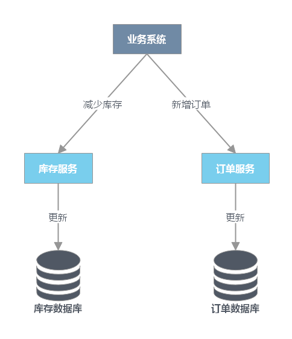

上图中包含了库存和订单两个独立的微服务，每个微服务维护了自己的数据库。在交易系统的业务逻辑中，一个商品在下单之前需要先调用库存服务，进行扣除库存，再调用订单服务，创建订单记录。

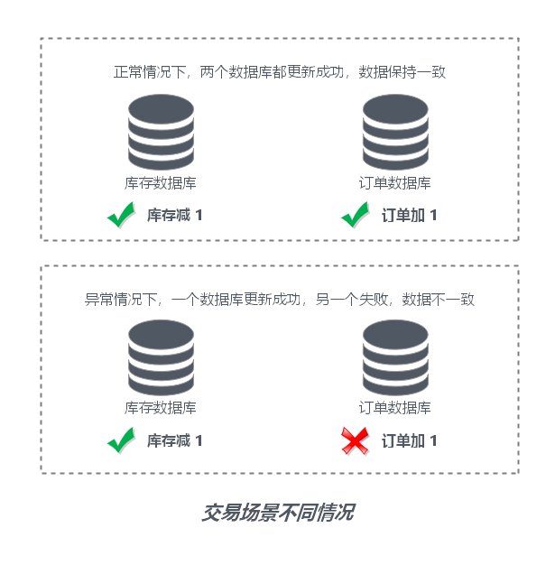

可以看到，如果多个数据库之间的数据更新没有保证事务，将会导致出现子系统数据不一致，业务出现问题。

分布式事务的难点：

- **事务的原子性**：事务操作跨不同节点，当多个节点某一节点操作失败时，需要保证多节点操作的**都做或都不做（All or Nothing）**的原子性。
- **事务的一致性**：当发生网络传输故障或者节点故障，节点间数据复制通道中断，在进行事务操作时需要保证数据一致性，保证事务的任何操作都不会使得数据违反数据库定义的约束、触发器等规则。
- **事务的隔离性**：事务隔离性的本质就是如何正确多个并发事务的处理的读写冲突和写写冲突，因为在分布式事务控制中，可能会出现提交不同步的现象，这个时候就有可能出现“部分已经提交”的事务。此时并发应用访问数据如果没有加以控制，有可能出现“脏读”问题。

### CAP 和 BASE

CAP 定理又称为 CAP 原则，指的是：**在一个分布式系统中， `一致性（C：Consistency）`、`可用性（A：Availability）` 和 `分区容忍性（P：Partition Tolerance）`，最多只能同时满足其中两项**。

BASE 是 **`基本可用（Basically Available）`**、**`软状态（Soft State）`** 和 **`最终一致性（Eventually Consistent）`** 三个短语的缩写。BASE 理论是对 CAP 中一致性和可用性权衡的结果，它的理论的核心思想是：即使无法做到强一致性，但每个应用都可以根据自身业务特点，采用适当的方式来使系统达到最终一致性。

### 柔性事务

在电商等互联网场景下，传统的事务在数据库性能和处理能力上都暴露出了瓶颈。在分布式领域基于 CAP 理论以及 BASE 理论，有人就提出了**柔性事务**的概念。

柔性事务是指：在不影响系统整体可用性的情况下(Basically Available 基本可用)，允许系统存在数据不一致的中间状态(Soft State 软状态)，在经过数据同步的延时之后，最终数据能够达到一致。**并不是完全放弃了 ACID，而是通过放宽一致性要求，借助本地事务来实现最终分布式事务一致性的同时也保证系统的吞吐**。

下面介绍的是实现柔性事务的一些常见特性，这些特性在具体的方案中不一定都要满足，因为不同的方案要求不一样。

- **可见性（对外可查询）**：在分布式事务执行过程中，如果某一个步骤执行出错，就需要明确的知道其他几个操作的处理情况，这就需要其他的服务都能够提供查询接口，保证可以通过查询来判断操作的处理情况。为了保证操作的可查询，需要对于每一个服务的每一次调用都有一个全局唯一的标识，可以是业务单据号（如订单号）、也可以是系统分配的操作流水号（如支付记录流水号）。除此之外，操作的时间信息也要有完整的记录。
- **操作幂等性**：幂等性，其实是一个数学概念。幂等函数，或幂等方法，是指可以使用相同参数重复执行，并能获得相同结果的函数。幂等操作的特点是其任意多次执行所产生的影响均与一次执行的影响相同。也就是说，同一个方法，使用同样的参数，调用多次产生的业务结果与调用一次产生的业务结果相同。之所以需要操作幂等性，是因为为了保证数据的最终一致性，很多事务协议都会有很多重试的操作，如果一个方法不保证幂等，那么将无法被重试。幂等操作的实现方式有多种，如在系统中缓存所有的请求与处理结果、检测到重复操作后，直接返回上一次的处理结果等。

## 两阶段提交 (2PC)

### 方案简介

二阶段提交协议（Two-phase Commit，即 2PC）是常用的分布式事务解决方案，即**将事务的提交过程分为两个阶段来进行处理：准备阶段和提交阶段**。事务的发起者称协调者，事务的执行者称参与者。

在分布式系统里，每个节点都可以知晓自己操作的成功或者失败，却无法知道其他节点操作的成功或失败。当一个事务跨多个节点时，为了保持事务的原子性与一致性，而引入一个协调者来统一掌控所有参与者的操作结果，并指示它们是否要把操作结果进行真正的提交或者回滚（rollback）。

二阶段提交的思路可以概括为：**参与者将操作成败通知协调者，再由协调者根据所有参与者的反馈情报决定各参与者是否要提交操作还是中止操作**。

核心思想就是对每一个事务都采用先尝试后提交的处理方式，处理后所有的读操作都要能获得最新的数据，因此也可以将二阶段提交看作是一个强一致性算法。

### 处理流程

简单一点理解，可以把协调者节点比喻为带头大哥，参与者理解比喻为跟班小弟，带头大哥统一协调跟班小弟的任务执行。

#### 阶段 1：准备阶段

1. 协调者向所有参与者发送事务内容，询问是否可以提交事务，并等待所有参与者答复。
2. 各参与者执行事务操作，将 undo 和 redo 信息记入事务日志中（但不提交事务）
3. 如参与者执行成功，给协调者反馈 yes，即可以提交；如执行失败，给协调者反馈 no，即不可提交。

#### 阶段 2：提交阶段

如果协调者收到了参与者的失败消息或者超时，直接给每个参与者发送回滚(rollback)消息；否则，发送提交(commit)消息；参与者根据协调者的指令执行提交或者回滚操作，释放所有事务处理过程中使用的锁资源。(注意:必须在最后阶段释放锁资源) 接下来分两种情况分别讨论提交阶段的过程。

**情况 1，当所有参与者均反馈 yes，提交事务**。

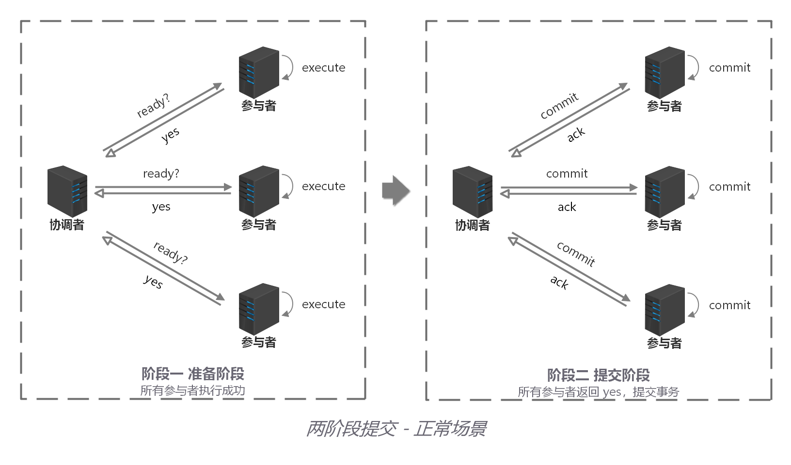

> 1. 协调者向所有参与者发出正式提交事务的请求（即 commit 请求）。
> 2. 参与者执行 commit 请求，并释放整个事务期间占用的资源。
> 3. 各参与者向协调者反馈 ack(应答)完成的消息。
> 4. 协调者收到所有参与者反馈的 ack 消息后，即完成事务提交。

**情况 2，当任何阶段 1 一个参与者反馈 no，中断事务**。

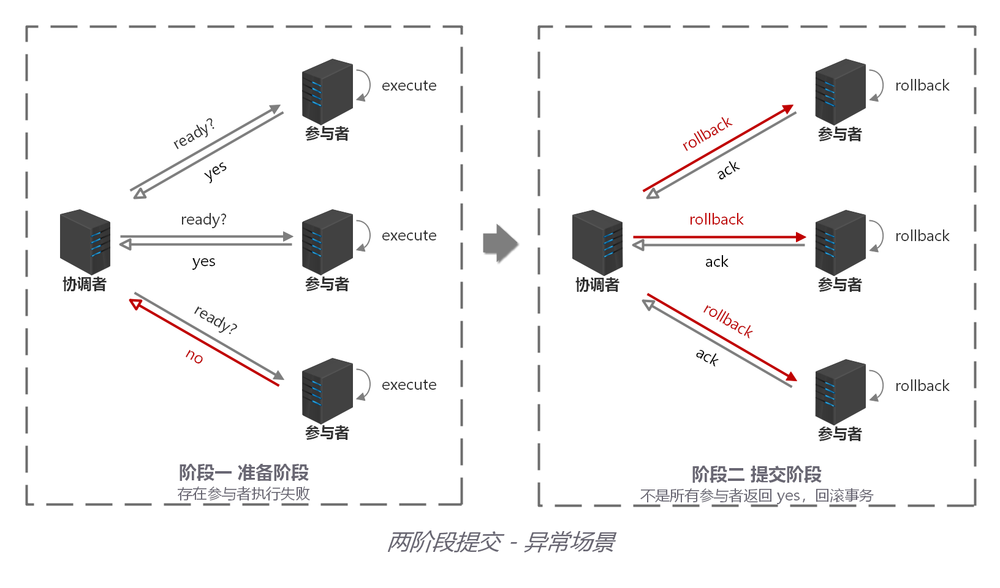

> 1. 协调者向所有参与者发出回滚请求（即 rollback 请求）。
> 2. 参与者使用阶段 1 中的 undo 信息执行回滚操作，并释放整个事务期间占用的资源。
> 3. 各参与者向协调者反馈 ack 完成的消息。
> 4. 协调者收到所有参与者反馈的 ack 消息后，即完成事务中断。

### 方案总结

2PC 方案实现起来简单，实际项目中使用比较少，主要因为以下问题：

- **性能问题** - 所有参与者在事务提交阶段处于同步阻塞状态，占用系统资源，容易导致性能瓶颈。
- **可靠性问题** - 如果协调者存在单点故障问题，如果协调者出现故障，参与者将一直处于锁定状态。
- **数据一致性问题** - 在阶段 2 中，如果发生局部网络问题，一部分事务参与者收到了提交消息，另一部分事务参与者没收到提交消息，那么就导致了节点之间数据的不一致。

## 三阶段提交 (3PC)

### 方案简介

三阶段提交协议（Three-phase Commit，3PC），是二阶段提交协议的改进版本，与二阶段提交不同的是，引入超时机制。同时在协调者和参与者中都引入超时机制。

三阶段提交将二阶段的准备阶段拆分为 2 个阶段，插入了一个 preCommit 阶段，使得原先在二阶段提交中，参与者在准备之后，由于协调者发生崩溃或错误，而导致参与者处于无法知晓是否提交或者中止的“不确定状态”所产生的可能相当长的延时的问题得以解决。

### 处理流程

#### 阶段 1：canCommit

协调者向参与者发送 commit 请求，参与者如果可以提交就返回 yes 响应(参与者不执行事务操作)，否则返回 no 响应：

1. 协调者向所有参与者发出包含事务内容的 canCommit 请求，询问是否可以提交事务，并等待所有参与者答复。
2. 参与者收到 canCommit 请求后，如果认为可以执行事务操作，则反馈 yes 并进入预备状态，否则反馈 no。

#### 阶段 2：preCommit

协调者根据阶段 1 canCommit 参与者的反应情况来决定是否可以基于事务的 preCommit 操作。根据响应情况，有以下两种可能。

**情况 1：阶段 1 所有参与者均反馈 yes，参与者预执行事务**。

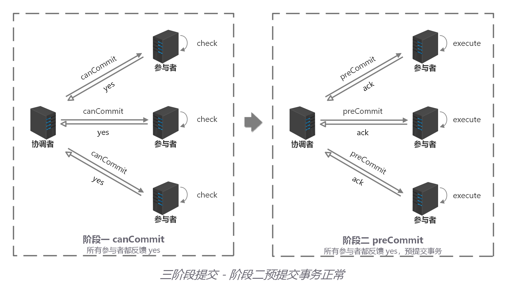

> 1. 协调者向所有参与者发出 preCommit 请求，进入准备阶段。
> 2. 参与者收到 preCommit 请求后，执行事务操作，将 undo 和 redo 信息记入事务日志中（但不提交事务）。
> 3. 各参与者向协调者反馈 ack 响应或 no 响应，并等待最终指令。

**情况 2：阶段 1 任何一个参与者反馈 no，或者等待超时后协调者尚无法收到所有参与者的反馈，即中断事务**。

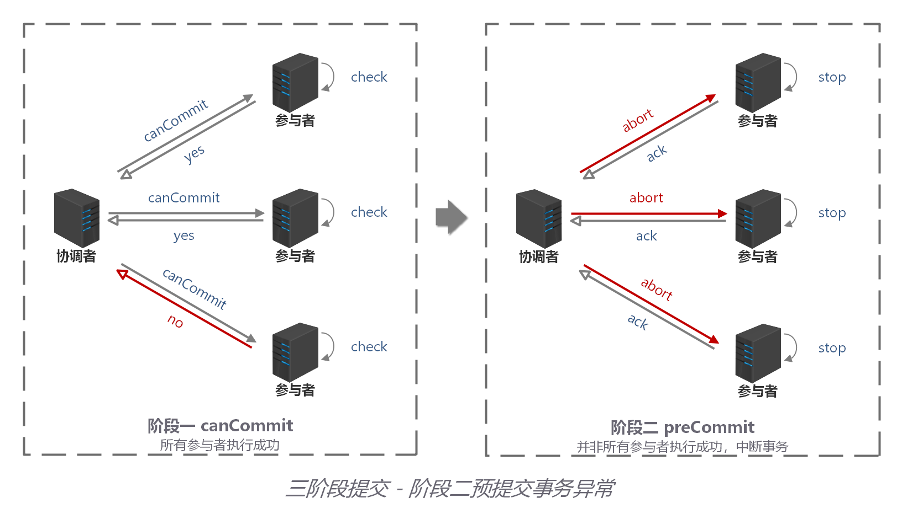

> 1. 协调者向所有参与者发出 abort 请求。
> 2. 无论收到协调者发出的 abort 请求，或者在等待协调者请求过程中出现超时，参与者均会中断事务。

#### 阶段 3：doCommit

该阶段进行真正的事务提交，也可以分为以下两种情况：

**情况 1：阶段 2 所有参与者均反馈 ack 响应，执行真正的事务提交**。

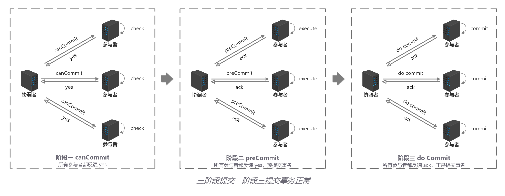

> 1. 如果协调者处于工作状态，则向所有参与者发出 do Commit 请求。
> 2. 参与者收到 do Commit 请求后，会正式执行事务提交，并释放整个事务期间占用的资源。
> 3. 各参与者向协调者反馈 ack 完成的消息。
> 4. 协调者收到所有参与者反馈的 ack 消息后，即完成事务提交。

**情况 2：任何一个参与者反馈 no，或者等待超时后协调者尚无法收到所有参与者的反馈，即中断事务**。

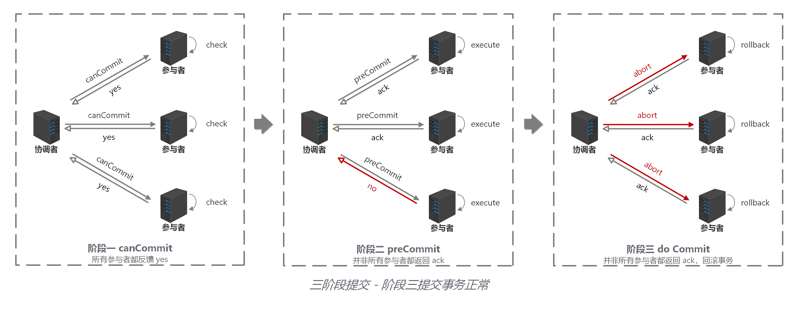

> 1. 如果协调者处于工作状态，向所有参与者发出 abort 请求。
> 2. 参与者使用阶段 1 中的 undo 信息执行回滚操作，并释放整个事务期间占用的资源。
> 3. 各参与者向协调者反馈 ack 完成的消息。
> 4. 协调者收到所有参与者反馈的 ack 消息后，即完成事务中断。

注意：进入阶段 3 后，无论协调者出现问题，或者协调者与参与者网络出现问题，都会导致参与者无法接收到协调者发出的 do Commit 请求或 abort 请求。此时，参与者都会在等待超时之后，继续执行事务提交。

### 方案总结

优点：

- 相比二阶段提交，三阶段降低了阻塞范围，在等待超时后协调者或参与者会中断事务。避免了协调者单点问题，阶段 3 中协调者出现问题时，参与者会继续提交事务。

缺点：

- 数据不一致问题依然存在，当在参与者收到 preCommit 请求后等待 do commite 指令时，此时如果协调者请求中断事务，而协调者无法与参与者正常通信，会导致参与者继续提交事务，造成数据不一致。

## 补偿事务（TCC）

### 方案简介

TCC（Try-Confirm-Cancel）的概念，最早是由 Pat Helland 于 2007 年发表的一篇名为《Life beyond Distributed Transactions:an Apostate’s Opinion》的论文提出。

TCC 是服务化的二阶段编程模型，其 Try、Confirm、Cancel 3 个方法均由业务编码实现；

- **Try** - 操作作为一阶段，负责资源的检查和预留。
- **Confirm** - 操作作为二阶段提交操作，执行真正的业务。
- **Cancel** - 是预留资源的取消。

TCC 事务的 Try、Confirm、Cancel 可以理解为 SQL 事务中的 Lock、Commit、Rollback。

### 处理流程

为了方便理解，下面以电商下单为例进行方案解析，这里把整个过程简单分为扣减库存，订单创建 2 个步骤，库存服务和订单服务分别在不同的服务器节点上。

#### Try 阶段

从执行阶段来看，与传统事务机制中业务逻辑相同。但从业务角度来看，却不一样。TCC 机制中的 Try 仅是一个初步操作，它和后续的确认一起才能真正构成一个完整的业务逻辑，这个阶段主要完成：

- 完成所有业务检查( 一致性 )
- 预留必须业务资源( 准隔离性 )
- Try 尝试执行业务 TCC 事务机制以初步操作（Try）为中心的，确认操作（Confirm）和取消操作（Cancel）都是围绕初步操作（Try）而展开。因此，Try 阶段中的操作，其保障性是最好的，即使失败，仍然有取消操作（Cancel）可以将其执行结果撤销。

假设商品库存为 100，购买数量为 2，这里检查和更新库存的同时，冻结用户购买数量的库存，同时创建订单，订单状态为待确认。

#### Confirm / Cancel 阶段

根据 Try 阶段服务是否全部正常执行，继续执行确认操作（Confirm）或取消操作（Cancel）。 Confirm 和 Cancel 操作满足幂等性，如果 Confirm 或 Cancel 操作执行失败，将会不断重试直到执行完成。

**Confirm：当 Try 阶段服务全部正常执行， 执行确认业务逻辑操作**

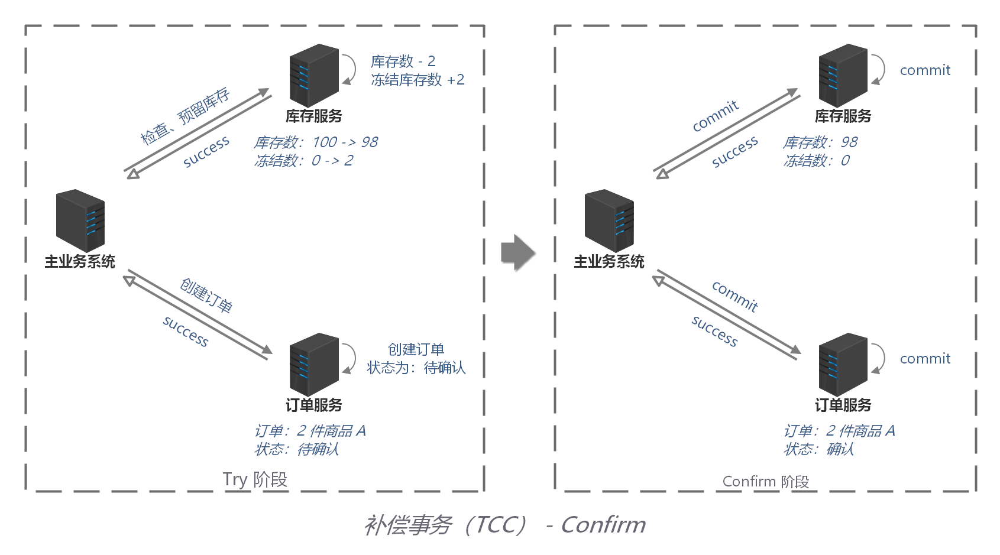

这里使用的资源一定是 Try 阶段预留的业务资源。在 TCC 事务机制中认为，如果在 Try 阶段能正常的预留资源，那 Confirm 一定能完整正确的提交。Confirm 阶段也可以看成是对 Try 阶段的一个补充，Try+Confirm 一起组成了一个完整的业务逻辑。

**Cancel：当 Try 阶段存在服务执行失败， 进入 Cancel 阶段**

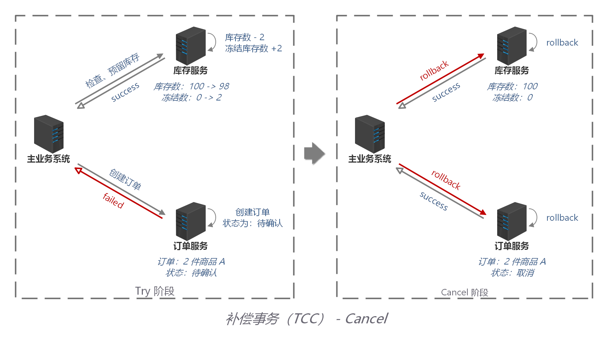

Cancel 取消执行，释放 Try 阶段预留的业务资源，上面的例子中，Cancel 操作会把冻结的库存释放，并更新订单状态为取消。

### 方案总结

TCC 事务机制相对于传统事务机制（X/Open XA），TCC 事务机制相比于上面介绍的 XA 事务机制，有以下优点:

- **性能提升** - 具体业务来实现控制资源锁的粒度变小，不会锁定整个资源。
- **数据最终一致性** - 基于 Confirm 和 Cancel 的幂等性，保证事务最终完成确认或者取消，保证数据的一致性。
- **可靠性** - 解决了 XA 协议的协调者单点故障问题，由主业务方发起并控制整个业务活动，业务活动管理器也变成多点，引入集群。

缺点： TCC 的 Try、Confirm 和 Cancel 操作功能要按具体业务来实现，业务耦合度较高，提高了开发成本。

## 本地消息表

### 方案简介

本地消息表的方案最初是由 ebay 提出，核心思路是将分布式事务拆分成本地事务进行处理。

方案通过在事务主动发起方额外新建事务消息表，事务发起方处理业务和记录事务消息在本地事务中完成，轮询事务消息表的数据发送事务消息，事务被动方基于消息中间件消费事务消息表中的事务。

这样设计可以避免”**业务处理成功 + 事务消息发送失败**"，或"**业务处理失败 + 事务消息发送成功**"的棘手情况出现，保证 2 个系统事务的数据一致性。

### 处理流程

下面把分布式事务最先开始处理的事务方成为事务主动方，在事务主动方之后处理的业务内的其他事务成为事务被动方。

为了方便理解，下面继续以电商下单为例进行方案解析，这里把整个过程简单分为扣减库存，订单创建 2 个步骤，库存服务和订单服务分别在不同的服务器节点上，其中库存服务是事务主动方，订单服务是事务被动方。

事务的主动方需要额外新建事务消息表，用于记录分布式事务的消息的发生、处理状态。

整个业务处理流程如下：

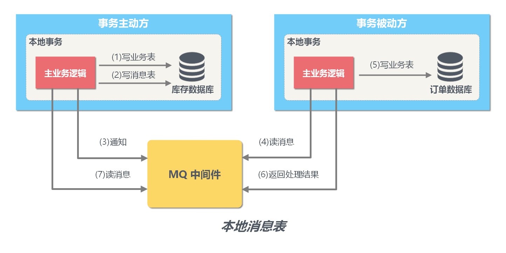

> 1. **步骤 1 事务主动方处理本地事务。** 事务主动发在本地事务中处理业务更新操作和写消息表操作。 上面例子中库存服务阶段再本地事务中完成扣减库存和写消息表(图中 1、2)。
> 2. **步骤 2 事务主动方通过 MQ 通知事务被动方处理事务**。 消息中间件可以基于 Kafka、RocketMQ 消息队列，事务主动方法主动写消息到消息队列，事务消费方消费并处理消息队列中的消息。 上面例子中，库存服务把事务待处理消息写到消息中间件，订单服务消费消息中间件的消息，完成新增订单（图中 3 - 5）。
> 3. **步骤 3 事务被动方通过 MQ 反会处理结果。** 上面例子中，订单服务把事务已处理消息写到消息中间件，库存服务消费中间件的消息，并将事务消息的状态更新为已完成(图中 6 - 8)

为了数据的一致性，当处理错误需要重试，事务发送方和事务接收方相关业务处理需要支持幂等。具体保存一致性的容错处理如下：

> - 当步骤 1 处理出错，事务回滚，相当于什么都没发生。
> - 当步骤 2、步骤 3 处理出错，由于未处理的事务消息还是保存在事务发送方，事务发送方可以定时轮询为超时消息数据，再次发送的消息中间件进行处理。事务被动方消费事务消息重试处理。
> - 如果是业务上的失败，事务被动方可以发消息给事务主动方进行回滚。
> - 如果多个事务被动方已经消费消息，事务主动方需要回滚事务时需要通知事务被动方回滚。

### 方案总结

方案的优点如下：

- 从应用设计开发的角度实现了消息数据的可靠性，消息数据的可靠性不依赖于消息中间件，弱化了对 MQ 中间件特性的依赖。
- 方案轻量，容易实现。

缺点如下：

- 与具体的业务场景绑定，耦合性强，不可复用。
- 消息数据与业务数据同库，占用业务系统资源。
- 业务系统在使用关系型数据库的情况下，消息服务性能会受到关系型数据库并发性能的局限。

## MQ 事务

事务消息需要消息队列提供相应的功能才能实现，Kafka 和 RocketMQ 都提供了事务相关功能。

- **Kafka** 的解决方案是：直接抛出异常，让用户自行处理。用户可以在业务代码中反复重试提交，直到提交成功，或者删除之前修改的数据记录进行事务补偿。
- **RocketMQ** 的解决方案是：通过事务反查机制来解决事务消息提交失败的问题。如果 Producer 在提交或者回滚事务消息时发生网络异常，RocketMQ 的 Broker 没有收到提交或者回滚的请求，Broker 会定期去 Producer 上反查这个事务对应的本地事务的状态，然后根据反查结果决定提交或者回滚这个事务。为了支撑这个事务反查机制，业务代码需要实现一个反查本地事务状态的接口，告知 RocketMQ 本地事务是成功还是失败。

### RocketMQ 事务消息流程

基于 MQ 的分布式事务方案其实是对本地消息表的封装，将本地消息表基于 MQ 内部，其他方面的协议基本与本地消息表一致。下面主要基于 RocketMQ 4.3 之后的版本介绍 MQ 的分布式事务方案。

在本地消息表方案中，保证事务主动方发写业务表数据和写消息表数据的一致性是基于数据库事务，RocketMQ 的事务消息相对于普通 MQ，相对于提供了 2PC 的提交接口，方案如下：

**正常情况——事务主动方发消息** 这种情况下，事务主动方服务正常，没有发生故障，发消息流程如下：

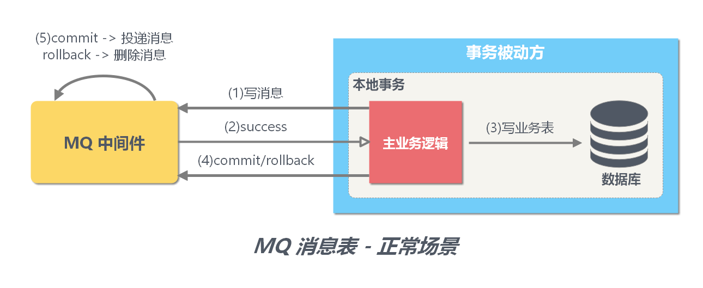

1. 发送方向 MQ 服务端(MQ Server)发送 half 消息。
2. MQ Server 将消息持久化成功之后，向发送方 ACK 确认消息已经发送成功。
3. 发送方开始执行本地事务逻辑。
4. 发送方根据本地事务执行结果向 MQ Server 提交二次确认（commit 或是 rollback）。
5. MQ Server 收到 commit 状态则将半消息标记为可投递，订阅方最终将收到该消息；MQ Server 收到 rollback 状态则删除半消息，订阅方将不会接受该消息。

**异常情况——事务主动方消息恢复** 在断网或者应用重启等异常情况下，图中 4 提交的二次确认超时未到达 MQ Server，此时处理逻辑如下：

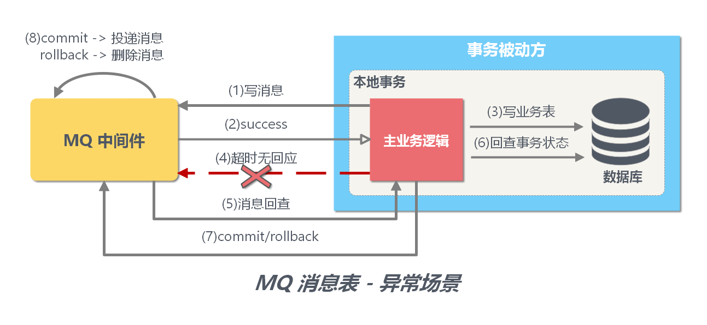

5. MQ Server 对该消息发起消息回查。
6. 发送方收到消息回查后，需要检查对应消息的本地事务执行的最终结果。
7. 发送方根据检查得到的本地事务的最终状态再次提交二次确认
8. MQ Server 基于 commit / rollback 对消息进行投递或者删除

> **思考**：为什么不等待写业务表成功后再向消息队列发送提交消息呢？
> 
> 因为可能存在这样情况：写业务表成功了，但是还没来得及发消息，节点就宕机了。

### MQ 事务方案总结

相比本地消息表方案，MQ 事务方案优点是：

- 消息数据独立存储 ，降低业务系统与消息系统之间的耦合。
- 吞吐量优于使用本地消息表方案。

缺点是：

- 一次消息发送需要两次网络请求(half 消息 + commit/rollback 消息)
- 业务处理服务需要实现消息状态回查接口

## 参考资料

- [聊聊分布式事务，再说说解决方案(opens new window)](https://www.cnblogs.com/savorboard/p/distributed-system-transaction-consistency.html)
- [理解分布式事务](https://juejin.im/post/5c0e5bf8e51d45063322fe50)
