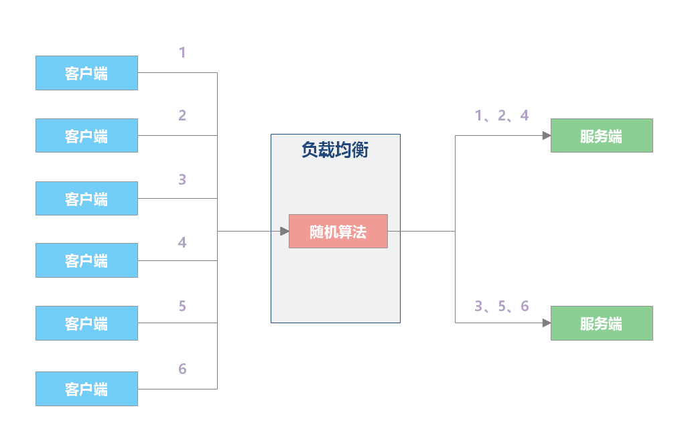
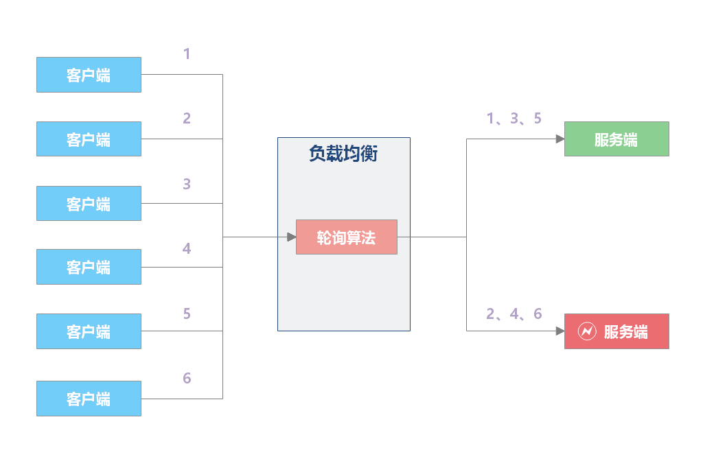
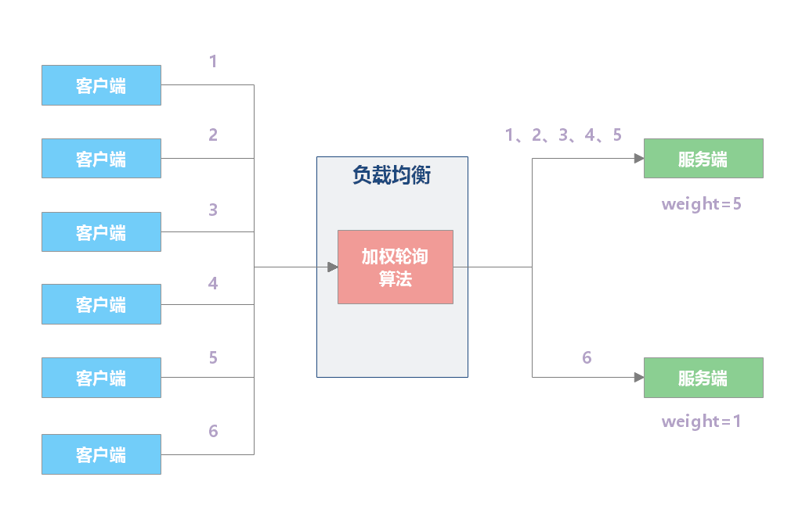
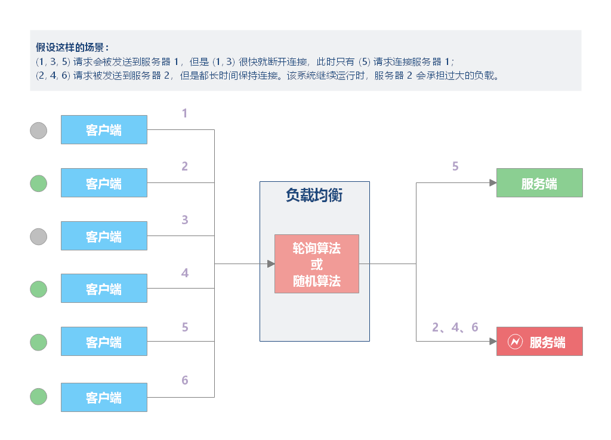
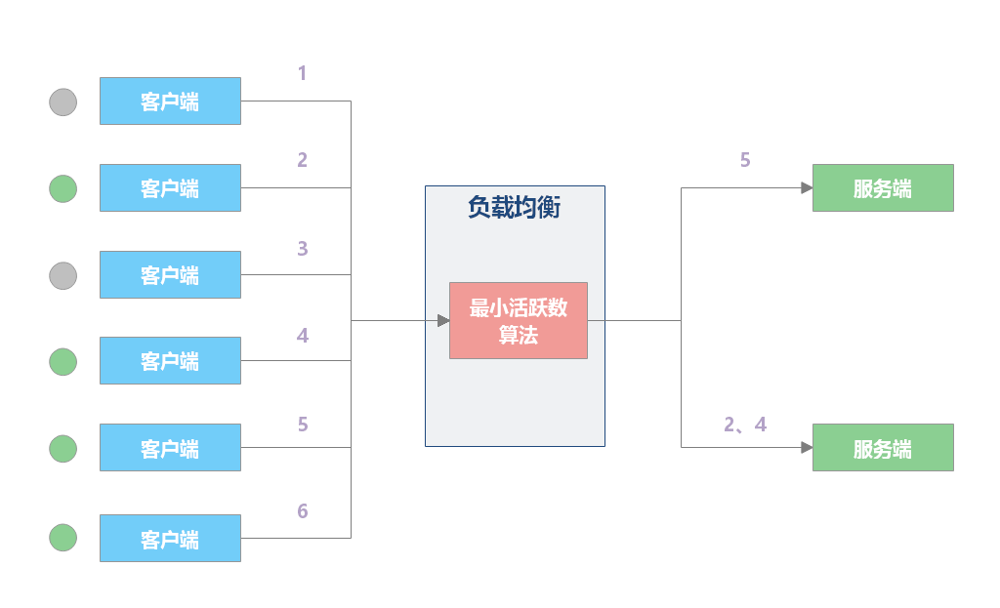
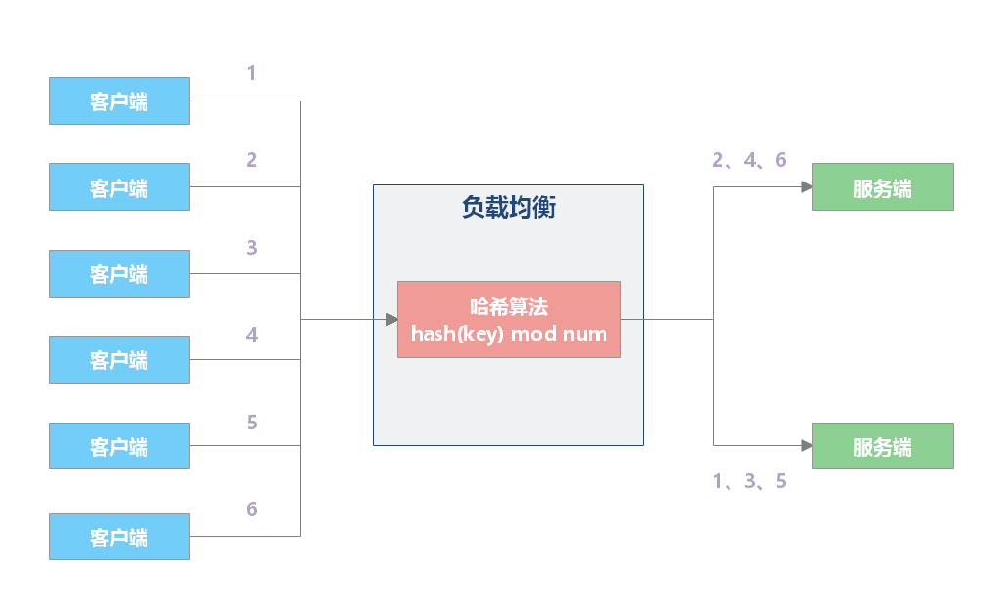
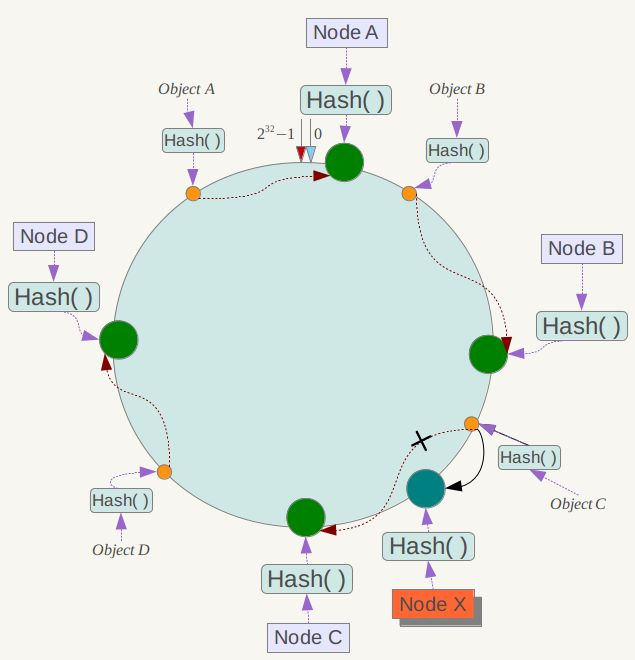

# 负载均衡算法

负载均衡器的实现可以分为两个部分：

- 根据负载均衡算法在候选服务器列表选出一个服务器；
- 将请求数据发送到该服务器上。

负载均衡算法是负载均衡服务核心中的核心。负载均衡产品多种多样，但是各种负载均衡算法原理是共性的。

负载均衡算法有很多种，分别适用于不同的应用场景，本文仅介绍最为常见的负载均衡算法的特性及原理：轮询、随机、最小活跃数、源地址哈希、一致性哈希。

> 注：负载均衡算法的实现，推荐阅读 [Dubbo 官方负载均衡算法说明 ](https://dubbo.apache.org/zh/docs/v2.7/dev/source/loadbalance/)，源码讲解非常详细，非常值得借鉴。
> 
> 下文中的各种算法的可执行示例已归档在 Github 仓库：https://github.com/dunwu/java-tutorial/tree/master/codes/java-distributed/java-load-balance，可以通过执行 io.github.dunwu.javatech.LoadBalanceDemo 查看各算法执行效果。

## 随机

### 随机算法

**`随机（Random）`** 算法 **将请求随机分发到候选服务器**。

随机算法 **适合服务器硬件相同的场景**。学习过概率论的都知道，调用量较小的时候，可能负载并不均匀，**调用量越大，负载越均衡**。



【示例】随机算法实现示例

负载均衡接口

```
public interface LoadBalance<N extends Node> {

    N select(List<N> nodes, String ip);

}
```

负载均衡抽象类

```
public abstract class BaseLoadBalance<N extends Node> implements LoadBalance<N> {

    @Override
    public N select(List<N> nodes, String ip) {
        if (CollectionUtil.isEmpty(nodes)) {
            return null;
        }

        // 如果 nodes 列表中仅有一个 node，直接返回即可，无需进行负载均衡
        if (nodes.size() == 1) {
            return nodes.get(0);
        }

        return doSelect(nodes, ip);
    }

    protected abstract N doSelect(List<N> nodes, String ip);

}
```

服务器节点类

```
public class Node implements Comparable<Node> {

    protected String url;

    protected Integer weight;

    protected Integer active;

    // ...
}
```

随机算法实现

```
public class RandomLoadBalance<N extends Node> extends BaseLoadBalance<N> implements LoadBalance<N> {

    private final Random random = new Random();

    @Override
    protected N doSelect(List<N> nodes, String ip) {
        // 在列表中随机选取一个节点
        int index = random.nextInt(nodes.size());
        return nodes.get(index);
    }

}
```

### 加权随机算法

**`加权随机（Weighted Random）`** 算法在随机算法的基础上，按照概率调整权重，进行负载分配。

【示例】加权随机算法实现示例

```
public class WeightRandomLoadBalance<N extends Node> extends BaseLoadBalance<N> implements LoadBalance<N> {

    private final Random random = ThreadLocalRandom.current();

    @Override
    protected N doSelect(List<N> nodes, String ip) {

        int length = nodes.size();
        AtomicInteger totalWeight = new AtomicInteger(0);
        for (N node : nodes) {
            Integer weight = node.getWeight();
            totalWeight.getAndAdd(weight);
        }

        if (totalWeight.get() > 0) {
            int offset = random.nextInt(totalWeight.get());
            for (N node : nodes) {
                // 让随机值 offset 减去权重值
                offset -= node.getWeight();
                if (offset < 0) {
                    // 返回相应的 Node
                    return node;
                }
            }
        }

        // 直接随机返回一个
        return nodes.get(random.nextInt(length));
    }

}
```

## 轮询

### 轮询算法

**`轮询（Round Robin）`** 算法的策略是：**将请求依次分发到候选服务器**。

如下图所示，负载均衡器收到来自客户端的 6 个请求，(1, 3, 5) 的请求会被发送到服务器 1，(2, 4, 6) 的请求会被发送到服务器 2。


该算法适合场景：各服务器处理能力相近，且每个事务工作量差异不大。如果存在较大差异，那么处理较慢的服务器就可能会积压请求，最终无法承担过大的负载。



【示例】轮询算法示例

轮询负载均衡算法实现

```
public class RoundRobinLoadBalance<N extends Node> extends BaseLoadBalance<N> implements LoadBalance<N> {

    private final AtomicInteger position = new AtomicInteger(0);

    @Override
    protected N doSelect(List<N> nodes, String ip) {
        int length = nodes.size();
        // 如果位置值已经等于节点数，重置为 0
        position.compareAndSet(length, 0);
        N node = nodes.get(position.get());
        position.getAndIncrement();
        return node;
    }

}
```

### 加权轮询算法

**`加权轮询（Weighted Round Robbin）`** 算法在轮询算法的基础上，增加了权重属性来调节转发服务器的请求数目。性能高、处理速度快的节点应该设置更高的权重，使得分发时优先将请求分发到权重较高的节点上。

如下图所示，服务器 A 设置权重为 5，服务器 B 设置权重为 1，负载均衡器收到来自客户端的 6 个请求，那么 (1, 2, 3, 4, 5) 请求会被发送到服务器 A，(6) 请求会被发送到服务器 B。



【示例】加权轮询算法实现示例

以下实现基于 Dubbo 加权轮询算法做了一些简化。

```
public class WeightRoundRobinLoadBalance<N extends Node> extends BaseLoadBalance<N> implements LoadBalance<N> {

    /**     * 60秒     */
    private static final int RECYCLE_PERIOD = 60000;

    /**     * Node hashcode 到 WeightedRoundRobin 的映射关系     */
    private ConcurrentMap<Integer, WeightedRoundRobin> weightMap = new ConcurrentHashMap<>();

    /**     * 原子更新锁     */
    private AtomicBoolean updateLock = new AtomicBoolean();

    @Override
    protected N doSelect(List<N> nodes, String ip) {

        int totalWeight = 0;
        long maxCurrent = Long.MIN_VALUE;

        // 获取当前时间
        long now = System.currentTimeMillis();
        N selectedNode = null;
        WeightedRoundRobin selectedWRR = null;

        // 下面这个循环主要做了这样几件事情：
        //   1. 遍历 Node 列表，检测当前 Node 是否有相应的 WeightedRoundRobin，没有则创建
        //   2. 检测 Node 权重是否发生了变化，若变化了，则更新 WeightedRoundRobin 的 weight 字段
        //   3. 让 current 字段加上自身权重，等价于 current += weight
        //   4. 设置 lastUpdate 字段，即 lastUpdate = now
        //   5. 寻找具有最大 current 的 Node，以及 Node 对应的 WeightedRoundRobin，
        //      暂存起来，留作后用
        //   6. 计算权重总和
        for (N node : nodes) {
            int hashCode = node.hashCode();
            WeightedRoundRobin weightedRoundRobin = weightMap.get(hashCode);
            int weight = node.getWeight();
            if (weight < 0) {
                weight = 0;
            }

            // 检测当前 Node 是否有对应的 WeightedRoundRobin，没有则创建
            if (weightedRoundRobin == null) {
                weightedRoundRobin = new WeightedRoundRobin();
                // 设置 Node 权重
                weightedRoundRobin.setWeight(weight);
                // 存储 url 唯一标识 identifyString 到 weightedRoundRobin 的映射关系
                weightMap.putIfAbsent(hashCode, weightedRoundRobin);
                weightedRoundRobin = weightMap.get(hashCode);
            }
            // Node 权重不等于 WeightedRoundRobin 中保存的权重，说明权重变化了，此时进行更新
            if (weight != weightedRoundRobin.getWeight()) {
                weightedRoundRobin.setWeight(weight);
            }

            // 让 current 加上自身权重，等价于 current += weight
            long current = weightedRoundRobin.increaseCurrent();
            // 设置 lastUpdate，表示近期更新过
            weightedRoundRobin.setLastUpdate(now);
            // 找出最大的 current
            if (current > maxCurrent) {
                maxCurrent = current;
                // 将具有最大 current 权重的 Node 赋值给 selectedNode
                selectedNode = node;
                // 将 Node 对应的 weightedRoundRobin 赋值给 selectedWRR，留作后用
                selectedWRR = weightedRoundRobin;
            }

            // 计算权重总和
            totalWeight += weight;
        }

        // 对 weightMap 进行检查，过滤掉长时间未被更新的节点。
        // 该节点可能挂了，nodes 中不包含该节点，所以该节点的 lastUpdate 长时间无法被更新。
        // 若未更新时长超过阈值后，就会被移除掉，默认阈值为60秒。
        if (!updateLock.get() && nodes.size() != weightMap.size()) {
            if (updateLock.compareAndSet(false, true)) {
                try {
                    // 遍历修改，即移除过期记录
                    weightMap.entrySet().removeIf(item -> now - item.getValue().getLastUpdate() > RECYCLE_PERIOD);
                } finally {
                    updateLock.set(false);
                }
            }
        }

        if (selectedNode != null) {
            // 让 current 减去权重总和，等价于 current -= totalWeight
            selectedWRR.decreaseCurrent(totalWeight);
            // 返回具有最大 current 的 Node
            return selectedNode;
        }

        // should not happen here
        return nodes.get(0);
    }

    protected static class WeightedRoundRobin {

        // 服务提供者权重
        private int weight;
        // 当前权重
        private AtomicLong current = new AtomicLong(0);
        // 最后一次更新时间
        private long lastUpdate;

        public long increaseCurrent() {
            // current = current + weight；
            return current.addAndGet(weight);
        }

        public long decreaseCurrent(int total) {
            // current = current - total;
            return current.addAndGet(-1 * total);
        }

        public int getWeight() {
            return weight;
        }

        public void setWeight(int weight) {
            this.weight = weight;
            // 初始情况下，current = 0
            current.set(0);
        }

        public AtomicLong getCurrent() {
            return current;
        }

        public void setCurrent(AtomicLong current) {
            this.current = current;
        }

        public long getLastUpdate() {
            return lastUpdate;
        }

        public void setLastUpdate(long lastUpdate) {
            this.lastUpdate = lastUpdate;
        }

    }

}
```

## 最小活跃数

**`最小活跃数（Least Active）`** 算法 **将请求分发到连接数/请求数最少的候选服务器**（目前处理请求最少的服务器）。

- 特点：根据候选服务器当前的请求连接数，动态分配。
- 场景：**适用于对系统负载较为敏感或请求连接时长相差较大的场景**。

由于每个请求的连接时长不一样，如果采用简单的轮循或随机算法，都可能出现**某些服务器当前连接数过大，而另一些服务器的连接过小**的情况，这就造成了负载并非真正均衡。虽然，轮询或算法都可以通过加权重属性的方式进行负载调整，但加权方式难以应对动态变化。



最小活跃数算法会记录当前时刻，每个候选节点正在处理的连接数，然后选择连接数最小的节点。该策略能够动态、实时地反应服务器的当前状况，较为合理地将负责分配均匀，适用于对当前系统负载较为敏感的场景。

例如下图中，服务器 1 当前连接数最小，那么新到来的请求 6 就会被发送到服务器 1 上。



**`加权最小活跃数（Weighted Least Connection）`**在最小活跃数的基础上，根据服务器的性能为每台服务器分配权重，再根据权重计算出每台服务器能处理的连接数。

最小活跃数算法实现要点：活跃调用数越小，表明该服务节点处理能力越高，单位时间内可处理更多的请求，应优先将请求分发给该服务。在具体实现中，每个服务节点对应一个活跃数 active。初始情况下，所有服务提供者活跃数均为 0。每收到一个请求，活跃数加 1，完成请求后则将活跃数减 1。在服务运行一段时间后，性能好的服务提供者处理请求的速度更快，因此活跃数下降的也越快，此时这样的服务提供者能够优先获取到新的服务请求、这就是最小活跃数负载均衡算法的基本思想。

【示例】最小活跃数算法实现

以下实现基于 Dubbo 最小活跃数负载均衡算法做了些许改动。

```
public class LeastActiveLoadBalance<N extends Node> extends BaseLoadBalance<N> implements LoadBalance<N> {

    private final Random random = new Random();

    @Override
    protected N doSelect(List<N> nodes, String ip) {
        int length = nodes.size();
        // 最小的活跃数
        int leastActive = -1;
        // 具有相同“最小活跃数”的服务者提供者（以下用 Node 代称）数量
        int leastCount = 0;
        // leastIndexs 用于记录具有相同“最小活跃数”的 Node 在 nodes 列表中的下标信息
        int[] leastIndexs = new int[length];
        int totalWeight = 0;
        // 第一个最小活跃数的 Node 权重值，用于与其他具有相同最小活跃数的 Node 的权重进行对比，
        // 以检测是否“所有具有相同最小活跃数的 Node 的权重”均相等
        int firstWeight = 0;
        boolean sameWeight = true;

        // 遍历 nodes 列表
        for (int i = 0; i < length; i++) {
            N node = nodes.get(i);
            // 发现更小的活跃数，重新开始
            if (leastActive == -1 || node.getActive() < leastActive) {
                // 使用当前活跃数更新最小活跃数 leastActive
                leastActive = node.getActive();
                // 更新 leastCount 为 1
                leastCount = 1;
                // 记录当前下标值到 leastIndexs 中
                leastIndexs[0] = i;
                totalWeight = node.getWeight();
                firstWeight = node.getWeight();
                sameWeight = true;

                // 当前 Node 的活跃数 node.getActive() 与最小活跃数 leastActive 相同
            } else if (node.getActive() == leastActive) {
                // 在 leastIndexs 中记录下当前 Node 在 nodes 集合中的下标
                leastIndexs[leastCount++] = i;
                // 累加权重
                totalWeight += node.getWeight();
                // 检测当前 Node 的权重与 firstWeight 是否相等，
                // 不相等则将 sameWeight 置为 false
                if (sameWeight && i > 0
                    && node.getWeight() != firstWeight) {
                    sameWeight = false;
                }
            }
        }

        // 当只有一个 Node 具有最小活跃数，此时直接返回该 Node 即可
        if (leastCount == 1) {
            return nodes.get(leastIndexs[0]);
        }

        // 有多个 Node 具有相同的最小活跃数，但它们之间的权重不同
        if (!sameWeight && totalWeight > 0) {
            // 随机生成一个 [0, totalWeight) 之间的数字
            int offsetWeight = random.nextInt(totalWeight);
            // 循环让随机数减去具有最小活跃数的 Node 的权重值，
            // 当 offset 小于等于0时，返回相应的 Node
            for (int i = 0; i < leastCount; i++) {
                int leastIndex = leastIndexs[i];
                // 获取权重值，并让随机数减去权重值
                offsetWeight -= nodes.get(leastIndex).getWeight();
                if (offsetWeight <= 0) {
                    return nodes.get(leastIndex);
                }
            }
        }
        // 如果权重相同或权重为0时，随机返回一个 Node
        return nodes.get(leastIndexs[random.nextInt(leastCount)]);
    }

}
```

## 哈希

**`哈希（Hash）`** 算法**根据一个 key （可以是唯一 ID、IP 等），通过哈希计算得到一个数值，用该数值在候选服务器列表的进行取模运算，得到的结果便是选中的服务器**。



可以保证同一 IP 的客户端的请求会转发到同一台服务器上，用来实现会话粘滞（Sticky Session）。

- 特点：保证特定用户总是请求到相同的服务器，若服务器宕机，会话会丢失。

【示例】源地址哈希算法实现示例

```
public class IpHashLoadBalance<N extends Node> extends BaseLoadBalance<N> implements LoadBalance<N> {

    @Override
    protected N doSelect(List<N> nodes, String ip) {
        if (StrUtil.isBlank(ip)) {
            ip = "127.0.0.1";
        }

        int length = nodes.size();
        int index = hash(ip) % length;
        return nodes.get(index);
    }

    public int hash(String text) {
        return HashUtil.fnvHash(text);
    }

}
```

## 一致性哈希

**`一致性哈希（Consistent Hash）`** 算法的目标是：**相同的请求尽可能落到同一个服务器上**。

**一致性哈希** 可以很好的解决 **稳定性问题**，可以将所有的存储节点排列在首尾相接的 `Hash` 环上，每个 `key` 在计算 `Hash` 后会 **顺时针** 找到 **邻接** 的存储节点存放。而当有节点 **加入** 或 **退出** 时，仅影响该节点在 `Hash` 环上 **顺时针相邻** 的 **后续节点**。



- **相同的请求**是指：一般在使用一致性哈希时，需要指定一个 key 用于 hash 计算，可能是：用户 ID、请求方 IP、请求服务名称，参数列表构成的串
- **尽可能**是指：服务器可能发生上下线，少数服务器的变化不应该影响大多数的请求。

当某台候选服务器宕机时，原本发往该服务器的请求，会基于虚拟节点，平摊到其它候选服务器，不会引起剧烈变动。

- **优点**

**加入** 和 **删除** 节点只影响 **哈希环** 中 **顺时针方向** 的 **相邻的节点**，对其他节点无影响。

- **缺点**

**加减节点** 会造成 **哈希环** 中部分数据 **无法命中**。当使用 **少量节点** 时，**节点变化** 将大范围影响 **哈希环** 中 **数据映射**，不适合 **少量数据节点** 的分布式方案。**普通** 的 **一致性哈希分区** 在增减节点时需要 **增加一倍** 或 **减去一半** 节点才能保证 **数据** 和 **负载的均衡**。

> **注意**：因为 **一致性哈希分区** 的这些缺点，一些分布式系统采用 **虚拟槽** 对 **一致性哈希** 进行改进，比如 `Dynamo` 系统、Redis。

【示例】一致性哈希算法示例

以下示例基于 Dubbo 的一致性哈希负载均衡算法做了一些简化。

```
public class ConsistentHashLoadBalance<N extends Node> extends BaseLoadBalance<N> implements LoadBalance<N> {

    private final ConcurrentMap<String, ConsistentHashSelector<?>> selectors = new ConcurrentHashMap<>();

    @SuppressWarnings("unchecked")
    @Override
    protected N doSelect(List<N> nodes, String ip) {
        // 分片数，这里设为节点数的 4 倍
        Integer replicaNum = nodes.size() * 4;
        // 获取 nodes 原始的 hashcode
        int identityHashCode = System.identityHashCode(nodes);

        // 如果 nodes 是一个新的 List 对象，意味着节点数量发生了变化
        // 此时 selector.identityHashCode != identityHashCode 条件成立
        ConsistentHashSelector<N> selector = (ConsistentHashSelector<N>) selectors.get(ip);
        if (selector == null || selector.identityHashCode != identityHashCode) {
            // 创建新的 ConsistentHashSelector
            selectors.put(ip, new ConsistentHashSelector<>(nodes, identityHashCode, replicaNum));
            selector = (ConsistentHashSelector<N>) selectors.get(ip);
        }
        // 调用 ConsistentHashSelector 的 select 方法选择 Node
        return selector.select(ip);
    }

    /**     * 一致性哈希选择器     */
    private static final class ConsistentHashSelector<N extends Node> {

        /**         * 存储虚拟节点         */
        private final TreeMap<Long, N> virtualNodes;

        private final int identityHashCode;

        /**         * 构造器         *         * @param nodes            节点列表         * @param identityHashCode hashcode         * @param replicaNum       分片数         */
        ConsistentHashSelector(List<N> nodes, int identityHashCode, Integer replicaNum) {
            this.virtualNodes = new TreeMap<>();
            this.identityHashCode = identityHashCode;
            // 获取虚拟节点数，默认为 100
            if (replicaNum == null) {
                replicaNum = 100;
            }
            for (N node : nodes) {
                for (int i = 0; i < replicaNum / 4; i++) {
                    // 对 url 进行 md5 运算，得到一个长度为16的字节数组
                    byte[] digest = md5(node.getUrl());
                    // 对 digest 部分字节进行 4 次 hash 运算，得到四个不同的 long 型正整数
                    for (int j = 0; j < 4; j++) {
                        // h = 0 时，取 digest 中下标为 0 ~ 3 的4个字节进行位运算
                        // h = 1 时，取 digest 中下标为 4 ~ 7 的4个字节进行位运算
                        // h = 2, h = 3 时过程同上
                        long m = hash(digest, j);
                        // 将 hash 到 node 的映射关系存储到 virtualNodes 中，
                        // virtualNodes 需要提供高效的查询操作，因此选用 TreeMap 作为存储结构
                        virtualNodes.put(m, node);
                    }
                }
            }
        }

        public N select(String key) {
            // 对参数 key 进行 md5 运算
            byte[] digest = md5(key);
            // 取 digest 数组的前四个字节进行 hash 运算，再将 hash 值传给 selectForKey 方法，
            // 寻找合适的 Node
            return selectForKey(hash(digest, 0));
        }

        private N selectForKey(long hash) {
            // 查找第一个大于或等于当前 hash 的节点
            Map.Entry<Long, N> entry = virtualNodes.ceilingEntry(hash);
            // 如果 hash 大于 Node 在哈希环上最大的位置，此时 entry = null，
            // 需要将 TreeMap 的头节点赋值给 entry
            if (entry == null) {
                entry = virtualNodes.firstEntry();
            }
            // 返回 Node
            return entry.getValue();
        }

    }

    /**     * 计算 hash 值     */
    public static long hash(byte[] digest, int number) {
        return (((long) (digest[3 + number * 4] & 0xFF) << 24)
            | ((long) (digest[2 + number * 4] & 0xFF) << 16)
            | ((long) (digest[1 + number * 4] & 0xFF) << 8)
            | (digest[number * 4] & 0xFF))
            & 0xFFFFFFFFL;
    }

    /**     * 计算 MD5 值     */
    public static byte[] md5(String value) {
        MessageDigest md5;
        try {
            md5 = MessageDigest.getInstance("MD5");
        } catch (NoSuchAlgorithmException e) {
            throw new IllegalStateException(e.getMessage(), e);
        }
        md5.reset();
        byte[] bytes = value.getBytes(StandardCharsets.UTF_8);
        md5.update(bytes);
        return md5.digest();
    }

}
```
