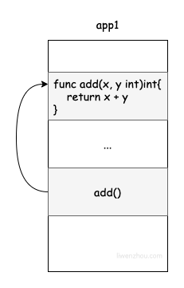
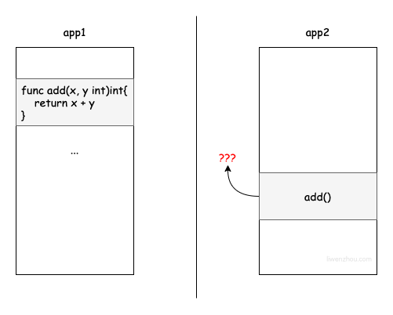

# RPC 原理

RPC（Remote Procedure Call），即远程过程调用。它允许像调用本地服务一样调用远程服务。

RPC是一种服务器-客户端（Client/Server）模式，经典实现是一个通过发送请求-接受回应进行信息交互的系统。

首先与RPC（远程过程调用）相对应的是本地调用。

## 本地调用

```go
package main

import "fmt"

func add(x, y int)int{
    return x + y
}

func main(){
    // 调用本地函数add
    a := 10
    b := 20
    ret := add(x, y)
    fmt.Println(ret)
}
```

将上述程序编译成二进制文件——`app1`后运行，会输出结果30。

在`app1`程序中本地调用`add`函数的执行流程，可以理解为以下四个步骤。

1. 将变量 a 和 b 的值分别压入堆栈上
2. 执行 add 函数，从堆栈中获取 a 和 b 的值，并将它们分配给 x 和 y
3. 计算 x + y 的值并将其保存到堆栈中
4. 退出 add 函数并将 x + y 的值赋给 ret

## RPC 调用

本地过程调用发生在同一进程中——定义`add`函数的代码和调用`add`函数的代码共享同一个内存空间，所以调用能够正常执行。



但是我们无法直接在另一个程序——`app2`中调用`add`函数，因为它们是两个程序——内存空间是相互隔离的。（app1和app2可能部署在同一台服务器上也可能部署在互联网的不同服务器上。）



RPC就是为了解决类似远程、跨内存空间、的函数/方法调用的。要实现RPC就需要解决以下三个问题。

1. 如何确定要执行的函数？ 在本地调用中，函数主体通过函数指针函数指定，然后调用 add 函数，编译器通过函数指针函数自动确定 add 函数在内存中的位置。但是在 RPC 中，调用不能通过函数指针完成，因为它们的内存地址可能完全不同。因此，调用方和被调用方都需要维护一个{ function <-> ID }映射表，以确保调用正确的函数。
2. 如何表达参数？ 本地过程调用中传递的参数是通过堆栈内存结构实现的，但 RPC 不能直接使用内存传递参数，因此参数或返回值需要在传输期间序列化并转换成字节流，反之亦然。
3. 如何进行网络传输？ 函数的调用方和被调用方通常是通过网络连接的，也就是说，function ID 和序列化字节流需要通过网络传输，因此，只要能够完成传输，调用方和被调用方就不受某个网络协议的限制。.例如，一些 RPC 框架使用 TCP 协议，一些使用 HTTP。

以往实现跨服务调用的时候，我们会采用RESTful API的方式，被调用方会对外提供一个HTTP接口，调用方按要求发起HTTP请求并接收API接口返回的响应数据。下面的示例是将`add`函数包装成一个RESTful API。

## HTTP 调用 RESTful API

首先，我们编写一个基于HTTP的server服务，它将接收其他程序发来的HTTP请求，执行特定的程序并将结果返回。

```go
// server/main.go

package main

import (
    "encoding/json"
    "io/ioutil"
    "log"
    "net/http"
)

type addParam struct {
    X int `json:"x"`
    Y int `json:"y"`
}

type addResult struct {
    Code int `json:"code"`
    Data int `json:"data"`
}

func add(x, y int) int {
    return x + y
}

func addHandler(w http.ResponseWriter, r *http.Request) {
    // 解析参数
    b, _ := ioutil.ReadAll(r.Body)
    var param addParam
    json.Unmarshal(b, &param)
    // 业务逻辑
    ret := add(param.X, param.Y)
    // 返回响应
    respBytes , _ := json.Marshal(addResult{Code: 0, Data: ret})
    w.Write(respBytes)
}

func main() {
    http.HandleFunc("/add", addHandler)
    log.Fatal(http.ListenAndServe(":9090", nil))
}
```

我们编写一个客户端来请求上述HTTP服务，传递x和y两个整数，等待返回结果。

```go
// client/main.go

package main

import (
    "bytes"
    "encoding/json"
    "fmt"
    "io/ioutil"
    "net/http"
)

type addParam struct {
    X int `json:"x"`
    Y int `json:"y"`
}

type addResult struct {
    Code int `json:"code"`
    Data int `json:"data"`
}

func main() {
    // 通过HTTP请求调用其他服务器上的add服务
    url := "http://127.0.0.1:9090/add"
    param := addParam{
        X: 10,
        Y: 20,
    }
    paramBytes, _ := json.Marshal(param)
    resp, _ := http.Post(url, "application/json", bytes.NewReader(paramBytes))
    defer resp.Body.Close()

    respBytes, _ := ioutil.ReadAll(resp.Body)
    var respData addResult
    json.Unmarshal(respBytes, &respData)
    fmt.Println(respData.Data) // 30
}
```

这种模式是我们目前比较常见的跨服务或跨语言之间基于RESTful API的服务调用模式。 既然使用API调用也能实现类似远程调用的目的，为什么还要用RPC呢？

## RPC 与 HTTP RESTful API 的区别

* RPC 传输数据使用二进制协议。

* HTTP 采用 json 等文本协议，性能较低。

使用 RPC 的目的是让我们调用远程方法像调用本地方法一样无差别。并且基于RESTful API通常是基于HTTP协议，传输数据采用JSON等文本协议，相较于RPC 直接使用TCP协议，传输数据多采用二进制协议来说，RPC通常相比RESTful API性能会更好。

RESTful API多用于前后端之间的数据传输，而目前微服务架构下各个微服务之间多采用RPC调用。
