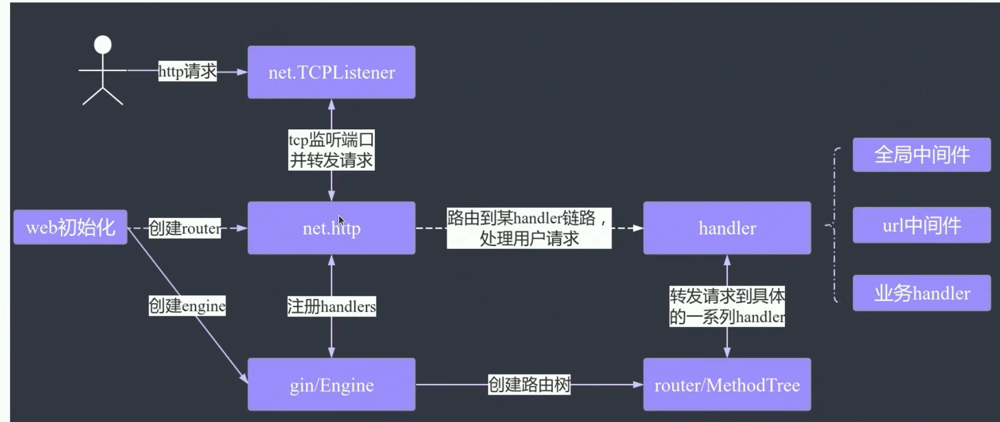

# Gin 简明教程

## Gin 简介

Gin 优点

- **快速**：路由不使用反射，基于Radix树，内存占用少。

- **中间件**：HTTP请求，可先经过一系列中间件处理，例如：Logger，Authorization，GZIP等。这个特性和 NodeJs 的 `Koa` 框架很像。中间件机制也极大地提高了框架的可扩展性。

- **异常处理**：服务始终可用，不会宕机。Gin 可以捕获 panic，并恢复。而且有极为便利的机制处理HTTP请求过程中发生的错误。

- **JSON**：Gin可以解析并验证请求的JSON。这个特性对`Restful API`的开发尤其有用。

- **路由分组**：例如将需要授权和不需要授权的API分组，不同版本的API分组。而且分组可嵌套，且性能不受影响。

- **渲染内置**：原生支持JSON，XML和HTML的渲染。

Gin 组件：



1. Engine：实现了ServeHTTP接口的Handler

2. MethodTree：根据 http 请求方法分别维护的路由书

3. RouterGroup：将路由表分组，方便中间件统一管理

4. Context：Gin 的上下文，在 Handler 之间传递函数

## 路由（Route）

路由方法有 **GET, POST, PUT, PATCH, DELETE** 和 **OPTIONS**，还有**Any**，可匹配以上任意类型的请求。

### 解析路径参数

有时候我们需要动态的路由，如 `/user/:name`，通过调用不同的 url 来传入不同的 name。`/user/:name/*role`，`*` 代表可选。

匹配 /user/geektutu：

```go
r.GET("/user/:name", func(c *gin.Context) {
    name := c.Param("name")
    c.String(http.StatusOK, "Hello %s", name)
})
```

```bash
$ curl http://localhost:9999/user/geektutu
Hello geektutu
```

### 获取 GET 参数

匹配 /users?name=xxx&role=xxx，role可选：

```go
r.GET("/users", func(c *gin.Context) {
    name := c.Query("name")
    role := c.DefaultQuery("role", "teacher")
    c.String(http.StatusOK, "%s is a %s", name, role)
})
```

```bash
$ curl "http://localhost:9999/users?name=Tom&role=student"
Tom is a student
```

### 获取 POST 参数

```go
r.POST("/form", func(c *gin.Context) {
    username := c.PostForm("username")
    password := c.DefaultPostForm("password", "000000") // 可设置默认值

    c.JSON(http.StatusOK, gin.H{
        "username": username,
        "password": password,
    })
})
```

```bash
$ curl http://localhost:9999/form  -X POST -d \
'username=geektutu&password=1234'

{"password":"1234","username":"geektutu"}
```

### POST 和 GET 混合参数

c.Query() 是获取 URL 中的参数，c.PostForm() 是获取请求表单中的参数。同时使用两者可以获得 URL 和 POST 表单中的参数。

### Map 参数（字典参数）

```go
r.POST("/post", func(c *gin.Context) {
    ids := c.QueryMap("ids")
    names := c.PostFormMap("names")

    c.JSON(http.StatusOK, gin.H{
        "ids":   ids,
        "names": names,
    })
})
```

```bash
$ curl -g \
"http://localhost:9999/post?ids[Jack]=001&ids[Tom]=002" \
 -X POST -d \
'names[a]=Sam&names[b]=David'

{"ids":{"Jack":"001","Tom":"002"},"names":{"a":"Sam","b":"David"}}
```

### 重定向（Redirect）

```go
r.GET("/redirect", func(c *gin.Context) {
    c.Redirect(http.StatusMovedPermanently, "/index")
})

r.GET("/goindex", func(c *gin.Context) {
    c.Request.URL.Path = "/"
    r.HandleContext(c)
})
```

```bash
$ curl -i http://localhost:9999/redirect
HTTP/1.1 301 Moved Permanently
Content-Type: text/html; charset=utf-8
Location: /
Date: Thu, 08 Aug 2019 17:22:14 GMT
Content-Length: 36

<a href="/">Moved Permanently</a>.

$ curl "http://localhost:9999/goindex"
Who are you?
```

### 分组路由

如果有一组路由，前缀都是`/api/v1`开头，是否每个路由都需要加上`/api/v1`这个前缀呢？答案是不需要，分组路由可以解决这个问题。利用分组路由还可以更好地实现权限控制，例如将需要登录鉴权的路由放到同一分组中去，简化权限控制。

```go
// group routes 分组路由
defaultHandler := func(c *gin.Context) {
    c.JSON(http.StatusOK, gin.H{
        "path": c.FullPath(),
    })
}
// group: v1
v1 := r.Group("/v1")
{
    v1.GET("/posts", defaultHandler)
    v1.GET("/series", defaultHandler)
}
// group: v2
v2 := r.Group("/v2")
{
    v2.GET("/posts", defaultHandler)
    v2.GET("/series", defaultHandler)
}
```

```bash
$ curl http://localhost:9999/v1/posts
{"path":"/v1/posts"}
$ curl http://localhost:9999/v2/posts
{"path":"/v2/posts"}
```

## 处理文件

### 单个文件

```go
func upload(c *gin.Context) {
    fileHeader, _ := c.FormFile("file")
    file, _ := fileHeader.Open()

    c.JSON(http.StatusOK, gin.H{
        "msg":  "upload succeeded",
        "code": 1,
    }) 

    newFile, _ := os.Create("/tmp/1")
    io.Copy(newFile, file)
}
```

### 多个文件

```go
func MultiUpload(c *gin.Context) {
    forms, _ := c.MultipartForm()
    fileHeaders := forms.File["file"]

    for i, fileHeader := range fileHeaders {
        newFile, _ := os.Create(fmt.Sprintf("/tmp/%d", i))
        file, _ := fileHeader.Open()
        io.Copy(newFile, file)
    }
}
```

## HTML 模板（Template）

```go
type student struct {
    Name string
    Age  int8
}

r.LoadHTMLGlob("templates/*")

stu1 := &student{Name: "Geektutu", Age: 20}
stu2 := &student{Name: "Jack", Age: 22}
r.GET("/arr", func(c *gin.Context) {
    c.HTML(http.StatusOK, "arr.tmpl", gin.H{
        "title":  "Gin",
        "stuArr": [2]*student{stu1, stu2},
    })
})
```

```html
<!-- templates/arr.tmpl -->
<html>
<body>
    <p>hello, {{.title}}</p>
    {{range $index, $ele := .stuArr }}
    <p>{{ $index }}: {{ $ele.Name }} is {{ $ele.Age }} years old</p>
    {{ end }}
</body>
</html>
```

```bash
$ curl http://localhost:9999/arr

<html>
<body>
    <p>hello, Gin</p>
    <p>0: Geektutu is 20 years old</p>
    <p>1: Jack is 22 years old</p>
</body>
</html>
```

## 中间件（Middleware）

### 使用方法

```go
r := gin.New()

// 作用于全局
r.Use(gin.Logger())
r.Use(gin.Recovery())

// 作用于单个路由
r.GET("/benchmark", MyBenchLogger(), benchEndpoint)

// 作用于某个组
authorized := r.Group("/")
authorized.Use(AuthRequired())
{
    authorized.POST("/login", loginEndpoint)
    authorized.POST("/submit", submitEndpoint)
}
```

### 自定义单个中间件

```go
func Logger() gin.HandlerFunc {
    return func(c *gin.Context) {
        t := time.Now()

        // 设置 example 变量
        c.Set("example", "12345")

        // 请求前

        c.Next()

        // 请求后
        latency := time.Since(t)
        log.Print(latency)

        // 获取发送的 status
        status := c.Writer.Status()
        log.Println(status)
    }
}

func main() {
    r := gin.New()
    r.Use(Logger())

    r.GET("/test", func(c *gin.Context) {
        // 从 gin.Context 中得到 k-v 值
        example := c.MustGet("example").(string)
        c.JSON(http.StatusOK, gin.H{
            "msg": "ok",
        })
        // 打印："12345"
        log.Println(example)
    })

    // 监听并在 0.0.0.0:8080 上启动服务
    r.Run(":8080")
}
```

```bash
[GIN-debug] Listening and serving HTTP on :8080
[GIN-debug] redirecting request 301: /test --> /test
2022/11/18 08:02:32 12345
2022/11/18 08:02:32 78.303µs
2022/11/18 08:02:32 200
```

浏览器界面：{"msg":"ok"}

c.Set() 可以设置一个上下文的 key-value 值。c.Next() 使用责任链模式，调用下一个 HandlerFunc，当下一个 HandlerFunc 返回后，继续执行当前 HandlerFunc 的内容。

### 自定义多个中间件

```go
// 定义中间件1
func MiddleWare1() gin.HandlerFunc {
    return func(c *gin.Context) {
        fmt.Println("调用中间件1")
        c.Next()
        fmt.Println("中间件1返回")
    }
}

// 定义中间件2
func MiddleWare2() gin.HandlerFunc {
    return func(c *gin.Context) {
        fmt.Println("调用中间件2")
        c.Next()
        fmt.Println("中间件2返回")
    }
}

// 定义中间件3
func MiddleWare3() gin.HandlerFunc {
    return func(c *gin.Context) {
        fmt.Println("调用中间件3")
        c.Next()
        fmt.Println("中间件3返回")
    }
}

func main() {
    // 创建路由
    engine := gin.Default()

    // 分组路由
    v1 := engine.Group("v1")

    // 注册中间件
    v1.Use(MiddleWare1(), MiddleWare2(), MiddleWare3())

    // 路由规则
    v1.GET("/test", func(c *gin.Context) {
        fmt.Println("调用路由处理函数")
        // 页面接收
        c.JSON(200, gin.H{"msg": "ok"})
    })

    engine.Run()
}
```

访问 http://localhost:8080/v1/test/

```bash
[GIN-debug] Listening and serving HTTP on :8080
调用中间件1
调用中间件2
调用中间件3
调用路由处理函数
中间件3返回
中间件2返回
中间件1返回
[GIN] 2022/11/18 - 08:16:57 | 200 |      64.454µs |       127.0.0.1 | GET      "/v1/test"
```

调用中间件的逻辑就是使用了责任链模式，层层调用。可以将中间件注册到全局，注册到各个 Group 上，注册到一个 HandlerFunc 上。

## 热加载调试

Python 的 `Flask`框架，有 *debug* 模式，启动时传入 *debug=True* 就可以热加载(Hot Reload, Live Reload)了。即更改源码，保存后，自动触发更新，浏览器上刷新即可。免去了杀进程、重新启动之苦。

Gin 原生不支持，但有很多额外的库可以支持。例如

- github.com/codegangsta/gin
- github.com/pilu/fresh

这次，我们采用 *github.com/pilu/fresh* 。

```go
go get -v -u github.com/pilu/fresh
```

安装好后，只需要将`go run main.go`命令换成`fresh`即可。每次更改源文件，代码将自动重新编译(Auto Compile)。

参考 [github.com/pilu/fresh - Github](https://github.com/gravityblast/fresh)
