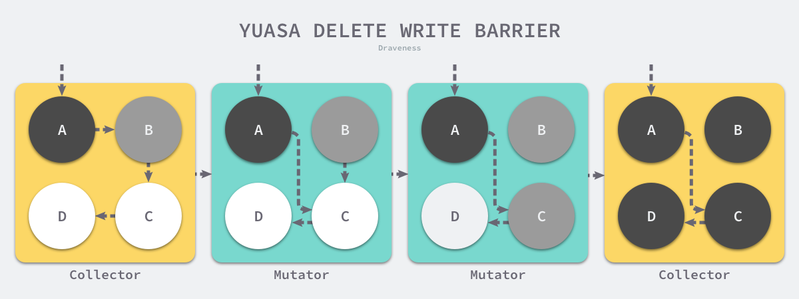

# 垃圾收集器

[Go 语言垃圾收集器的实现原理 | Go 语言设计与实现](https://draveness.me/golang/docs/part3-runtime/ch07-memory/golang-garbage-collector/)

## 1 设计原理

### 1.1 标记清除

标记清除（Mark-Sweep）算法是最常见的垃圾收集算法，标记清除收集器是跟踪式垃圾收集器，其执行过程可以分成标记（Mark）和清除（Sweep）两个阶段：

1. 标记阶段 — 从根对象出发查找并标记堆中所有存活的对象；
2. 清除阶段 — 遍历堆中的全部对象，回收未被标记的垃圾对象并将回收的内存加入空闲链表；

**<u>标记阶段</u>**: 内存空间中包含多个对象，我们从根对象出发依次遍历对象的子对象并将从根节点可达的对象都标记成存活状态，剩余的对象因为从根节点不可达，所以会被当做垃圾。


**<u>清除阶段</u>**: 标记阶段结束后会进入清除阶段，在该阶段中收集器会依次遍历堆中的所有对象，释放其中没有被标记的对象并将新的空闲内存空间以链表的结构串联起来，方便内存分配器的使用。


这里介绍的是最传统的标记清除算法，垃圾收集器从垃圾收集的根对象出发，递归遍历这些对象指向的子对象并将所有可达的对象标记成存活；标记阶段结束后，垃圾收集器会依次遍历堆中的对象并清除其中的垃圾，整个过程需要标记对象的存活状态，用户程序在垃圾收集的过程中也不能执行，我们需要用到更复杂的机制来解决 STW 的问题。

### 1.2 三色抽象

为了解决原始标记清除算法带来的长时间 STW，多数现代的追踪式垃圾收集器都会实现三色标记算法的变种以缩短 STW 的时间。三色标记算法将程序中的对象分成白色、黑色和灰色三类：

- 白色对象 — 潜在的垃圾，其内存可能会被垃圾收集器回收；
- 黑色对象 — 活跃的对象，包括不存在任何引用外部指针的对象以及从根对象可达的对象；
- 灰色对象 — 活跃的对象，因为存在指向白色对象的外部指针，垃圾收集器会扫描这些对象的子对象；

<u>**开始阶段**</u>：在垃圾收集器开始工作时，程序中不存在任何的黑色对象，垃圾收集的根对象会被标记成灰色，垃圾收集器只会从灰色对象集合中取出对象开始扫描，当灰色集合中不存在任何对象时，标记阶段就会结束。

<u>**标记阶段**</u>：三色标记垃圾收集器的工作原理很简单，我们可以将其归纳成以下几个步骤：

1. 从灰色对象的集合中选择一个灰色对象并将其标记成黑色；
2. 将黑色对象指向的所有对象都标记成灰色，保证该对象和被该对象引用的对象都不会被回收；
3. 重复上述两个步骤直到对象图中不存在灰色对象；

<u>**回收阶段**</u>：当三色的标记清除的标记阶段结束之后，应用程序的堆中就不存在任何的灰色对象，我们只能看到黑色的存活对象以及白色的垃圾对象，垃圾收集器可以回收这些白色的垃圾。

<u>**三色标记会出现的问题**</u>：

因为用户程序可能在标记执行的过程中修改对象的指针，所以三色标记清除算法本身是不可以并发或者增量执行的，它仍然需要 STW。

本来不应该被回收的对象却被回收了，这在内存管理中是非常严重的错误，我们将这种错误称为悬挂指针，即指针没有指向特定类型的合法对象，影响了内存的安全性，想要并发或者增量地标记对象还是需要使用屏障技术。

### 1.3 屏障技术

内存屏障技术是一种屏障指令，它可以让 CPU 或者编译器在执行内存相关操作时遵循特定的约束，目前多数的现代处理器都会乱序执行指令以最大化性能，但是该技术能够保证内存操作的顺序性，在内存屏障前执行的操作一定会先于内存屏障后执行的操作。

想要在并发或者增量的标记算法中保证正确性，我们需要达成以下两种三色不变性（Tri-color invariant）中的一种：

- 强三色不变性 — 黑色对象不会指向白色对象，只会指向灰色对象或者黑色对象；
- 弱三色不变性 — 黑色对象指向的白色对象必须包含一条从灰色对象经由多个白色对象的可达路径；


垃圾收集中的屏障技术更像是一个钩子方法，它是在用户程序读取对象、创建新对象以及更新对象指针时执行的一段代码，根据操作类型的不同，我们可以将它们分成读屏障（Read barrier）和写屏障（Write barrier）两种，因为读屏障需要在读操作中加入代码片段，对用户程序的性能影响很大，所以编程语言往往都会采用写屏障保证三色不变性。

Go 语言中使用的两种写屏障技术，分别是 Dijkstra 提出的插入写屏障和 Yuasa 提出的删除写屏障。

**<u>插入写屏障</u>**

```go
writePointer(slot, ptr):
    shade(ptr)
    *slot = ptr
```

每当执行类似 `*slot = ptr` 的表达式时，我们会执行上述写屏障通过 `shade` 函数尝试改变指针的颜色。如果 `ptr` 指针是白色的，那么该函数会将该对象设置成灰色，其他情况则保持不变。


标记过程：

1. 垃圾收集器将根对象指向 A 对象标记成黑色并将 A 对象指向的对象 B 标记成灰色；
2. 用户程序修改 A 对象的指针，将原本指向 B 对象的指针指向 C 对象，这时触发写屏障将 C 对象标记成灰色；
3. 垃圾收集器依次遍历程序中的其他灰色对象，将它们分别标记成黑色；

Dijkstra 的插入写屏障是一种相对保守的屏障技术，它会将**有存活可能的对象都标记成灰色**以满足强三色不变性。在如上所示的垃圾收集过程中，实际上不再存活的 B 对象最后没有被回收；而如果我们在第二和第三步之间将指向 C 对象的指针改回指向 B，垃圾收集器仍然认为 C 对象是存活的，这些被错误标记的垃圾对象只有在下一个循环才会被回收。

**<u>删除写屏障</u>**

```go
writePointer(slot, ptr)
    shade(*slot)
    *slot = ptr
```

上述代码会在老对象的引用被删除时，将白色的老对象涂成灰色，这样删除写屏障就可以保证弱三色不变性，老对象引用的下游对象一定可以被灰色对象引用。



标记过程：

1. 垃圾收集器将根对象指向 A 对象标记成黑色并将 A 对象指向的对象 B 标记成灰色；
2. 用户程序将 A 对象原本指向 B 的指针指向 C，触发删除写屏障，但是因为 B 对象已经是灰色的，所以不做改变；
3. **用户程序将 B 对象原本指向 C 的指针删除，触发删除写屏障，白色的 C 对象被涂成灰色**；
4. 垃圾收集器依次遍历程序中的其他灰色对象，将它们分别标记成黑色；

上述过程中的第三步触发了 Yuasa 删除写屏障的着色，因为用户程序删除了 B 指向 C 对象的指针，所以 C 和 D 两个对象会分别违反强三色不变性和弱三色不变性：

- 强三色不变性 — 黑色的 A 对象直接指向白色的 C 对象；
- 弱三色不变性 — 垃圾收集器无法从某个灰色对象出发，经过几个连续的白色对象访问白色的 C 和 D 两个对象；
