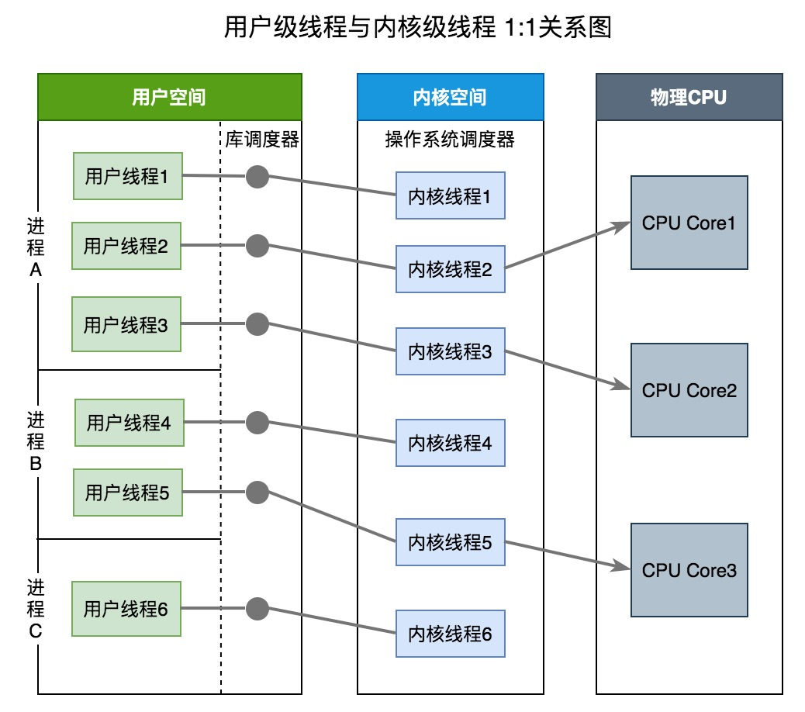
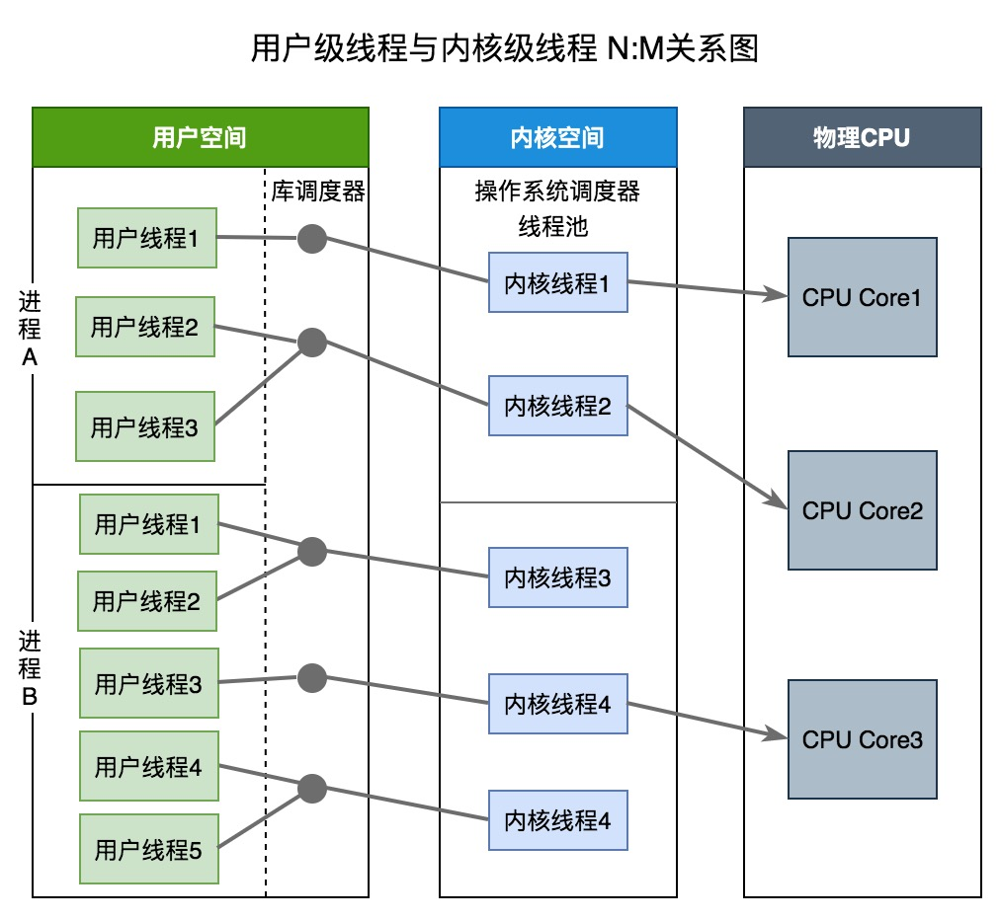

# 调度器

## 用户级线程和内核级线程

| 特性         | 用户级线程                           | 内核级线程                          |
| ---------- | ------------------------------- | ------------------------------ |
| 创建者        | **应用程序**                        | **内核**                         |
| 操作系统是否感知存在 | 否                               | 是                              |
| 开销成本       | **创建成本低，上下文切换成本低**，上下文切换不需要硬件支持 | **创建成本高，上下文切换成本高**，上下文切换需要硬件支持 |
| 如果线程阻塞     | 整个进程将被阻塞。即不能利用多处理来发挥并发优势        | 其他线程可以继续执行,进程不会阻塞              |
| 案例         | Java thread, POSIX threads      | Window Solaris                 |

### 用户级:内核级=1:1

库调度器为每个用户级线程请求一个内核级线程。操作系统的内存管理和调度子系统必须要考虑到数量巨大的用户级线程。操作系统为每个线程创建上下文。进程的每个线程在资源可用时都可以被指派到处理器内核。

内核级线程模型有如下优点：

- 在多处理器系统中，内核能够并行执行同一进程内的多个线程

- 如果进程中的一个线程被阻塞，不会阻塞其他线程，是能够切换同一进程内的其他线程继续执行

- 当一个线程阻塞时，内核根据选择可以运行另一个进程的线程，而用户空间实现的线程中，运行时系统始终运行自己进程中的线程

缺点：

- 线程的创建与删除都需要CPU参与，成本大

### 用户级:内核级=N:1

库调度器从进程的多个线程中选择一个线程，然后该线程和该进程允许的一个内核线程关联起来。内核线程将被操作系统调度器指派到处理器内核。用户级线程是一种”多对一”的线程映射。

用户级线程有如下优点：

- 创建和销毁线程、线程切换代价等线程管理的代价比内核线程少得多, 因为保存线程状态的过程和调用程序都只是本地过程

- 线程能够利用的表空间和堆栈空间比内核级线程多

缺点：

- 线程发生I/O或页面故障引起的阻塞时，如果调用阻塞系统调用则内核由于不知道有多线程的存在，而会阻塞整个进程从而阻塞所有线程, 因此同一进程中只能同时有一个线程在运行

- 资源调度按照进程进行，多个处理机下，同一个进程中的线程只能在同一个处理机下分时复用

### 用户级:内核级=N:M

两级线程模型充分吸收上面两种模型的优点，尽量规避缺点。其线程创建在用户空间中完成，线程的调度和同步也在应用程序中进行。一个应用程序中的多个用户级线程被绑定到一些（小于或等于用户级线程的数目）内核级线程上。

### Go 的线程模型

KSE（内核线程），M（用户线程）。其中用户线程的切换不需要内核支持，而内核线程的切换需要内核支持。**是N:M模型**。

## GMP

### M

- machine的缩写，一个M代表一个用户线程，与内核线程（KSE）总是一一对应,在M的生命周期内，会且仅会与一个KSE产生关联。
- M刚创建之初，就会被加入到**全局M列表**。
- 有些时候，M会被停止（比如找不到可运行G时等），M会被加入到**调度器的空闲M列表**，在需要一个未被使用的M时，调度器会先尝试从该列表中获取。
- 单个Go程序所使用的M的最大值可以设置，初始值是10000
- M的启动和停止：  
  当M的因系统调用而阻塞（更确切的说，是它运行的G进入了系统调用）,运行时系统会把M和关联的P分离开来，如果这个P的可运行队列中还有未被运行的G，那么运行时系统会去**调度器的空闲M列表**中找一个空闲的M,如果找不到就新建，然后这个p关联起来，使得剩下的这些G得以运行。
- go 语言本身的限制：go 程序启动时，会设置 M 的最大数量，默认 10000. 但是内核很难支持这么多的线程数，所以这个限制可以忽略。
  runtime/debug 中的 SetMaxThreads 函数，设置 M 的最大数量
  一个 M 阻塞了，会创建新的 M。

### P

1. processor的缩写，一个P代表执行一个Go代码片段所必需的资源（上下文环境）
2. 调度器会适时的让P与不同的M建立或断开关联，使得P中的可运行G能够及时获得运行时机。(切换M即切换用户线程)
3. 当一个P不再与任何M关联时，且它的可运行G队列为空，会被放入**调度器的空闲P列表**，在需要一个空闲的P关联M时，会从此列表取出。
4. P的包含一个自由G列表，存放一些已经运行完成的G。当增长到一定程度，运行时系统会把其中的部分G转移到**调度器的自由G列表**中。
5. P的状态：
   - Pidel：初始化完成，当前p未与m关联，放入**调度器的空闲P列表**里。  
   - Prunning：当前p已经和某个m关联，m在执行某个g。  
   - Psyscall:当前p中的被运行的g正在被系统调用  
   - Pgcstop:调度器停止调度。runtime正在进行GC(runtime会在gc时试图把全局P列表中的P都处于此种状态)；有串行运行时任务正在等执行-->停止当前M-->释放本地P-->p为pgcstop  
   - Pdead：当前P不再被使用（在调用runtime.GOMAXPROCS减少P数量时，多余的P就处于这种状态）
- 任何非Pdead状态的p都会在运行时系统欲停止调度室被置于Pgcstop，其在启用调度的时候并不会恢复到原有状态，而是处在Pidle（同一起跑线上）
- 任何非Pgcstop的P都可能因为全局P列表的缩小而被认为是多余的，被置于Pdead状态，其可运行G队列都会被转移到**调度器的可运行G队列**，它的自由G列表中的G也会被转移到**调度器的自由G队列**中。
- 数量：由启动时环境变量 GOMAXPROCS 或者是由 runtime 的方法 GOMAXPROCS() 决定。GOMAXPROCS 默认值是CPU的核数。

### G

- goroutine的缩写，一个G代表一个go代码片段，G是对go代码的一种封装.Go的编译器会把go语句变成对内部函数newproc的调用，并把go函数及其参数都作为参数传递给这个函数。
- 新建的G会被首先加入**全局G列表**，初始化之后，会被加入到本地P的可运行队列，还会被存储到本地P的runnext字段，该字段用户存放新鲜出炉的G，以便更早的运行它。如果runnext已经有一个G，那么这个已有G会被踢到**该P的可运行G队列**的末尾。如果该队列已满，那么这个G就只能追加到**调度器的可运行G队列**中。
- 当go语句欲启用一个G的时候，运行时系统会先试图从相应的**P的自由G列表**中获取一个现成的G，来封装这个go函数。仅当获取不到G才有可能创建一个新G。
- 运行时系统会在发现本地P自由G太少，会尝试从调度器的自由G列表中转移一些过来。如果发现本地P的自由G队列满了，会转移一些到**调度器的自由G列表**。
- 所有的**自由G列表** 都是先进后出的。
- 一个G在被启用之后，会先被追加到某个P的可运行G队列中，以等待运行时机。
- G的状态：
  - Gidle（刚被分配，还未初始化）
  - Grunnable(初始化之后，一般在在p本地的可运行队列中等待运行；如果是退出系统调用且能运行的，放入**调度器的可运行G队列**，不能直接运行的G，则放入**调度器的自由G列表**等待被运行)
  - Grunning(正在运行)
  - Gsyscall(正在执行系统调用，转出系统调用状态且能运行的，放入**调度器的可运行G队列**；不能直接运行的G，则放入**调度器的自由G列表**等待被运行)
  - Gwaiting（正在阻塞,被 channel、IO操作、定时器(time.Timer)、time.Sleep等阻塞）,在事件到来之后，G被唤醒，进入 - Grunnable，等待被调用，有些被放入**本地p的可运行G队列**，有些被放入**调度器的本地可运行G队列**，还有些被直接运行（如刚进行网络I/O）。
  - Gdead（正在闲置，被放入**本地p或者调度器的自由G队列**）
  - Gcopystack(表示G的栈正被移动，为啥移动？因为栈的扩展或收缩)
  - Gscan(该状态不能单独存在，和其他状态组合在一起形成一个新状态，在GC扫描时发生)

## Go 程序执行过程

## 调度流程

从上图中可以看出：

- 每个P有个局部队列，局部队列保存待执行的goroutine(流程2)，当M绑定的P的的局部队列已经满了之后就会把goroutine放到全局队列(流程2-1)

- 每个P和一个M绑定，M是真正的执行P中goroutine的实体(流程3)，M从绑定的P中的局部队列获取G来执行

- 当M绑定的P的局部队列为空时，M会从全局队列获取到本地队列来执行G(流程3.1)，当从全局队列中没有获取到可执行的G时候，M会从其他P的局部队列中偷取G来执行(流程3.2)，这种从其他P偷的方式称为**work stealing**

- 当G因系统调用(syscall)阻塞时会阻塞M，此时P会和M解绑即**hand off**，并寻找新的idle的M，若没有idle的M就会新建一个M(流程5.1)。

- 当G因channel或者network I/O阻塞时，不会阻塞M，M会寻找其他runnable的G；当阻塞的G恢复后会重新进入runnable进入P队列等待执行(流程5.3)

总流程图：

## 调度过程中阻塞

* I/O，network

* channel

* 等待锁

* select

* block on syscall （在系统调用上阻塞）

### 用户态阻塞

当goroutine因为channel操作或者network I/O而阻塞时（实际上golang已经用netpoller实现了goroutine网络I/O阻塞不会导致M被阻塞，仅阻塞G），对应的G会被放置到某个wait队列(如channel的waitq)，该G的状态由_Gruning变为_Gwaitting，而M会跳过该G尝试获取并执行下一个G，如果此时没有runnable的G供M运行，那么M将解绑P，并进入sleep状态；当阻塞的G被另一端的G2唤醒时（比如channel的可读/写通知），G被标记为runnable，尝试加入G2所在P的runnext，然后再是P的Local队列和Global队列。

### 系统调用阻塞

当G被阻塞在某个系统调用上时，此时G会阻塞在_Gsyscall状态，M也处于 block on syscall 状态，此时的M可被抢占调度：执行该G的M会与P解绑，而P则尝试与其它idle的M绑定，继续执行其它G。如果没有其它idle的M，但P的Local队列中仍然有G需要执行，则创建一个新的M；当系统调用完成后，G会重新尝试获取一个idle的P进入它的Local队列恢复执行，如果没有idle的P，G会被标记为runnable加入到Global队列。

## goroutine和线程的区别

- 内存占用
  
  - goroutine: 栈内存消耗为2KB, 不够可以自动扩容
  
  - thread: 栈内存消耗1MB

- 创建和销毁
  
  - goroutine: Go runtime负责管理, 用户级, 开销小
  
  - thread: 操作系统管理, 内核级, 开销大

- 切换
  
  - goroutine: 只需保存三个寄存器: Program Counter, Stack Pointer and BP, 时间短200ns
  
  - thread: 需要保存各种寄存器, 时间长1500ns

## 名词解释

- KSE: 内核调度实体，可以被内核的调度器调度的对象，也称为内核级线程，是操作系统内核最小调度单元。

- 系统调用：是操作系统内核提供给用户空间程序的一套标准接口。通过这套接口，用户态程序可以受限地访问硬件设备，从而实现申请系统资源，读写设备，创建新进程等操作。
