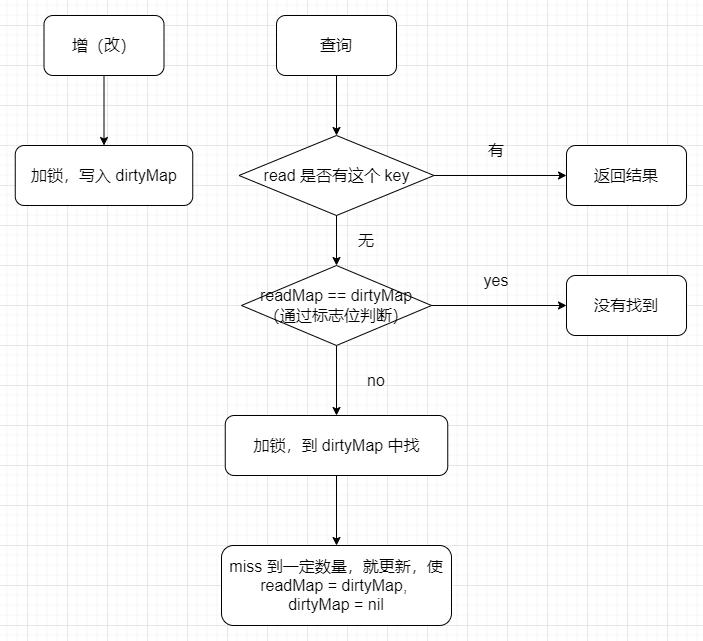

# Map

## 1 Go Map 的底层实现原理

Go 中 Map 是一个指针，指向 hmap 结构体。hmap 包含 buckets(Pointer) 和 oldbuckets(Pointer)，Pointer 指针的地址是 bmap 数组作为 hash 表，散列的方式是将 bmap 连成链表来进行散列。

bmap 就是我们说的 bucket（桶）。一个 bmap 中最多装着 8 个 key，hash 值低 B 位相同的 key 会落入到一个桶内，而 hash 值高 8 位决定 key 在这个桶中的位置。（一个桶最多有8个位置，如果满了就通过链表散列，如果散列的桶过多，就会触发 rehash）。bmap 中 key 和 value 是分开存储的，因为内存需要对齐，所以分开存储可以节省内存空间。

## 2 Go Map 遍历为什么是无序的

* map 在遍历的时候，是从一个随机的 bucket 开始遍历的

* map 在扩容后，会发生 key 的迁移，所以遍历顺序就会改变

## 3 Go Map 为什么是非线程安全的

在大部分场景下，map 只被单个 goroutine 访问，如果要为了线程安全而加锁，那么会让大部分场景为了小部分场景而付出加锁的性能代价。

map 在写的时候会将写标志位置为 1，表示当前 goroutine 正在写，其他 goroutine 在**读/写**之前检查写标志位，如果为1，说明其他 goroutine 正在写，那么就 panic。

如何实现 map 线程安全？

* Map + sync.RWMutex （使用读写锁）

* 使用 Go 提供的 sync.Map

## 4 Go Map 如何查找

* 检查写标志位是否为 1，为 1 则 panic

* 计算 hash 值

* 找到 bucket

* 遍历 bucket 查找

* 返回 key 对应的指针

## 5 Go Map 如何扩容

**扩容时机：**

在向 map 插入 key 是检查扩容条件。

**扩容条件：**

1. 超出负载：map 元素个数 > 6.5 * 桶个数

2. 溢出桶过多：溢出桶个数 >= 桶总数 或 溢出桶个数 >= 2 ^ 15

**扩容机制：**

1. 双倍扩容：针对条件1，新建一个容量为原来两倍的 buckets 数组，将旧数据搬迁过去。使用渐进式扩容，插入删除修改key的时候，进行搬迁。

```go
func growWork(t *maptype, h *hmap, bucket uintptr) {
    // 为了确认搬迁的 bucket 是我们正在使用的 bucket
    // 即如果当前key映射到老的bucket1，那么就搬迁该bucket1。
    evacuate(t, h, bucket&h.oldbucketmask())
    // 如果还未完成扩容工作，则再搬迁一个bucket。
    if h.growing() {
        evacuate(t, h, h.nevacuate)
    }
}
```

2. 等量扩容：针对条件2，不扩大容量，bucket 数量维持不变，将松散的键值对重新排列。

## 6 Go Map 和 sync.Map 区别

### sync.map 源码实现

Go 语言的 `sync.Map` 支持并发读写，采取了 “空间换时间” 的机制，冗余了两个数据结构，分别是：read 和 dirty

```go
type Map struct {
   mu Mutex
   read atomic.Value // readOnly
   dirty map[interface{}]*entry
   misses int
} 
```

| 说明     | 类型                     | 作用                                                      |
| ------ | ---------------------- | ------------------------------------------------------- |
| mu     | Mutex                  | 加锁作用。保护后文的dirty字段                                       |
| read   | atomic.Value           | 存读的数据。因为是atomic.Value类型，只读，所以并发是安全的。实际存的是readOnly的数据结构。 |
| misses | int                    | 计数作用。每次从read中读失败，则计数+1。                                 |
| dirty  | map[interface{}]*entry | 包含最新写入的数据。当misses计数达到一定值，将其赋值给read。                     |

```go
type readOnly struct {
    m  map[interface{}]*entry
    amended bool 
}
```

| 说明      | 类型                     | 作用                                  |
| ------- | ---------------------- | ----------------------------------- |
| m       | map[interface{}]*entry | 单纯的map结构                            |
| amended | bool                   | Map.dirty的数据和这里的 m 中的数据不一样的时候，为true |

```go
type entry struct {
    //可见value是个指针类型，虽然read和dirty存在冗余情况（amended=false），但是由于是指针类型，存储的空间应该不是问题
    p unsafe.Pointer // *interface{}
}
```

这个结构体主要是想说明。虽然前文read和dirty存在冗余的情况，但是由于value都是指针类型，其实存储的空间其实没增加多少。



### 与 map 的对别

**对比原始map：**

和原始map+RWLock的实现并发的方式相比，减少了加锁对性能的影响。它做了一些优化：可以无锁访问read map，而且会优先操作read map，倘若只操作read map就可以满足要求，那就不用去操作write map(dirty)，所以在某些特定场景中它发生锁竞争的频率会远远小于map+RWLock的实现方式

**优点：**

适合读多写少的场景

**缺点：**

写多的场景，会导致 read map 缓存失效，需要加锁，冲突变多，性能急剧下降

### 思考

想一想，mysql加锁，是不是有表级锁、行级锁，前文的sync.RWMutex加锁方式相当于表级锁。

而sync.Map其实也是相当于表级锁，只不过多读写分了两个map，本质还是一样的。
既然这样，那就自然知道优化方向了：就是把锁的粒度尽可能降低来提高运行速度。

思路：对一个大map进行hash，其内部是n个小map，根据key来来hash确定在具体的那个小map中，这样加锁的粒度就变成1/n了。
网上找了下，真有大佬实现了：[点这里](https://link.juejin.cn?target=https%3A%2F%2Fgithub.com%2Forcaman%2Fconcurrent-map "https://github.com/orcaman/concurrent-map")
