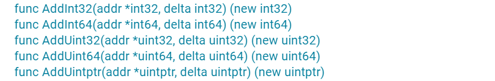
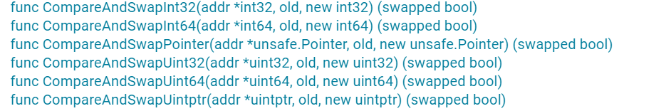
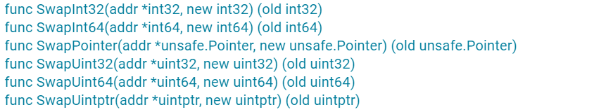
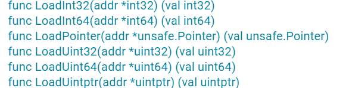
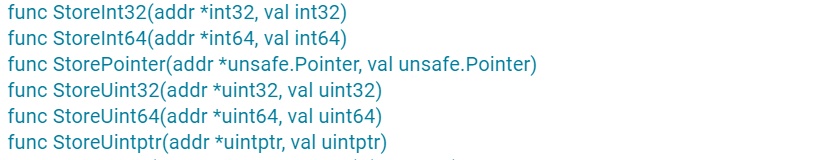
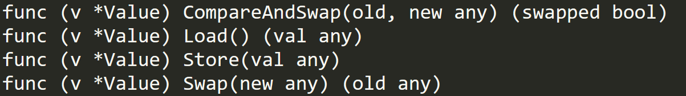

# atomic

Mutex、RWMutex 等并发原语的实现，最底层是通过 atomic 包中的一些原子操作来实现的.

在很多场景中，使用并发原语实现起来比较复杂，而原子操作可以帮助我们更轻松地实现底层的优化.

## atomic 原子操作的应用场景

* 可以使用 atomic 实现自己定义的基本并发原语.

* 如果想要不加锁, 可以考虑atomic. atomic是实现lock-free数据结构的基石.  lock-free 的数据结构可以让我们不使用互斥锁，这样就不会让线程因为等待互斥锁而阻塞休眠，而是让线程保持继续处理的状态. 

lock-free数据结构实现起来比较复杂, 这里是一位微软专家写的一篇经验分享:

[Xbox 360 和 Microsof Windows 的无锁编程注意事项 - Win32 apps | Microsoft Learn](https://learn.microsoft.com/zh-cn/windows/win32/dxtecharts/lockless-programming)

## atomic 提供的方法和一个特殊类型--Value

atomic 为了支持 int32、int64、uint32、uint64、uintptr、Pointer（Add 方法不支持）类型，分别提供了 AddXXX、CompareAndSwapXXX、SwapXXX、LoadXXX、StoreXXX 等方法。不过，你也不要担心，你只要记住了一种数据类型的方法的意义，其它数据类型的方法也是一样的

关于 atomic，还有一个地方你一定要记住，atomic 操作的对象是一个地址，你需要把可寻址的变量的地址作为参数传递给方法，而不是把变量的值传递给方法.

### Add



Add*** 以原子方式将 delta 添加到 *addr 并返回新值.

对于有符号的整数来说，delta 可以是一个负数，相当于减去一个值。对于无符号的整数和 uinptr 类型来说，怎么实现减去一个值呢？毕竟，atomic 并没有提供单独的减法操作. 

Go 官方给出以下操作, 以Uint64为例: (你可以利用计算机补码的规则，把减法变成加法)

要从 x 中减去有符号的正常数值 c，请执行 AddUint64(&x, ^uint64(c-1)).  特别是，要将x减去1，请执行 AddUint64(&x, ^uint64(0)).

### CompareAndSwap (CAS)



这个方法会比较当前 addr 地址里的值是不是 old，如果不等于 old，就返回 false；如果等于 old，就把此地址的值替换成 new 值，返回 true。这就相当于“判断相等才替换”。

如果使用伪代码来表示这个原子操作，代码如下：

```go
if *addr == old {
  *addr = new
  return true
}
return false
```

### Swap



如果不需要比较旧值，只是比较粗暴地替换的话，就可以使用 Swap 方法，它替换后还可以返回旧值，伪代码如下：

```go
old = *addr
*addr = new
return old
```

### Load



Load 方法会取出 addr 地址中的值，即使在多处理器、多核、有 CPU cache 的情况下，这个操作也能保证 Load 是一个原子操作。

### Store



Store 方法会把一个值存入到指定的 addr 地址中，即使在多处理器、多核、有 CPU cache 的情况下，这个操作也能保证 Store 是一个原子操作。别的 goroutine 通过 Load 读取出来，不会看到存取了一半的值。

### Value



[atomic package - sync/atomic - Go Packages](https://pkg.go.dev/sync/atomic#Value)

刚刚说的都是一些比较常见的类型，其实，atomic 还提供了一个特殊的类型：Value。它可以原子地存取对象类型

下面的例子显示了如何使用Value进行定期的程序配置更新并将变化传播给工作程序。

```go
type Config struct {
    NodeName string
    Addr     string
    Count    int32
}

func loadNewConfig() Config {
    return Config{
        NodeName: "北京",
        Addr:     "10.77.95.27",
        Count:    rand.Int31(),
    }
}
func main() {
    var config atomic.Value
    config.Store(loadNewConfig())
    var cond = sync.NewCond(&sync.Mutex{})

    // 设置新的config
    go func() {
        for {
            time.Sleep(time.Duration(5+rand.Int63n(5)) * time.Second)
            config.Store(loadNewConfig())
            cond.Broadcast() // 通知等待着配置已变更
        }
    }()

    go func() {
        for {
            cond.L.Lock()
            cond.Wait()                 // 等待变更信号
            c := config.Load().(Config) // 读取新的配置
            fmt.Printf("new config: %+v\n", c)
            cond.L.Unlock()
        }
    }()

    select {}
}
```

下面的例子显示了如何维护一个可扩展的频繁读取但不频繁更新的数据结构(使用copy-on-write习惯用法).

```go
package main

import (
    "sync"
    "sync/atomic"
)

func main() {
    type Map map[string]string
    var m atomic.Value
    m.Store(make(Map))
    var mu sync.Mutex // used only by writers
    // read function can be used to read the data without further synchronization
    read := func(key string) (val string) {
        m1 := m.Load().(Map)
        return m1[key]
    }
    // insert function can be used to update the data without further synchronization
    insert := func(key, val string) {
        mu.Lock() // synchronize with other potential writers
        defer mu.Unlock()
        m1 := m.Load().(Map) // load current value of the data structure
        m2 := make(Map)      // create a new value
        for k, v := range m1 {
            m2[k] = v // copy all data from the current object to the new one
        }
        m2[key] = val // do the update that we need
        m.Store(m2)   // atomically replace the current object with the new one
        // At this point all new readers start working with the new version.
        // The old version will be garbage collected once the existing readers
        // (if any) are done with it.
    }
    _, _ = read, insert
}
```

## 使用 atomic 实现 lock-free queue

atomic 常常用来实现 Lock-Free 的数据结构，这次我会给你展示一个 Lock-Free queue 的实现。

Lock-Free queue 最出名的就是 Maged M. Michael 和 Michael L. Scott 1996 年发表的论文中的算法，算法比较简单，容易实现，伪代码的每一行都提供了注释，我就不在这里贴出伪代码了，因为我们使用 Go 实现这个数据结构的代码几乎和伪代码一样：

```go
package queue

import (
  "sync/atomic"
  "unsafe"
)
// lock-free的queue
type LKQueue struct {
  head unsafe.Pointer
  tail unsafe.Pointer
}
// 通过链表实现，这个数据结构代表链表中的节点
type node struct {
  value interface{}
  next  unsafe.Pointer
}
func NewLKQueue() *LKQueue {
  n := unsafe.Pointer(&node{})
  return &LKQueue{head: n, tail: n}
}
// 入队
func (q *LKQueue) Enqueue(v interface{}) {
  n := &node{value: v}
  for {
    tail := load(&q.tail)
    next := load(&tail.next)
    if tail == load(&q.tail) { // 尾还是尾
      if next == nil { // 还没有新数据入队
        if cas(&tail.next, next, n) { //增加到队尾
          cas(&q.tail, tail, n) //入队成功，移动尾巴指针
          return
        }
      } else { // 已有新数据加到队列后面，需要移动尾指针
        cas(&q.tail, tail, next)
      }
    }
  }
}
// 出队，没有元素则返回nil
func (q *LKQueue) Dequeue() interface{} {
  for {
    head := load(&q.head)
    tail := load(&q.tail)
    next := load(&head.next)
    if head == load(&q.head) { // head还是那个head
      if head == tail { // head和tail一样
        if next == nil { // 说明是空队列
          return nil
        }
        // 只是尾指针还没有调整，尝试调整它指向下一个
        cas(&q.tail, tail, next)
      } else {
        // 读取出队的数据
        v := next.value
        // 既然要出队了，头指针移动到下一个
        if cas(&q.head, head, next) {
          return v // Dequeue is done.  return
        }
      }
    }
  }
}

// 将unsafe.Pointer原子加载转换成node
func load(p *unsafe.Pointer) (n *node) {
  return (*node)(atomic.LoadPointer(p))
}

// 封装CAS,避免直接将*node转换成unsafe.Pointer
func cas(p *unsafe.Pointer, old, new *node) (ok bool) {
  return atomic.CompareAndSwapPointer(
    p, unsafe.Pointer(old), unsafe.Pointer(new))
}
```

我来给你介绍下这里的主要逻辑。

这个 lock-free 的实现使用了一个辅助头指针（head），头指针不包含有意义的数据，只是一个辅助的节点，这样的话，出队入队中的节点会更简单。

入队的时候，通过 CAS 操作将一个元素添加到队尾，并且移动尾指针。

出队的时候移除一个节点，并通过 CAS 操作移动 head 指针，同时在必要的时候移动尾指针。
