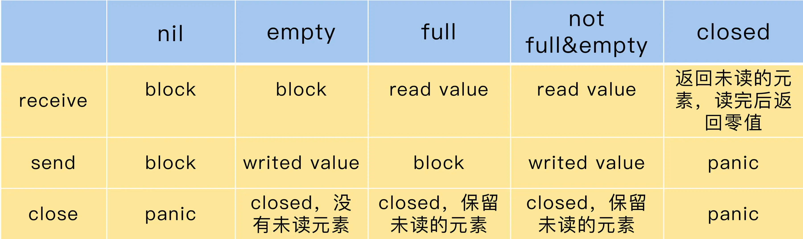

# Channel

## Channel 的应用场景

> Don’t communicate by sharing memory, share memory by communicating.
> 
> Go Proverbs by Rob Pike

“communicate by sharing memory”和“share memory by communicating”是两种不同的并发处理模式。“communicate by sharing memory”是传统的并发编程处理方式，就是指，共享的数据需要用锁进行保护，goroutine 需要获取到锁，才能并发访问数据。

“share memory by communicating”则是类似于 CSP 模型的方式，通过通信的方式，一个 goroutine 可以把数据的“所有权”交给另外一个 goroutine（虽然 Go 中没有“所有权”的概念，但是从逻辑上说，你可以把它理解为是所有权的转移）。

1. 数据交流：当作并发的 buffer 或者 queue，解决生产者 - 消费者问题。多个 goroutine 可以并发当作生产者（Producer）和消费者（Consumer）。

2. 数据传递：一个 goroutine 将数据交给另一个 goroutine，相当于把数据的拥有权 (引用) 托付出去。

3. 信号通知：一个 goroutine 可以将信号 (closing、closed、data ready 等) 传递给另一个或者另一组 goroutine 。

4. 任务编排：可以让一组 goroutine 按照一定的顺序并发或者串行的执行，这就是编排的功能。

5. 锁：利用 Channel 也可以实现互斥锁的机制。

## Channel 的基本用法

Channel的类型分为只能接收、只能发送、既可以接收又可以发送三种类型。

```go
chan string          // 可以发送接收string
chan<- struct{}      // 只能发送struct{}
<-chan int           // 只能从chan接收int
```

> 简记方法:
> 
> 这个箭头总是射向左边的，元素类型总在最右边。如果箭头指向 chan，就表示可以往 chan 中塞数据；如果箭头远离 chan，就表示 chan 会往外吐数据。

“<-”有个规则，总是尽量和左边的 chan 结合.

```go
chan<- （chan int） // <- 和第一个chan结合
chan<- （<-chan int） // 第一个<-和最左边的chan结合，第二个<-和左边第二个chan结合
<-chan （<-chan int） // 第一个<-和最左边的chan结合，第二个<-和左边第二个chan结合 
chan (<-chan int) // 因为括号的原因，<-和括号内第一个chan结合
```

通过 make，我们可以初始化一个 chan，未初始化的 chan 的零值是 nil。你可以设置它的容量，我们把这样的 chan 叫做 buffered chan；如果没有设置，它的容量是 0，我们把这样的 chan 叫做 unbuffered chan。

如果 chan 中还有数据，那么，从这个 chan 接收数据的时候就不会阻塞，如果 chan 还未满（“满”指达到其容量），给它发送数据也不会阻塞，否则就会阻塞。**unbuffered chan 只有读写都准备好之后才不会阻塞**，这也是很多使用 unbuffered chan 时的常见 Bug。

**nil 是 chan 的零值，是一种特殊的 chan，对值是 nil 的 chan 的发送接收调用者总是会阻塞。**

### 1. 发送数据

```go
ch <- 2000
```

### 2. 接收数据

```go
x := <-ch // 把接收的一条数据赋值给变量x
foo(<-ch) // 把接收的一个的数据作为参数传给函数
<-ch // 丢弃接收的一条数据
x, ok <-ch
```

这里的 ch 类型是 chan T(发送接收) 或者 <-chan T(只接收)

接收数据时，还可以返回两个值。第一个值是返回的 chan 中的元素，很多人不太熟悉的是第二个值。第二个值是 bool 类型，代表是否成功地从 chan 中读取到一个值

如果第二个参数是 false，代表chan 已经被 close 而且 chan 中没有缓存的数据，这个时候，第一个值是零值。

所以，如果从 chan 读取到一个零值，可能是 sender 真正发送的零值，也可能是 closed 的并且没有缓存元素产生的零值。

还有一个值得注意的点是，**只要一个 chan 还有未读的数据，即使把它 close 掉，你还是可以继续把这些未读的数据消费完，之后才是读取零值数据。**

### 3. 其他操作

Go 内建的函数 close、cap、len 都可以操作 chan 类型：close 会把 chan 关闭掉，cap 返回 chan 的容量，len 返回 chan 中缓存的还未被取走的元素数量。

send 和 recv 都可以作为 select 语句的 case clause，如下面的例子

```go
func main() {
    var ch = make(chan int, 10)
    for i := 0; i < 10; i++ {
        select {
        case ch <- i:
        case v := <-ch:
            fmt.Println(v)
        }
    }
}
```

chan 还可以应用于 for-range 语句中，比如：

```go
for v := range ch {
    fmt.Println(v)
}
```

或者是忽略读取的值，只是清空 chan：

```go
for range ch {
}
```

### 4. 有方向的 Channel

```go
var bidirectionalChan chan string // can read from, write to and close()
var receiveOnlyChan <-chan string // can read from, but cannot write to or close()
var sendOnlyChan chan<- string    // cannot read from, but can write to and close()
```

如果希望创建的 channel 其他 goroutine 只能读，并且不能关闭。那么就需要用到 Directional Channel.

标准库中的 ticker 和 timer 的实现：

```go
type Ticker struct {
        C <-chan Time // The channel on which the ticks are delivered.
        // Has unexported fields.
}
    A Ticker holds a channel that delivers `ticks' of a clock at intervals.

func After(d Duration) <-chan Time
    After waits for the duration to elapse and then sends the current time on
    the returned channel. It is equivalent to NewTimer(d).C. The underlying
    Timer is not recovered by the garbage collector until the timer fires. If
    efficiency is a concern, use NewTimer instead and call Timer.Stop if the
    timer is no longer needed.
```

### 5. 监听的 channel 被关闭会触发 select

如果 select 外有循环，那么会一直触发，不是只触发一次。

golang中的select用于选择一个可用的chan，没有default情况下是堵塞的收发，有default情况下是非堵塞收发。case如果监听的是receive的channel, 那么channel在关闭的时候, 就会触发select.

```go
func main() {
    ch := make(chan struct{})
    go func() {
        close(ch)
    }()

    for {
        time.Sleep(1 * time.Second)
        select {
        case v, ok := <-ch:
            fmt.Printf("value: %v; closed or not: %v", v, ok)
        }
    }
}
```

执行结果

```go
value: {}; closed or not(false is closed): false
value: {}; closd or not(false is closed): false
value: {}; closed or not(false is closed): false
value: {}; closed or not(false is closed): false
...
...
```

### 6. 如果 channel 关闭，for-range 循环会退出

```go
// 测试 for range 遍历 channel 的时候，channel 关闭，for-range 是否会退出
func test() {
    ch := make(chan interface{}, 1)
    go func() {
        for i := 0; i < 10; i++ {
            ch <- i
        }
        // close(ch)
        close(ch)
    }()

    go func() {
        for v := range ch {
            fmt.Println(v)
        }
        fmt.Println("退出")
    }()

    select {
    case <- time.After(2 * time.Second):
        return
    }
}

func Test(t *testing.T) {
    test()
}
```

close(ch) 之后的结果：

```bash
.
.
退出
```

没有close(ch)：

```bash
.
.
```

## 使用channel常犯的错误

**使用 Channel 最常见的错误是 panic 和 goroutine 泄漏。**

首先，我们来总结下会 panic 的情况，总共有 3 种：

1. close 为 nil 的 chan；

2. send 已经 close 的 chan；

3. close 已经 close 的 chan。

goroutine 泄漏的问题也很常见，下面的代码也是一个实际项目中的例子：

```go
func process(timeout time.Duration) bool {
    ch := make(chan bool)

    go func() {
        // 模拟处理耗时的业务
        time.Sleep((timeout + time.Second))
        ch <- true // block
        fmt.Println("exit goroutine")
    }()
    select {
    case result := <-ch:
        return result
    case <-time.After(timeout):
        return false
    }
}
```

在这个例子中，process 函数会启动一个 goroutine，去处理需要长时间处理的业务，处理完之后，会发送 true 到 chan 中，目的是通知其它等待的 goroutine，可以继续处理了。

我们来看一下第 10 行到第 15 行，主 goroutine 接收到任务处理完成的通知，或者超时后就返回了。这段代码有问题吗？

如果发生超时，process 函数就返回了，这就会导致 unbuffered 的 chan 从来就没有被读取。我们知道，unbuffered chan 必须等 reader 和 writer 都准备好了才能交流，否则就会阻塞。超时导致未读，结果就是子 goroutine 就阻塞在第 7 行永远结束不了，进而导致 goroutine 泄漏。

解决这个 Bug 的办法很简单，就是将 unbuffered chan 改成容量为 1 的 chan，这样第 7 行就不会被阻塞了。



## 不同场景下使用Channel的方法

Go 的开发者极力推荐使用 Channel，不过，这两年，大家意识到，Channel 并不是处理并发问题的“银弹”，有时候使用并发原语更简单，而且不容易出错。所以，我给你提供一套选择的方法:

* 共享资源的并发访问使用传统并发原语；

* 复杂的任务编排和消息传递使用 Channel；

* 消息通知机制使用 Channel，除非只想 signal 一个 goroutine，才使用 Cond；

* 简单等待所有任务的完成用 WaitGroup，也有 Channel 的推崇者用 Channel，都可以；

* 需要和 Select 语句结合，使用 Channel；

* 需要和超时配合时，使用 Channel 和 Context。

## 两道思考题

* 有一道经典的使用 Channel 进行任务编排的题，你可以尝试做一下：有四个 goroutine，编号为 1、2、3、4。每秒钟会有一个 goroutine 打印出它自己的编号，要求你编写一个程序，让输出的编号总是按照 1、2、3、4、1、2、3、4、……的顺序打印出来。

* chan T 是否可以给 <- chan T 和 chan<- T 类型的变量赋值？反过来呢？

```go
func channel_2() {
    chanArr := []chan struct{}{
        make(chan struct{}),
        make(chan struct{}),
        make(chan struct{}),
        make(chan struct{}),
    }

    for i := 0; i < 4; i++ {
        go func(i int) {
            for {
                // 监听第i个channel, 没有值的时候阻塞住了
                <-chanArr[i] 
                fmt.Printf("I am %d\n", i)
                time.Sleep(1 * time.Second)
                // 往下一个应该被执行的goroutine监听的channel中传值, 让下一个goroutine由阻塞变为正在执行
                // 因为第3个goroutine应该唤醒第0个goroutine, 所以应该是一个类似的环路.
                chanArr[(i+1)%4] <- struct{}{}
            }
        }(i)
    }

    // 唤醒第0个goroutine
    chanArr[0] <- struct{}{}
    select {
    case <- time.After(12 * time.Second):
        return
    }
}
```

## 使用反射操作 Channel

select 语句可以处理 chan 的 send 和 recv，send 和 recv 都可以作为 case clause。如果我们同时处理两个 chan，就可以写成下面的样子：

```go
select { 
    case v := <-ch1: 
        fmt.Println(v) 
    case v := <-ch2: 
        fmt.Println(v) 
}
```

如果需要处理三个 chan，你就可以再添加一个 case clause，用它来处理第三个 chan。可是，如果要处理 100 个 chan 呢？一万个 chan 呢？或者是，chan 的数量在编译的时候是不定的，在运行的时候需要处理一个 slice of chan，这个时候，也没有办法在编译前写成字面意义的 select。那该怎么办？

这个时候，就要“祭”出我们的反射大法了。

通过 reflect.Select 函数，你可以将一组运行时的 case clause 传入，当作参数执行。Go 的 select 是伪随机的，它可以在执行的 case 中随机选择一个 case，并把选择的这个 case 的索引（chosen）返回，如果没有可用的 case 返回，会返回一个 bool 类型的返回值，这个返回值用来表示是否有 case 成功被选择。如果是 recv case，还会返回接收的元素。Select 的方法签名如下：

```go
func Select(cases []SelectCase) (chosen int, recv Value, recvOK bool)
```

recvOK = false 即 channel 被关闭

下面，我来借助一个例子，来演示一下，动态处理两个 chan 的情形。因为这样的方式可以动态处理 case 数据，所以，你可以传入几百几千几万的 chan，这就解决了不能动态处理 n 个 chan 的问题。

```go
func channel_4() {
    var ch1 = make(chan int, 10)
    var ch2 = make(chan int, 10)

    // 创建SelectCase
    var cases = createCases(ch1, ch2)
    ch1 <- 10
    ch2 <- 10 

    go func () {
        time.Sleep(1 * time.Second)
        close(ch1)
        close(ch2)
    }()

    for len(cases) > 0 {
        chosen, resv, ok := reflect.Select(cases)
        if !ok {
            // 此通道关闭并且它的缓冲队列中为空
            cases = append(cases[:chosen], cases[chosen+1:]...)
            fmt.Printf("%d closed\n", chosen)
            continue
        }

        time.Sleep(200 * time.Millisecond)
        fmt.Println(chosen, resv, ok)
    }
}

func createCases(chs ...chan int) []reflect.SelectCase {
    var cases []reflect.SelectCase

    // 创建receive case, 与监听channel数据一样
    for _, ch := range chs {
        cases = append(cases, reflect.SelectCase{
            Dir:  reflect.SelectRecv,
            Chan: reflect.ValueOf(ch),
        })
    }

    return cases
}

func Test_channel_4(t *testing.T) {
    channel_4()
}
```

运行结果

```bash
=== RUN   Test_channel_4
0 10 true
1 10 true
0 closed
0 closed
--- PASS: Test_channel_4 (1.00s)
```

## 典型的应用场景

### 1. 消息交流

从 chan 的内部实现看，它是以一个循环队列的方式存放数据，所以，它有时候也会被当成线程安全的队列和 buffer 使用。一个 goroutine 可以安全地往 Channel 中塞数据，另外一个 goroutine 可以安全地从 Channel 中读取数据，goroutine 就可以安全地实现信息交流了。

我们来看几个例子。

第一个例子是 worker 池的例子。Marcio Castilho 在 [使用 Go 每分钟处理百万请求](http://marcio.io/2015/07/handling-1-million-requests-per-minute-with-golang/)) 这篇文章中，就介绍了他们应对大并发请求的设计。他们将用户的请求放在一个 chan Job 中，这个 chan Job 就相当于一个待处理任务队列。除此之外，还有一个 chan chan Job 队列，用来存放可以处理任务的 worker 的缓存队列。

第二个例子是 etcd 中的 node 节点的实现，包含大量的 chan 字段，比如 recvc 是消息处理的 chan，待处理的 protobuf 消息都扔到这个 chan 中，node 有一个专门的 run goroutine 负责处理这些消息。

### 2. 数据传递

有 4 个 goroutine，编号为 1、2、3、4。每秒钟会有一个 goroutine 打印出它自己的编号，要求你编写程序，让输出的编号总是按照 1、2、3、4、1、2、3、4……这个顺序打印出来。

为了实现顺序的数据传递，我们可以定义一个令牌的变量，谁得到令牌，谁就可以打印一次自己的编号，同时将令牌传递给下一个 goroutine，我们尝试使用 chan 来实现，可以看下下面的代码。

```go
type Token struct{}

func newWorker(id int, ch chan Token, nextCh chan Token) {
    for {
        token := <-ch         // 取得令牌, 从ch中接收信息
        fmt.Println((id + 1)) // id从1开始
        time.Sleep(time.Second)
        nextCh <- token    // 将接收的信息发送到nextCh
    }
}
func main() {
    chs := []chan Token{make(chan Token), make(chan Token), make(chan Token), make(chan Token)}

    // 创建4个worker
    for i := 0; i < 4; i++ {
        // 监听chs[i], 向chs[(i+1%4]发送信息
        go newWorker(i, chs[i], chs[(i+1)%4])
    }

    //首先把令牌交给第一个worker
    chs[0] <- struct{}{}

    select {}
}
```

首先，我们定义一个令牌类型（Token），接着定义一个创建 worker 的方法，这个方法会从它自己的 chan 中读取令牌。哪个 goroutine 取得了令牌，就可以打印出自己编号，因为需要每秒打印一次数据，所以，我们让它休眠 1 秒后，再把令牌交给它的下家。

这类场景有一个特点，就是当前持有数据的 goroutine 都有一个信箱，信箱使用 chan 实现，goroutine 只需要关注自己的信箱中的数据，处理完毕后，就把结果发送到下一家的信箱中。

### 3. 信号通知

chan 类型有这样一个特点：chan 如果为空，那么，receiver 接收数据的时候就会阻塞等待，直到 chan 被关闭或者有新的数据到来。利用这个机制，我们可以实现 wait/notify 的设计模式。

传统的并发原语 Cond 也能实现这个功能。但是，Cond 使用起来比较复杂，容易出错，而使用 chan 实现 wait/notify 模式，就方便多了。

channel 在被关闭时， select 能够感知到。

举个例子

```go
func test() {
    ch := make(chan struct{})
    go func() {
        close(ch)
    }()

    for {
        time.Sleep(1 * time.Second)
        select {
        case v, ok := <-ch:
            fmt.Printf("value: %v; closed or not(false is closed): %v\n", v, ok)
        }
    }
}

func main() {
    test()
}
```

输出结果：

```shell
value: {}; closed or not(false is closed): false
value: {}; closed or not(false is closed): false
value: {}; closed or not(false is closed): false
...
```

select 的时候，如果监听的 channel 被关闭，会始终触发select条件。

### 4. 锁

使用 chan 也可以实现互斥锁。

在 chan 的内部实现中，就有一把互斥锁保护着它的所有字段。从外在表现上，chan 的发送和接收之间也存在着 happens-before 的关系，保证元素放进去之后，receiver 才能读取到（关于 happends-before 的关系，是指事件发生的先后顺序关系，我会在下一讲详细介绍，这里你只需要知道它是一种描述事件先后顺序的方法）。

要想使用 chan 实现互斥锁，至少有两种方式。一种方式是先初始化一个 capacity 等于 1 的 Channel，然后再放入一个元素。这个元素就代表锁，谁取得了这个元素，就相当于获取了这把锁。另一种方式是，先初始化一个 capacity 等于 1 的 Channel，它的“空槽”代表锁，谁能成功地把元素发送到这个 Channel，谁就获取了这把锁。

这是使用 Channel 实现锁的两种不同实现方式，我重点介绍下第一种。理解了这种实现方式，第二种方式也就很容易掌握了，我就不多说了。

```go
// 用channel来实现锁
// 一种方式是先初始化一个 capacity 等于 1 的 Channel，然后再放入一个元素。这个元素就代表锁，谁取得了这个元素，就相当于获取了这把锁。
// 另一种方式是，先初始化一个 capacity 等于 1 的 Channel，它的“空槽”代表锁，谁能成功地把元素发送到这个 Channel，谁就获取了这把锁。
// 这里实现第一种方式

type mutex struct {
    ch chan struct{}
}

// 初始化锁
func NewMutex() *mutex {
    mu := &mutex{ch: make(chan struct{}, 1)}
    mu.ch <- struct{}{}
    return mu
}

// 获得锁
func (mu *mutex) Lock() {
    <-mu.ch
}

// 释放锁
func (mu *mutex) UnLock() {
    select {
    case mu.ch <- struct{}{}:
    default:
        panic("释放了没有被lock的锁")
    }
}

// 尝试获取锁
func (mu *mutex) TryLock() bool {
    select {
    case <-mu.ch:
        return true
    default:
        return false
    }
}

// 锁是否已经被持有
func (mu *mutex) IsLocked() bool {
    return len(mu.ch) == 0
}

// 加入持有锁不得超时的设置, 返回加锁是否成功
func (mu *mutex) LockTimeout(duration time.Duration) bool {
    timer := time.NewTimer(duration)
    select {
    case <-timer.C:
        return false
    case <-mu.ch:
        timer.Stop()
        return true
    }
}

func Test_channel(t *testing.T) {
    m := NewMutex()
    ok := m.TryLock()
    fmt.Printf("locked v %v\n", ok)
    ok = m.LockTimeout(1 * time.Second)
    fmt.Printf("locked v %v\n", ok)
    m.UnLock()
}
```

### 5. 任务编排

前面所说的消息交流的场景是一个特殊的任务编排的场景，这个“击鼓传花”的模式也被称为流水线模式。

在第 6 讲，我们学习了 WaitGroup，我们可以利用它实现等待模式：启动一组 goroutine 执行任务，然后等待这些任务都完成。其实，我们也可以使用 chan 实现 WaitGroup 的功能。这个比较简单，我就不举例子了，接下来我介绍几种更复杂的编排模式。

这里的编排既指安排 goroutine 按照指定的顺序执行，也指多个 chan 按照指定的方式组合处理的方式。goroutine 的编排类似“击鼓传花”的例子，我们通过编排数据在 chan 之间的流转，就可以控制 goroutine 的执行。接下来，我来重点介绍下多个 chan 的编排方式，总共 5 种，分别是 `Or-Done 模式、扇入模式、扇出模式、Stream 和 map-reduce`。

#### Or-Done 模式

我们会使用“信号通知”实现某个任务执行完成后的通知机制，在实现时，我们为这个任务定义一个类型为 chan struct{}类型的 done 变量，等任务结束后，我们就可以 close 这个变量，然后，其它 receiver 就会收到这个通知。(详情见Channel的基本用法--4.其他)

这是有一个任务的情况，如果有多个任务，只要有任意一个任务执行完，我们就想获得这个信号，这就是 Or-Done 模式。

比如，你发送同一个请求到多个微服务节点，只要任意一个微服务节点返回结果，就算成功，这个时候，就可以参考下面的实现：

```go
func or(channels ...<-chan interface{}) <-chan interface{} {
    //特殊情况，只有0个或者1个
    switch len(channels) {
    case 0:
        return nil
    case 1:
        return channels[0]
    }

    orDone := make(chan interface{})
    go func() {
        // 收到微服务节点的信号，则关闭。
        defer close(orDone)
        // 利用反射构建SelectCase
        var cases []reflect.SelectCase
        for _, c := range channels {
            cases = append(cases, reflect.SelectCase {
                Dir:  reflect.SelectRecv,
                Chan: reflect.ValueOf(c),
            })
        }

        // 随机选择一个可用的case, 只要有任意一个channel被关闭就会收到信号
        reflect.Select(cases)
    }()

    return orDone
}
```

#### 扇入模式

扇入借鉴了数字电路的概念，它定义了单个逻辑门能够接受的数字信号输入最大量的术语。一个逻辑门可以有多个输入，一个输出。

在软件工程中，模块的扇入是指有多少个上级模块调用它。而对于我们这里的 Channel 扇入模式来说，就是指有多个源 Channel 输入、一个目的 Channel 输出的情况。扇入比就是源 Channel 数量比 1。

每个源 Channel 的元素都会发送给目标 Channel，相当于目标 Channel 的 receiver 只需要监听目标 Channel，就可以接收所有发送给源 Channel 的数据。

扇入模式也可以使用反射、递归，或者是用最笨的每个 goroutine 处理一个 Channel 的方式来实现。这里我列举下递归和反射的方式，帮你加深一下对这个技巧的理解。反射的代码比较简短，易于理解，主要就是构造出 SelectCase slice，然后传递给 reflect.Select 语句。

```go
func fanInReflect(chans ...<-chan interface{}) <-chan interface{} {
    out := make(chan interface{})
    go func() {
        defer close(out)
        // 构造SelectCase slice
        var cases []reflect.SelectCase
        for _, c := range chans {
            cases = append(cases, reflect.SelectCase{
                Dir:  reflect.SelectRecv,
                Chan: reflect.ValueOf(c),
            })
        }

        // 循环，从cases中选择一个可用的
        for len(cases) > 0 {
            i, v, ok := reflect.Select(cases)
            if !ok { // 此channel已经close
                cases = append(cases[:i], cases[i+1:]...)
                continue
            }
            out <- v.Interface()    // 将channel中的值传给out
        }
    }()
    return out
}
```

#### 扇出模式

有扇入模式，就有扇出模式，扇出模式是和扇入模式相反的。

扇出模式只有一个输入源 Channel，有多个目标 Channel，扇出比就是 1 比目标 Channel 数的值，经常用在设计模式中的观察者模式中（观察者设计模式定义了对象间的一种一对多的组合关系。这样一来，一个对象的状态发生变化时，所有依赖于它的对象都会得到通知并自动刷新）。在观察者模式中，数据变动后，多个观察者都会收到这个变更信号。

下面是一个扇出模式的实现。从源 Channel 取出一个数据后，依次发送给目标 Channel。在发送给目标 Channel 的时候，可以同步发送，也可以异步发送：

```go
func fanOut(ch <-chan interface{}, out []chan interface{}, async bool) {
    go func() {
        defer func() { //退出时关闭所有的输出chan
            for i := 0; i < len(out); i++ {
                close(out[i])
            }
        }()

        for v := range ch { // 从输入chan中读取数据
            v := v
            for i := 0; i < len(out); i++ {
                i := i
                if async { //异步
                    go func() {
                        out[i] <- v // 放入到输出chan中,异步方式
                    }()
                } else {
                    out[i] <- v // 放入到输出chan中，同步方式
                }
            }
        }
    }()
}
```

#### map-reduce

map-reduce 是一种处理数据的方式，最早是由 Google 公司研究提出的一种面向大规模数据处理的并行计算模型和方法，开源的版本是 hadoop，前几年比较火。

不过，我要讲的并不是分布式的 map-reduce，而是单机单进程的 map-reduce 方法。

map-reduce 分为两个步骤，第一步是映射（map），处理队列中的数据，第二步是规约（reduce），把列表中的每一个元素按照一定的处理方式处理成结果，放入到结果队列中。

我们先来看下 map 函数的处理逻辑: 

```go
func mapChan(in <-chan interface{}, fn func(interface{}) interface{}) <-chan interface{} {
    out := make(chan interface{}) //创建一个输出chan
    if in == nil { // 异常检查
        close(out)
        return out
    }

    go func() { // 启动一个goroutine,实现map的主要逻辑
        defer close(out)
        for v := range in { // 从输入chan读取数据，执行业务操作，也就是map操作
            out <- fn(v)
        }
    }()

    return out
}
```

reduce 函数的处理逻辑如下：

```go
func reduce(in <-chan interface{}, fn func(r, v interface{}) interface{}) interface{} {
    if in == nil { // 异常检查
        return nil
    }

    out := <-in // 先读取第一个元素
    for v := range in { // 实现reduce的主要逻辑
        out = fn(out, v)
    }

    return out
}
```

我们可以写一个程序，这个程序使用 map-reduce 模式处理一组整数，map 函数就是为每个整数乘以 10，reduce 函数就是把 map 处理的结果累加起来：

```go
// 生成一个数据流
func asStream(done <-chan struct{}) <-chan interface{} {
    s := make(chan interface{})
    values := []int{1, 2, 3, 4, 5}
    go func() {
        defer close(s)
        for _, v := range values { // 从数组生成
            select {
            case <-done:
                return
            case s <- v:
            }
        }
    }()
    return s
}

func main() {
    in := asStream(nil)

    // map操作: 乘以10
    mapFn := func(v interface{}) interface{} {
        return v.(int) * 10
    }

    // reduce操作: 对map的结果进行累加
    reduceFn := func(r, v interface{}) interface{} {
        return r.(int) + v.(int)
    }

    sum := reduce(mapChan(in, mapFn), reduceFn) //返回累加结果
    fmt.Println(sum)
}
```
