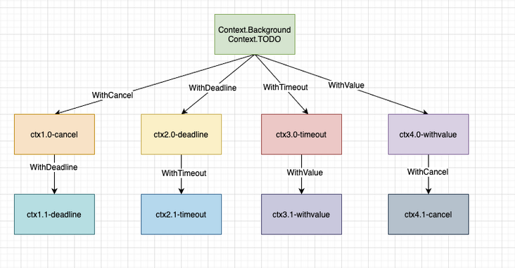
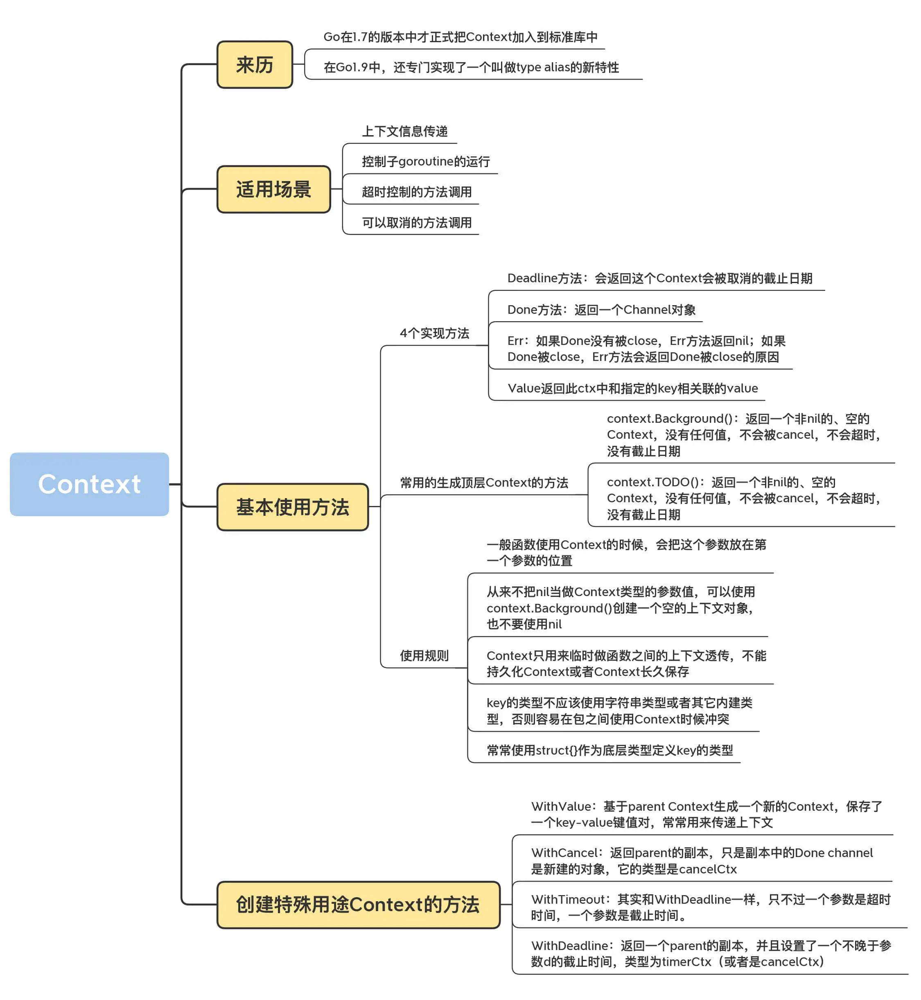

# Context

## 基本使用方法

```go
type Context interface {
    Deadline() (deadline time.Time, ok bool)
    Done() <-chan struct{}
    Err() error
    Value(key interface{}) interface{}
}
```

**Deadline** 方法会返回这个 Context 被取消的截止日期。如果没有设置截止日期，ok 的值是 false。后续每次调用这个对象的 Deadline 方法时，都会返回和第一次调用相同的结果。

**Done** 方法返回一个 Channel 对象。在 Context 被取消时，此 Channel 会被 close，如果没被取消，可能会返回 nil。后续的 Done 调用总是返回相同的结果。当 Done 被 close 的时候，你可以通过 ctx.Err 获取错误信息。Done 这个方法名其实起得并不好，因为名字太过笼统，不能明确反映 Done 被 close 的原因，因为 cancel、timeout、deadline 都可能导致 Done 被 close，不过，目前还没有一个更合适的方法名称。

关于 Done 方法，你必须要记住的知识点就是：如果 Done 没有被 close，Err 方法返回 nil；如果 Done 被 close，Err 方法会返回 Done 被 close 的原因。

**Value** 返回此 ctx 中和指定的 key 相关联的 value。

Context 中实现了 2 个常用的生成顶层 Context 的方法。

* context.Background()：返回一个非 nil 的、空的 Context，没有任何值，不会被 cancel，不会超时，没有截止日期。一般用在主函数、初始化、测试以及创建根 Context 的时候。

* context.TODO()：返回一个非 nil 的、空的 Context，没有任何值，不会被 cancel，不会超时，没有截止日期。当你不清楚是否该用 Context，或者目前还不知道要传递一些什么上下文信息的时候，就可以使用这个方法。

```go
var (
    background = new(emptyCtx)
    todo       = new(emptyCtx)
)

func Background() Context {
    return background
}

func TODO() Context {
    return todo
}
```

在使用 Context 的时候，有一些约定俗成的规则。

1. 一般函数使用 Context 的时候，会把这个参数放在第一个参数的位置。

2. 从来不把 nil 当做 Context 类型的参数值，可以使用 context.Background() 创建一个空的上下文对象，也不要使用 nil。

3. Context 只用来临时做函数之间的上下文透传，不能持久化 Context 或者把 Context 长久保存。把 Context 持久化到数据库、本地文件或者全局变量、缓存中都是错误的用法。

4. key 的类型不应该是字符串类型或者其它内建类型，否则容易在包之间使用 Context 时候产生冲突。使用 WithValue 时，key 的类型应该是自己定义的类型。

5. 常常使用 struct{}作为底层类型定义 key 的类型。对于 exported key 的静态类型，常常是接口或者指针。这样可以尽量减少内存分配。

## 创建特殊用途的Context的方法

WithValue, WithCancel, WithTimeout, WithDeadline.

```go
func WithCancel(parent Context) (ctx Context, cancel CancelFunc)
func WithDeadline(parent Context, deadline time.Time) (Context, CancelFunc)
func WithTimeout(parent Context, timeout time.Duration) (Context, CancelFunc)
func WithValue(parent Context, key, val interface{}) Context
```



## WithValue

```go
type valueCtx struct {
    Context
    key, val interface{}
}
```

> 携带数据

我们日常在业务开发中都希望能有一个`trace_id`能串联所有的日志，这就需要我们打印日志时能够获取到这个`trace_id`，在`python`中我们可以用`gevent.local`来传递，在`java`中我们可以用`ThreadLocal`来传递，在`Go`语言中我们就可以使用`Context`来传递，通过使用`WithValue`来创建一个携带`trace_id`的`context`，然后不断透传下去，打印日志时输出即可，来看使用例子：

```go
const (
    KEY = "trace_id"
)

func NewRequestID() string {
    return strings.Replace(uuid.New().String(), "-", "", -1)
}

func NewContextWithTraceID() context.Context {
    ctx := context.WithValue(context.Background(), KEY,NewRequestID())
    return ctx
}

func PrintLog(ctx context.Context, message string)  {
    fmt.Printf("%s|info|trace_id=%s|%s",time.Now().Format("2006-01-02
 15:04:05") , GetContextValue(ctx, KEY), message)
}

func GetContextValue(ctx context.Context,k string)  string {
    v, ok := ctx.Value(k).(string)
    if !ok{
        return ""
    }
    return v
}

func ProcessEnter(ctx context.Context) {
    PrintLog(ctx, "Golang梦工厂")
}

func main()  {
    // 将NewContextWithTraceID的ctx传递给processEnter
    ProcessEnter(NewContextWithTraceID())
}
```

```go
2021-10-31 15:13:25|info|trace_id=7572e295351e478e91b1ba0fc37886c0|Golang梦工厂
Process finished with the exit code 0
```

使用WithValue的四个注意事项:

- 不建议使用`context`值传递关键参数，关键参数应该显示的声明出来，不应该隐式处理，`context`中最好是携带签名、`trace_id`这类值。
- 因为携带`value`也是`key`、`value`的形式，为了避免`context`因多个包同时使用`context`而带来冲突，`key`建议采用内置类型。
- 上面的例子我们获取`trace_id`是直接从当前`ctx`获取的，实际我们也可以获取父`context`中的`value`，在获取键值对是，我们先从当前`context`中查找，没有找到会在从父`context`中查找该键对应的值直到在某个父`context`中返回 `nil` 或者查找到对应的值。
- `context`传递的数据中`key`、`value`都是`interface`类型，这种类型编译期无法确定类型，所以不是很安全，所以在类型断言时别忘了保证程序的健壮性。

## WithCancel

日常业务开发中我们往往为了完成一个复杂的需求会开多个`gouroutine`去做一些事情，这就导致我们会在一次请求中开了多个`goroutine`确无法控制他们，这时我们就可以使用`withCancel`来衍生一个`context`传递到不同的`goroutine`中，当我想让这些`goroutine`停止运行，就可以调用`对应的cancel`来进行取消。

### 举一个例子

```go
func main()  {
    ctx,cancel := context.WithCancel(context.Background())
    go Speak(ctx)
    time.Sleep(10*time.Second)
    cancel()
    time.Sleep(1*time.Second)
}

func Speak(ctx context.Context)  {
    for range time.Tick(time.Second){
        select {
        case <- ctx.Done():
            fmt.Println("我要闭嘴了")
            return
        default:
            fmt.Println("balabalabalabala")
        }
    }
}
```

执行结果

```bash
balabalabalabala
....省略
balabalabalabala
我要闭嘴了
```

我们使用`withCancel`创建一个基于`Background`的ctx，然后启动一个讲话程序，每隔1s说一话，`main`函数在10s后执行`cancel`，那么`speak`检测到取消信号就会退出。

### 内部实现

WithCancel 方法返回 parent 的副本，只是副本中的 Done Channel 是新建的对象，它的类型是 cancelCtx。

我们常常在一些需要主动取消长时间的任务时，创建这种类型的 Context，然后把这个 Context 传给长时间执行任务的 goroutine。当需要中止任务时，我们就可以 cancel 这个 Context，这样长时间执行任务的 goroutine，就可以通过检查这个 Context，知道 Context 已经被取消了。

WithCancel 返回值中的第二个值是一个 cancel 函数。其实，这个返回值的名称（cancel）和类型（Cancel）也非常迷惑人。

记住，不是只有你想中途放弃，才去调用 cancel，只要你的任务正常完成了，就需要调用 cancel，这样，这个 Context 才能释放它的资源（通知它的 children 处理 cancel，从它的 parent 中把自己移除，甚至释放相关的 goroutine）。很多同学在使用这个方法的时候，都会忘记调用 cancel，切记切记，而且一定尽早释放。

我们来看下 WithCancel 方法的实现代码：

```go
func WithCancel(parent Context) (ctx Context, cancel CancelFunc) {
    c := newCancelCtx(parent)
    propagateCancel(parent, &c)// 把c朝上传播
    return &c, func() { c.cancel(true, Canceled) }
}

// newCancelCtx returns an initialized cancelCtx.
func newCancelCtx(parent Context) cancelCtx {
    return cancelCtx{Context: parent}
}
```

代码中调用的 propagateCancel 方法会顺着 parent 路径往上找，直到找到一个 cancelCtx，或者为 nil。如果不为空，就把自己加入到这个 cancelCtx 的 child，以便这个 cancelCtx 被取消的时候通知自己。如果为空，会新起一个 goroutine，由它来监听 parent 的 Done 是否已关闭。

当这个 cancelCtx 的 cancel 函数被调用的时候，或者 parent 的 Done 被 close 的时候，这个 cancelCtx 的 Done 才会被 close。

cancel 是向下传递的，如果一个 WithCancel 生成的 Context 被 cancel 时，如果它的子 Context（也有可能是孙，或者更低，依赖子的类型）也是 cancelCtx 类型的，就会被 cancel，但是不会向上传递。parent Context 不会因为子 Context 被 cancel 而 cancel。

cancelCtx 被取消时，它的 Err 字段就是下面这个 Canceled 错误：

```go
var Canceled = errors.New("context canceled")
```

## WithTimeout

通常健壮的程序都是要设置超时时间的，避免因为服务端长时间响应消耗资源，所以一些`web`框架或`rpc`框架都会采用`withTimeout`或者`withDeadline`来做超时控制，当一次请求到达我们设置的超时时间，就会及时取消，不在往下执行。`withTimeout`和`withDeadline`作用是一样的，就是传递的时间参数不同而已，他们都会通过传入的时间来自动取消`Context`，这里要注意的是他们都会返回一个`cancelFunc`方法，通过调用这个方法可以达到提前进行取消，不过在使用的过程还是建议在自动取消后也调用`cancelFunc`去停止定时减少不必要的资源浪费。

`withTimeout`、`WithDeadline`不同在于`WithTimeout`将持续时间作为参数输入而不是时间对象，这两个方法使用哪个都是一样的，看业务场景和个人习惯了，因为本质`withTimout`内部也是调用的`WithDeadline`。

### 内部实现

WithTimeout 其实是和 WithDeadline 一样，只不过一个参数是超时时间，一个参数是截止时间。超时时间加上当前时间，其实就是截止时间，因此，WithTimeout 的实现是：

```go
func WithTimeout(parent Context, timeout time.Duration) (Context, CancelFunc) {
    // 当前时间+timeout就是deadline
    return WithDeadline(parent, time.Now().Add(timeout))
}
```

### 举几个例子

- 达到超时时间终止接下来的执行

```go
func main()  {
    HttpHandler()
}

func NewContextWithTimeout() (context.Context,context.CancelFunc) {
    return context.WithTimeout(context.Background(), 3 * time.Second)
}

func HttpHandler()  {
    ctx, cancel := NewContextWithTimeout()
    defer cancel()
    deal(ctx)
}

func deal(ctx context.Context)  {
    for i:=0; i< 10; i++ {
        time.Sleep(1*time.Second)
        select {
        case <- ctx.Done():
            fmt.Println(ctx.Err())
            return
        default:
            fmt.Printf("deal time is %d\n", i)
        }
    }
}
```

输出结果：

```bash
deal time is 0
deal time is 1
context deadline exceeded
```

- 没有达到超时时间终止接下来的执行

```go
func main()  {
    HttpHandler1()
}

func NewContextWithTimeout1() (context.Context,context.CancelFunc) {
    return context.WithTimeout(context.Background(), 3 * time.Second)
}

func HttpHandler1()  {
    ctx, cancel := NewContextWithTimeout1()
    defer cancel()
    deal1(ctx, cancel)
}

func deal1(ctx context.Context, cancel context.CancelFunc)  {
    for i:=0; i< 10; i++ {
        time.Sleep(1*time.Second)
        select {
        case <- ctx.Done():
            fmt.Println(ctx.Err())
            return
        default:
            fmt.Printf("deal time is %d\n", i)
            cancel()
        }
    }
}
```

输出结果：

```bash
deal time is 0
context canceled
```

使用起来还是比较容易的，既可以超时自动取消，又可以手动控制取消。这里大家要记的一个坑，就是我们往从请求入口透传的调用链路中的`context`是携带超时时间的，如果我们想在其中单独开一个goroutine去处理其他的事情并且不会随着请求结束后而被取消的话，那么传递的`context`要基于`context.Background`或者`context.TODO`重新衍生一个传递，否决就会和预期不符合了，可以看一下我之前的一篇踩坑文章：[context使用不当引发的一个bug](https://link.segmentfault.com/?enc=xHtjY00NOLO0lSxEIe17YQ%3D%3D.YnEJDVzRZWLY27UWkyPLMSR5GAPu2%2BbFbORmNav1e6fxOqBotxCnhxr67gw4ywDV6oMP2km%2FtZL%2B0IzPr3ozhQ%3D%3D)。

## WithDeadline

WithDeadline 会返回一个 parent 的副本，并且设置了一个不晚于参数 d 的截止时间，类型为 timerCtx（或者是 cancelCtx）。

如果它的截止时间晚于 parent 的截止时间，那么就以 parent 的截止时间为准，并返回一个类型为 cancelCtx 的 Context，因为 parent 的截止时间到了，就会取消这个 cancelCtx。

如果当前时间已经超过了截止时间，就直接返回一个已经被 cancel 的 timerCtx。否则就会启动一个定时器，到截止时间取消这个 timerCtx。

综合起来，timerCtx 的 Done 被 Close 掉，主要是由下面的某个事件触发的：

* 截止时间到了；

* cancel 函数被调用；

* parent 的 Done 被 close。

下面的代码是 WithDeadline 方法的实现：

```go
func WithDeadline(parent Context, d time.Time) (Context, CancelFunc) {
    // 如果parent的截止时间更早，直接返回一个cancelCtx即可
    if cur, ok := parent.Deadline(); ok && cur.Before(d) {
        return WithCancel(parent)
    }
    c := &timerCtx{
        cancelCtx: newCancelCtx(parent),
        deadline:  d,
    }
    propagateCancel(parent, c) // 同cancelCtx的处理逻辑
    dur := time.Until(d)
    if dur <= 0 { //当前时间已经超过了截止时间，直接cancel
        c.cancel(true, DeadlineExceeded)
        return c, func() { c.cancel(false, Canceled) }
    }
    c.mu.Lock()
    defer c.mu.Unlock()
    if c.err == nil {
        // 设置一个定时器，到截止时间后取消
        c.timer = time.AfterFunc(dur, func() {
            c.cancel(true, DeadlineExceeded)
        })
    }
    return c, func() { c.cancel(true, Canceled) }
}
```

和 cancelCtx 一样，WithDeadline（WithTimeout）返回的 cancel 一定要调用，并且要尽可能早地被调用，这样才能尽早释放资源，不要单纯地依赖截止时间被动取消。正确的使用姿势是啥呢？我们来看一个例子。

```go
func slowOperationWithTimeout(ctx context.Context) (Result, error) {
  ctx, cancel := context.WithTimeout(ctx, 100*time.Millisecond)
  defer cancel() // 一旦慢操作完成就立马调用cancel
  return slowOperation(ctx)
}
```

## 总结

我们经常使用 Context 来取消一个 goroutine 的运行，这是 Context 最常用的场景之一，Context 也被称为 goroutine 生命周期范围（goroutine-scoped）的 Context，把 Context 传递给 goroutine。但是，goroutine 需要尝试检查 Context 的 Done 是否关闭了：

```go
func main() {
    ctx, cancel := context.WithCancel(context.Background())

    go func() {
        defer func() {
            fmt.Println("goroutine exit")
        }()

        for {
            select {
            case <-ctx.Done():
                return
            default:
                time.Sleep(time.Second)
            }
        }
    }()

    time.Sleep(time.Second)
    cancel()
    time.Sleep(2 * time.Second)
}
```

如果你要为 Context 实现一个带超时功能的调用，比如访问远程的一个微服务，超时并不意味着你会通知远程微服务已经取消了这次调用，大概率的实现只是避免客户端的长时间等待，远程的服务器依然还执行着你的请求。

所以，有时候，Context 并不会减少对服务器的请求负担。如果在 Context 被 cancel 的时候，你能关闭和服务器的连接，中断和数据库服务器的通讯、停止对本地文件的读写，那么，这样的超时处理，同时能减少对服务调用的压力，但是这依赖于你对超时的底层处理机制。



## 思考题

使用 WithCancel 和 WithValue 写一个级联的使用 Context 的例子，验证一下 parent Context 被 cancel 后，子 conext 是否也立刻被 cancel 了。

## 参考资料

* https://segmentfault.com/a/1190000040917752

* [11 | Context：信息穿透上下文-极客时间](https://time.geekbang.org/column/article/304086)
