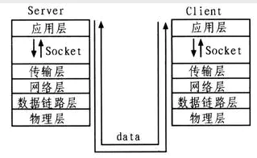

## 1. 虚拟内存 ？

每个程序都拥有自己的地址空间，这个地址空间被分成大小相等的页，这些页被映射到物理内存；但不需要所有的页都在物理内存中，当程序引用到不在物理内存中的页时，由操作系统将缺失的部分装入物理内存。这样，对于程序来说，逻辑上似乎有很大的内存空间，只是实际上有一部分是存储在磁盘上，因此叫做虚拟内存。

虚拟内存的优点是让程序可以获得更多的可用内存。

## 2. 有哪些页面置换算法 ？

- **先进先出**FIFO：置换在内存中驻留时间最长的页面。缺点：有可能将那些经常被访问的页面也被换出，从而使缺页率升高；
- **时钟算法** Clock：SCR中需要将页面在链表中移动（第二次机会的时候要将这个页面从链表头移到链表尾），时钟算法使用环形链表，再使用一个指针指向最老的页面，避免了移动页面的开销；
- **最近未使用算法**NRU（Not Recently Used）：检查访问位R、修改位M，优先置换R=M=0，其次是（R=0, M=1）；
- **最近最少使用算法**LRU（Least Recently Used）：置换出未使用时间最长的一页；实现方式：维护时间戳，或者维护一个所有页面的链表。当一个页面被访问时，将这个页面移到链表表头。这样就能保证链表表尾的页面是最近最久未访问的。
- **最不经常使用算法**LFU（Least Frequently Used）：置换出访问次数最少的页面

## 3 进程线程协程 ？

### 进程（Process）

进程是系统进行资源分配和调度的基本单位，系统资源如I/O，内存，CPU。

### 线程（Thread）

一个标准的线程由线程ID、当前指令指针(PC)、寄存器集合和堆栈组成。线程是被系统独立调度和分派的基本单位。线程自己不拥有系统资源，只拥有一点儿在运行中必不可少的资源，但它可与同属一个进程的其他线程共享进程所拥有的全部资源。

线程拥有自己独立的栈和共享的堆，共享堆，不共享栈。线程的切换一般也由操作系统调度。线程具有5种状态：初始化、可运行、运行中、阻塞、销毁。

> **提示** 对操作系统而言，线程是最小的执行单元，进程是最小的资源管理单元。无论是进程还是线 程，都是由操作系统所管理的。

### 协程（Coroutines）

协程即用户态线程。一个线程可以拥有多个协程。协程不是被操作系统内核所管理的，而是完全由用户程序管理。这样带来的好处是：性能有大幅度的提升，因为不会像线程切换那样消耗资源。

> **提示** 协程不是进程也不是线程，而是一个特殊的函数。这个函数可以在某个地方被“挂起”,并且可以重新在挂起处外继续运行。所以说，协程与进程、线程相比并不是一个维度的概念。

一个进程可以包含多个线程，一个线程也可以包含多个协程。简单来说，在一个线程内可以有多个这样的特殊函数在运行，但是有一点必须明确的是：**一个线程中的多个协程的运行是串行的**。 如果是多核CPU,那多个进程或一个进程内的多个线程是可以并行运行的。但是在一个线程内协程 却绝对是串行的，无论CPU有多少个核毕竟协程虽然是一个特殊的函数，但仍然是一个函数。 一个线程内可以运行多个函数，但这些函数都是串行运行的。当一个协程运行时，其他协程必须被挂起。

进程、线程和协程的关系如下图所示：

### 进程、线程、协程的对比

进程、线程、协程的对比如下：

- 协程既不是进程也不是线程，协程仅是一个特殊的函数。协程、进程和线程不是一个维度的。
- 一个进程可以包含多个线程，一个线程可以包含多个协程。虽然一个线程内的多个协程可以切换但是这多个协程是串行执行的，某个时刻只能有一个线程在运行，没法利用CPU的多核能力。
- 协程与进程一样，也存在上下文切换问题。
- 进程的切换者是操作系统，切换时机是根据操作系统自己的切换策略来决定的，用户是无感的。进程的切换内容包括页全局目录、内核栈和硬件上下文，切换内容被保存在内存中。 进程切换过程采用的是“从用户态到内核态再到用户态”的方式，切换效率低。
- 线程的切换者是操作系统，切换时机是根据操作系统自己的切换策略来决定的，用户是无感的。线程的切换内容包括内核栈和硬件上下文。线程切换内容被保存在内核栈中。线程切换过程采用的是“从用户态到内核态再到用户态”的方式，切换效率中等。
- 协程的切换者是用户(编程者或应用程序),切换时机是用户自己的程序来决定的。协程的切换内容是硬件上下文，切换内存被保存在用自己的变量(用户栈或堆)中。协程的切换过程只有用户态(即没有陷入内核态),因此切换效率高。

### 什么时候用线程，什么时候用协程

> I/O 密集型任务，需要频繁进行系统调用。

举个例子：给你200W条url，需要你把每个url对应的页面抓取保存起来，这种时候，单单使用多进程，效果肯定是很差的。为什么呢？

例如每次请求的等待时间是2秒，那么如下（忽略cpu计算时间）：

1. 单进程+单线程：需要2秒*200W=400W秒==1111.11个小时==46.3天，这个速度明显是不能接受的。

2. 单进程+多线程：例如我们在这个进程中开了10个多线程，比1中能够提升10倍速度，也就是大约4.63天能够完成200W条抓取，请注意，这里的实际执行是：线程1遇见了阻塞，CPU切换到线程2去执行，遇见阻塞又切换到线程3等等，10个线程都阻塞后，这个进程就阻塞了，而直到某个线程阻塞完成后，这个进程才能继续执行，所以速度上提升大约能到10倍（这里忽略了线程切换带来的开销，实际上的提升应该是不能达到10倍的），但是需要考虑的是线程的切换也是有开销的，所以不能无限的启动多线程（开200W个线程肯定是不靠谱的）。

3. 多进程+多线程：这里就厉害了，一般来说也有很多人用这个方法，多进程下，每个进程都能占一个cpu，而多线程从一定程度上绕过了阻塞的等待，所以比单进程下的多线程又更好使了，例如我们开10个进程，每个进程里开20W个线程，执行的速度理论上是比单进程开200W个线程快10倍以上的（为什么是10倍以上而不是10倍，主要是cpu切换200W个线程的消耗肯定比切换20W个线程进程大得多，考虑到这部分开销，所以是10倍以上）。

4. 协程：不管是进程还是线程，每次阻塞、切换都需要陷入系统调用(system call)，先让CPU跑操作系统的调度程序，然后再由调度程序决定该跑哪一个进程(线程)。而且由于抢占式调度执行顺序无法确定的特点，使用线程时需要非常小心地处理同步问题，而协程完全不存在这个问题（事件驱动和异步程序也有同样的优点）。因为协程是用户自己来编写调度逻辑的，对CPU来说，协程其实是单线程，所以CPU不用去考虑怎么调度、切换上下文，这就省去了CPU的切换开销，所以协程在一定程度上又好于多线程。

## 4 什么是用户态和内核态

往往我们的系统的资源是固定的，例如内存2G，CPU固定，磁盘2TB，网络接口固定。所以就需要操作系统对资源进行有效的利用。假设某个应用程序过分的访问这些资源，就会导致整个系统的资源被占用，如果不对这种行为进行限制和区分，就会导致资源访问的冲突。所以，Linux的设计的初衷：**给不同的操作给与不同的“权限”**。Linux操作系统就将权限等级分为了2个等级，分别就是内核态和用户态。

- 用户态只能受限地访问内存，且不允许访问外围设备，没有占用CPU的能力，CPU资源可以被其它程序获取。
- 内核态可以访问内存所有数据以及外围设备，也可以进行程序的切换。

### 从用户态到内核态切换可以通过三种方式？

1. 系统调用。
2. 异常：如果当前进程运行在用户态，如果这个时候发生了异常事件，就会触发切换。例如：缺页异常。
3. 外设中断：当外设完成用户的请求时，会向CPU发送中断信号。

### 什么是系统调用？

用户态就是提供应用程序运行的空间，为了使应用程序访问到内核管理的资源例如CPU，内存，I/O。内核必须提供一组通用的访问接口，这些接口就叫**系统调用。** 比如 **用户态想要申请一块20K大小的动态内存，就需要brk系统调用，将数据段指针向下偏移**。

## 5 进程间通信的方式 ？

### 进程间通信的概念

每个进程各自有不同的用户地址空间，任何一个进程的全局变量在另一个进程中都看不到，所以进程之间要交换数据必须通过内核，在内核中开辟一块缓冲区，进程1把数据从用户空间拷到内核缓冲区，进程2再从内核缓冲区把数据读走，内核提供的这种机制称为**进程间通信（IPC，InterProcess Communication）**

### 管道

管道是半双工的，数据只能向一个方向流动；需要双方通信时，需要建立起两个管道。管道只支持单向数据流。

管道的实质是一个内核缓冲区，进程以先进先出的方式从缓冲区存取数据，管道一端的进程顺序的将数据写入缓冲区，另一端的进程则顺序的读出数据。

### 消息队列

- 消息队列是存放在内核中的消息链表，每个消息队列由消息队列标识符表示。
- 另外与管道不同的是，消息队列在某个进程往一个队列写入消息之前，并不需要另外某个进程在该队列上等待消息的到达。
- 消息队列允许一个或多个进程向它写入与读取消息。

### 共享内存

- 为了在多个进程间交换信息，内核专门留出了一块内存区，可以由需要访问的进程将其**映射到自己的私有地址空间。进程就可以直接读写这一块内存而不需要进行数据的拷贝**，从而大大提高效率。
- 由于多个进程共享一段内存，因此需要依靠某种同步机制（如信号量）来达到进程间的同步及互斥。

### 信号量

- 信号是Linux系统中用于进程间互相通信或者操作的一种机制，信号可以在任何时候发给某一进程，而无需知道该进程的状态。
- 如果该进程当前并未处于执行状态，则该信号就有内核保存起来，知道该进程回复执行并传递给它为止。
- 如果一个信号被进程设置为阻塞，则该信号的传递被延迟，直到其阻塞被取消是才被传递给进程。

> **Linux系统中常用信号：**  
> （1）**SIGHUP：** 用户从终端注销，所有已启动进程都将收到该进程。系统缺省状态下对该信号的处理是终止进程。  
> （2）**SIGINT：** 程序终止信号。程序运行过程中，按`Ctrl+C`键将产生该信号。  
> （3）**SIGQUIT：** 程序退出信号。程序运行过程中，按`Ctrl+\\`键将产生该信号。  
> （4）**SIGBUS和SIGSEGV：** 进程访问非法地址。  
> （5）**SIGFPE：** 运算中出现致命错误，如除零操作、数据溢出等。  
> （6）**SIGKILL：** 用户终止进程执行信号。shell下执行`kill -9`发送该信号。  
> （7）**SIGTERM：** 结束进程信号。shell下执行`kill 进程pid`发送该信号。  
> （8）**SIGALRM：** 定时器信号。  
> （9）**SIGCLD：** 子进程退出信号。如果其父进程没有忽略该信号也没有处理该信号，则子进程退出后将形成僵尸进程。

### 套接字

socket 网络通信

Socket是应用层和传输层之间的桥梁。
