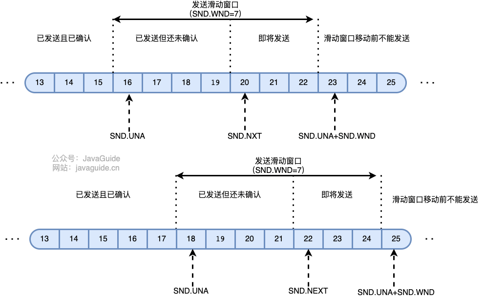
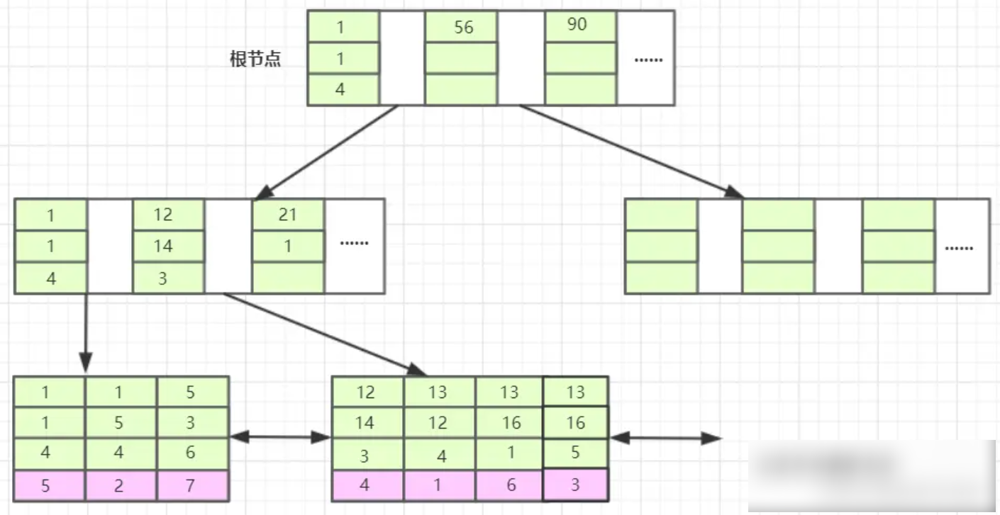

## 一、 场景

### 1 负载均衡算法有哪些？

随机算法：

* 简单随机

* 加权随机

轮询算法：

* 简单轮询

* 加权轮询

最小活跃数：**将请求分发到连接数/请求数最少的候选服务器**（目前处理请求最少的服务器）。**适用于对系统负载较为敏感或请求连接时长相差较大的场景**

一致性 Hash 算法：对请求 Hash，让相同的请求落在同一个服务器上。

一致性 Hash + 虚拟槽：将请求与虚拟槽绑定，服务器与虚拟槽绑定，这样可以更好的扩缩容。

### 2 每个负载均衡算法的使用场景？

一致性 Hash：**保证信息相同的请求能够尽量地打到同一个实例上**（因为如果请求在实例中保存数据，那实例的不同就会造成取不到这些数据导致错误，这时候就需要数据迁移）（这里没有考虑服务实例之间的数据一致性，有可能它们会进行数据同步也不一定），在集群扩容缩容时，一致性哈希可以减少数据的迁移量，只有一部分的请求会打到不同的实例上。所以**一致性哈希适用于需要使用节点存储数据（打到不同实例上会出现不同结果）、并且节点个数会动态变化的场景**。

随机权重算法：适用于**不同的服务实例具有不同的负载能力、处理优先级**的场景，每个服务实例具有不同的权重（在默认权重下就退化成朴素的随机算法了），请求打在权重较高的实例上的概率会更高。但是随机权重算法没有考虑到数据的迁移问题，所以应该适用于 **不需要使用节点存储数据，打在哪个实例上都没有区别 得到的结果都是相同的，但是需要考虑各个实例具有不同负载能力的场景**。

### 3 如何实现这些负载均衡算法？

### 4 IP 访问记录，求 Top K 被访问的 IP

1. 将大文件 hash 到多个节点上，保证记录相同的在同一个节点。

2. 节点中使用 hashmap 来处理文件，得出 IP 地址的访问次数。时间复杂度 O(M)

3. 节点中使用**堆**来处理2生成的文件，构建一个元素数量为 K 的大顶堆，时间复杂度：O(N * logk)

4. 然后将子节点中的 Top K IP 传递给主节点，主节点也构建一个元素数量为 K 的大顶堆。

时间复杂度 O(M) + O(N * logk)

### 5 如何实现前缀查询

采用字典树，前缀树，trie 树（一个东西，三个名字）。

假设所有字符串长度之和为 n，构建字典树的时间复杂度为 O(n)。假设要查找的字符串长度为 k，查找的时间复杂度为 O(k)。

### 6 设计一个传输大文件的协议（滑动窗口，分块上传）

分块上传，通过滑动窗口保证传输可靠性




### 7 JWT 失效怎么办

"Actually, JWT serves a different purpose than a session and it is not possible to forcefully delete or invalidate an existing token."  
这篇文章写得比较简单易懂：[https://medium.com/devgorilla...](https://link.segmentfault.com/?enc=xJY0EYxi3DM9RSakPGfKhw%3D%3D.4AOL3OZ9kf1AdcuJXuKtkLcV2S%2BbYohEHU2NPpOUwit5BzIOYeQcnqEqQPnLvI2AMN2v7FQNnnYPckd8ltSWaethEdkF4lIK2cdnKW%2BYATA%3D)

有以下几个方法可以做到失效 JWT token：

1. 将 token 存入 DB（如 Redis）中，失效则删除；但增加了一个每次校验时候都要先从 DB 中查询 token 是否存在的步骤，而且违背了 JWT 的无状态原则（这不就和 session 一样了么？）。
2. 维护一个 token 黑名单，失效则加入黑名单中。
3. 在 JWT 中增加一个版本号字段，失效则改变该版本号。
4. 在服务端设置加密的 key 时，为每个用户生成唯一的 key，失效则改变该 key。

### 8 RedLock

开源框架 Redission 的底层原理：


巨大的不足之处：

如果线程一在Redis的master节点上拿到了锁，但是加锁的key还没同步到slave节点。恰好这时，master节点发生故障，一个slave节点就会升级为master节点。线程二就可以获取同个key的锁啦，但线程一也已经拿到锁了，锁的安全性就没了。

更加安全高效的 RedLock：


- 1.获取当前时间，以毫秒为单位。
- 2.按顺序向5个master节点请求加锁。客户端设置网络连接和响应超时时间，并且超时时间要小于锁的失效时间。（假设锁自动失效时间为10秒，则超时时间一般在5-50毫秒之间,我们就假设超时时间是50ms吧）。如果超时，跳过该master节点，尽快去尝试下一个master节点。
- 3.客户端使用当前时间减去开始获取锁时间（即步骤1记录的时间），得到获取锁使用的时间。当且仅当超过一半（N/2+1，这里是5/2+1=3个节点）的Redis master节点都获得锁，并且使用的时间小于锁失效时间时，锁才算获取成功。（如上图，10s> 30ms+40ms+50ms+4m0s+50ms）
- 如果取到了锁，key的真正有效时间就变啦，需要减去获取锁所使用的时间。
- 如果获取锁失败（没有在至少N/2+1个master实例取到锁，有或者获取锁时间已经超过了有效时间），客户端要在所有的master节点上解锁（即便有些master节点根本就没有加锁成功，也需要解锁，以防止有些漏网之鱼）。

> 简化步骤：
> 
> - 按顺序向5个master节点请求加锁
> - 根据设置的超时时间来判断，是不是要跳过该master节点。
> - 如果大于等于三个节点加锁成功，并且使用的时间小于锁的有效期，即可认定加锁成功啦。
> - 如果获取锁失败，解锁！

### 9 RPC 和 HTTP

RPC 是一种方法，HTTP 是一种协议。RPC 服务主要工作在 TCP 上

### 10 给一个数组，输出第K大的数


## 二、计网

### 1 TCP 宕机问题

1. 给定你一个场景，发送端和接收端建立了TCP连接，正在传输数据，如果此时接收端进程宕机了（是进程宕机哦），而发送端并不知道，这时候会发生什么样的事情？

没有ack 导致发送端阻塞 超时重传；经过提醒才知道原来tcp是由操作系统的协议栈控制的，只要主机没宕掉就仍然会ack

## 三、数据库

### 1 原子性 一致性 隔离性 持久性 举例子

原子性：一个事务中的所有操作，要么都成功，要么都不成功

一致性：用户 A 和用户 B 在银行分别有 800 元和 600 元，总共 1400 元，用户 A 给用户 B 转账 200 元，分为两个步骤，从 A 的账户扣除 200 元和对 B 的账户增加 200 元。一致性就是要求上述步骤操作后，最后的结果是用户 A 还有 600 元，用户 B 有 800 元，总共 1400 元，而不会出现用户 A 扣除了 200 元，但用户 B 未增加的情况（该情况，用户 A 和 B 均为 600 元，总共 1200 元）。

隔离性：数据库允许多个并发事务同时对其数据进行读写和修改的能力，隔离性可以防止多个事务并发执行时由于交叉执行而导致数据的不一致，因为多个事务同时使用相同的数据时，不会相互干扰，每个事务都有一个完整的数据空间，对其他并发事务是隔离的。也就是说，消费者购买商品这个事务，是不影响其他消费者购买的。

持久性：事务处理结束后，对数据的修改就是永久的，即便系统故障也不会丢失。

### 2 update delete select...for update

前面的案例，我们的查询语句都有使用索引查询，也就是查询记录的时候，是通过索引扫描的方式查询的，然后对扫描出来的记录进行加锁。

**如果锁定读查询语句，没有使用索引列作为查询条件，或者查询语句没有走索引查询，导致扫描是全表扫描。那么，每一条记录的索引上都会加 next-key 锁，这样就相当于锁住的全表，这时如果其他事务对该表进行增、删、改操作的时候，都会被阻塞**。

不只是锁定读查询语句不加索引才会导致这种情况，update 和 delete 语句如果查询条件不加索引，那么由于扫描的方式是全表扫描，于是就会对每一条记录的索引上都会加 next-key 锁，这样就相当于锁住的全表。

因此，**在线上在执行 update、delete、select ... for update 等具有加锁性质的语句，一定要检查语句是否走了索引，如果是全表扫描的话，会对每一个索引加 next-key 锁，相当于把整个表锁住了**，这是挺严重的问题。

### 3 MySQL 的 Update 会加哪些锁？

* 意向写锁（表锁 IX 锁）

* 行级锁

例子1：

```sql
update t1 set age=222 where id=5;
```

这是一条最常见的`UPDATE`语句，`where`条件使用主键索引来更新数据，加锁分为2种情况：

- `id=5`的记录存在，只会在`id=5`的主键索引加上一个行锁。
- `id=5`的记录不存在，会在主键索引上加上一个间隙锁。

表格中`id`列只有1、5、6，执行`update ... where id=2`将产生一个间隙锁`(1, 5)`。例如插入`id=3`的记录将被阻塞：

```sql
mysql> insert into t1 (id,age) values (3, 80);
/* 被阻塞 */ 
```

> Update where 条件没有使用索引，那么就会锁住全表！！！！！
> 
> 全表都是 next-key！！！！

### 4 select ... for update

加行级锁，写锁（互斥锁）。是当前读，不是 MVCC 的快照读。

### 5 行级锁包括？

Record Lock：记录锁

* X 锁（写锁）

* S 锁 （读锁）

Gap Lock：间隙锁

Next-Key Lock：Record Lock + Gap Lock

两个间隙锁可以同时存在。间隙锁只是让间隙内不能插入数据。

### 6 MySQL 联合索引底层原理


首先，表T1有字段a,b,c,d,e，其中a是主键，除e为varchar其余为int类型，并创建了一个联合索引idx_t1_bcd(b,c,d)，然后b、c、d三列作为联合索引，在B+树上的结构正如上图所示。联合索引的所有索引列都出现在索引数上，并依次比较三列的大小。

```sql
CREATE TABLE `t1`  (
  `a` int(11) NOT NULL AUTO_INCREMENT,
  `b` int(11) NULL DEFAULT NULL,
  `c` int(11) NULL DEFAULT NULL,
  `d` int(11) NULL DEFAULT NULL,
  `e` varchar(20) CHARACTER SET utf8 COLLATE utf8_general_ci NULL DEFAULT NULL,
  PRIMARY KEY (`a`) USING BTREE,
  INDEX `index_bcd`(`b`, `c`, `d`) USING BTREE
) ENGINE = InnoDB AUTO_INCREMENT = 8 CHARACTER SET = utf8 COLLATE = utf8_general_ci ROW_FORMAT = Dynamic;

-- ----------------------------
-- Records of t1
-- ----------------------------
INSERT INTO `t1` VALUES (1, 13, 12, 4, 'dll');
INSERT INTO `t1` VALUES (2, 1, 5, 4, 'doc');
INSERT INTO `t1` VALUES (3, 13, 16, 5, 'img');
INSERT INTO `t1` VALUES (4, 12, 14, 3, 'xml');
INSERT INTO `t1` VALUES (5, 1, 1, 4, 'txt');
INSERT INTO `t1` VALUES (6, 13, 16, 1, 'exe');
INSERT INTO `t1` VALUES (7, 5, 3, 6, 'pdf');
```

bcd联合索引在B+树上的结构图：



InnoDB会使用主键索引在B+树维护索引和数据文件，然后我们创建了一个`联合索引（b，c，d）`也会生成一个索引树，同样是B+树的结构，只不过它的data部分存储的是联合索引所在行的主键值（上图叶子节点紫色背景部分）。

当我们的SQL语言可以应用到索引的时候，比如 `select * from T1 where b = 12 and c = 14 and d = 3;`

索引排序是按照 b，c，d 的顺序来进行排序的，先按照 b 排序，b相同按照 c 排序，c 相同按照 d 排序。
