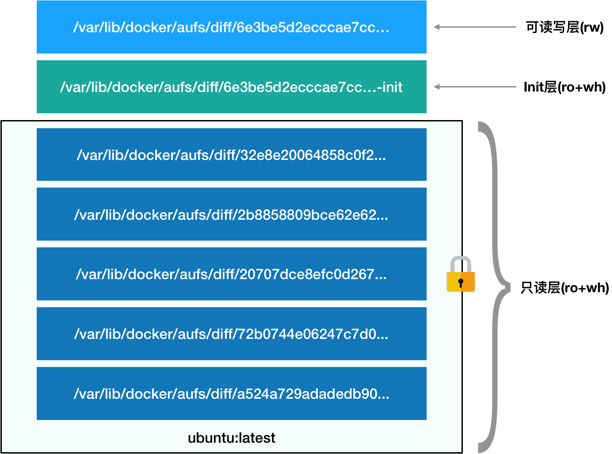
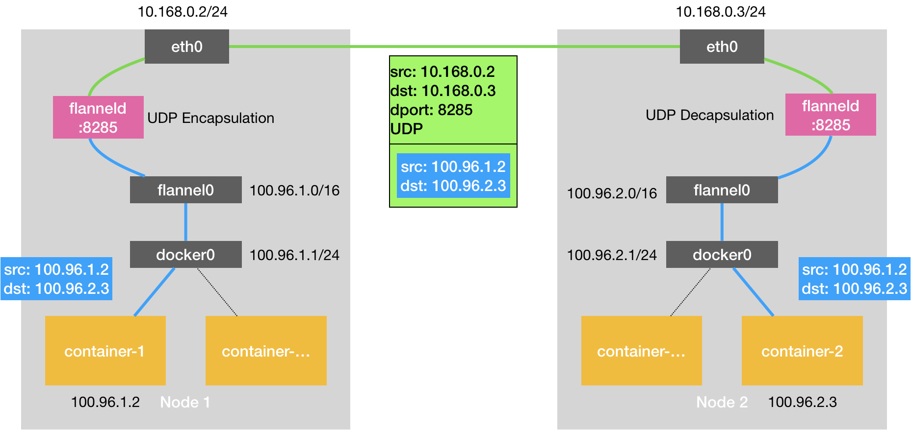
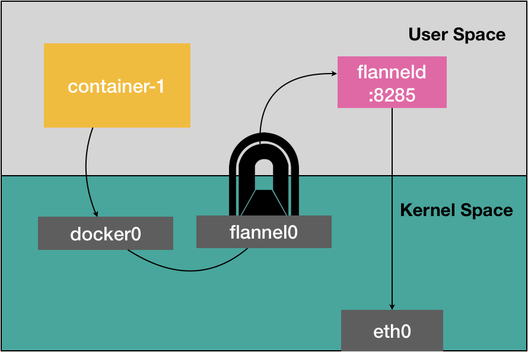

# Docker 常见面试题

## Namespace Cgroups

* Namespace

Docker 容器这个听起来玄而又玄的概念，实际上是在创建容器进程时，指定了这个进程所需要启用的一组 Namespace 参数。这样，容器就只能“看”到当前 Namespace 所限定的资源、文件、设备、状态，或者配置。而对于宿主机以及其他不相关的程序，它就完全看不到了。

Linux 通过 Namespace 技术，只让一个进程只看见自己的进程空间，不能看见操作系统的进程空间。Namespace 包括：PID，Mount，UTS，IPC，Network，User Namespace。比如，Mount Namespace，用于让被隔离进程只看到当前 Namespace 里的挂载点信息；Network Namespace，用于让被隔离进程看到当前 Namespace 里的网络设备和配置。

一个正在运行的 Docker 容器，其实就是一个启用了多个 Linux Namespace 的应用进程，而这个进程能够使用的资源量，则受 Cgroups 配置的限制。容器是一个“单进程”模型。

其次，在 Linux 内核中，有很多资源和对象是不能被 Namespace 化的，最典型的例子就是：时间。

* Cgroups

Linux Cgroups （Linux Control Group）它最主要的作用，就是限制一个进程组能够使用的资源上限，包括 CPU、内存、磁盘、网络带宽等等。 

- blkio，为​​​块​​​设​​​备​​​设​​​定​​​I/O 限​​​制，一般用于磁盘等设备；
- cpuset，为进程分配单独的 CPU 核和对应的内存节点；
- memory，为进程设定内存使用的限制。

**Linux Cgroups 的设计还是比较易用的，简单粗暴地理解呢，它就是一个子系统目录加上一组资源限制文件的组合**。而对于 Docker 等 Linux 容器项目来说，它们只需要在每个子系统下面，为每个容器创建一个控制组（即创建一个新目录），然后在启动容器进程之后，把这个进程的 PID 填写到对应控制组的 tasks 文件中就可以了。

而至于在这些控制组下面的资源文件里填上什么值，就靠用户执行 docker run 时的参数指定了，比如这样一条命令：

```shell
$ docker run -it --cpu-period=100000 --cpu-quota=20000 ubuntu /bin/bash
```

在启动这个容器后，我们可以通过查看 Cgroups 文件系统下，CPU 子系统中，“docker”这个控制组里的资源限制文件的内容来确认：

```shell
$ cat /sys/fs/cgroup/cpu/docker/5d5c9f67d/cpu.cfs_period_us 100000$ cat /sys/fs/cgroup/cpu/docker/5d5c9f67d/cpu.cfs_quota_us 20000
```

这就意味着这个 Docker 容器，只能使用到 20% 的 CPU 带宽。

## 容器与虚拟机的区别

虚拟机是虚拟化一套完整的操作系统，而容器是共用底层的操作系统。实际上，容器化的用户应用，只是运行在宿主机上的一个普通进程，这就意味着因为虚拟化带来的性能损耗都是不存在的；另一方面，使用 Namespace 作为隔离手段的容器并不需要单独的 Guest OS 这就使得容器额外的资源占用几乎可以忽略不计。

## 文件系统

可以使用 `chroot 目录 进程` 来指定该进程的根目录。Mount Namespace 就是基于 chroot 不断改良，为了让容器这个根目录看起来更真实，我们一般会在这个根目录下挂载一个完整的 Linux 文件系统，这个文件系统就叫 `容器镜像` 或者 `rootfs(根文件系统)` 。

rootfs 只包括 Linux 的文件系统，不包括 Linux 内核，因为同一台宿主机上的容器进程，共享操作系统内核。rootfs 打包的不止是应用，而是整个操作系统的文件和目录，所以应用和应用所需要的依赖，都被封装在一起。

```bash
$ ls /
bin dev etc home lib lib64 mnt opt proc root run sbin sys tmp usr var
```

Docker 是如何创建容器的？

1. 启动 Linux Namespace 配置

2. 设置 Linux Cgroups 参数

3. 切换进程根目录

## Union File System

将多个不同位置的目录联合挂载（union mount）到同一个目录下。

```
$ tree
.
├── A
│  ├── a
│  └── x
└── B
  ├── b
  └── x
```

使用联合挂载，挂载到公共目录 C 上：

```bash
$ mkdir C
$ mount -t aufs -o dirs=./A:./B none ./C
```

挂载结果：

```
$ tree ./C
./C
├── a
├── b
└── x
```

> 一个例子

```bash
$ docker image inspect ubuntu:latest
...
     "RootFS": {
      "Type": "layers",
      "Layers": [
        "sha256:f49017d4d5ce9c0f544c...",
        "sha256:8f2b771487e9d6354080...",
        "sha256:ccd4d61916aaa2159429...",
        "sha256:c01d74f99de40e097c73...",
        "sha256:268a067217b5fe78e000..."
      ]
    }
```

可以看到，这个ubuntu镜像，由五个层构成，每一层都是Ubuntu操作系统文件与目录的一部分。然后联合挂载到一个统一的挂载点上。

挂载到一起的各个层的信息：

```bash
$ cat /sys/fs/aufs/si_972c6d361e6b32ba/br[0-9]*
/var/lib/docker/aufs/diff/6e3be5d2ecccae7cc...=rw
/var/lib/docker/aufs/diff/6e3be5d2ecccae7cc...-init=ro+wh
/var/lib/docker/aufs/diff/32e8e20064858c0f2...=ro+wh
/var/lib/docker/aufs/diff/2b8858809bce62e62...=ro+wh
/var/lib/docker/aufs/diff/20707dce8efc0d267...=ro+wh
/var/lib/docker/aufs/diff/72b0744e06247c7d0...=ro+wh
/var/lib/docker/aufs/diff/a524a729adadedb90...=ro+wh
```



第一层：只读层

它是这个容器的 rootfs 最下面的五层，对应的正是 ubuntu:latest 镜像的五层。可以看到，它们的挂载方式都是只读的（ro+wh，即 readonly+whiteout）。

第二层：init 层 (更改不需提交)

它是一个以“-init”结尾的层，夹在只读层和读写层之间。Init 层是 Docker 项目单独生成的一个内部层，专门用来存放 /etc/hosts、/etc/resolv.conf 等信息。需要这样一层的原因是，这些文件本来属于只读的 Ubuntu 镜像的一部分，但是用户往往需要在启动容器时写入一些指定的值比如 hostname，所以就需要在可读写层对它们进行修改。可是，这些修改往往只对当前的容器有效，我们并不希望执行 docker commit 时，把这些信息连同可读写层一起提交掉。所以，Docker 做法是，在修改了这些文件之后，以一个单独的层挂载了出来。而用户执行 docker commit 只会提交可读写层，所以是不包含这些内容的。

第三层：可读写层 (更改需要提交)

它是这个容器的 rootfs 最上面的一层（6e3be5d2ecccae7cc），它的挂载方式为：rw，即 read write。在没有写入文件之前，这个目录是空的。而一旦在容器里做了写操作，你修改产生的内容就会以增量的方式出现在这个层中。删除操作，AuFS 会在可读写层创建一个 whiteout 文件，把只读层里的文件“遮挡”起来。

比如，你要删除只读层里一个名叫 foo 的文件，那么这个删除操作实际上是在可读写层创建了一个名叫.wh.foo 的文件。这样，当这两个层被联合挂载之后，foo 文件就会被.wh.foo 文件“遮挡”起来，“消失”了。这个功能，就是“ro+wh”的挂载方式，即只读 +whiteout 的含义。

所以，最上面这个可读写层的作用，就是专门用来存放你修改 rootfs 后产生的增量，无论是增、删、改，都发生在这里。而当我们使用完了这个被修改过的容器之后，还可以使用 docker commit 和 push 指令，保存这个被修改过的可读写层，并上传到 Docker Hub 上，供其他人使用；而与此同时，原先的只读层里的内容则不会有任何变化。这，就是增量 rootfs 的好处。

## 网络

### 同一个主机下

一个容器可以直接监听宿主机的端口，比如：

```shell
docker run –d –net=host --name nginx-host nginx
```

这样容器启动之后，直接监听的就是宿主机的 80 端口。

像这样直接使用宿主机网络栈的方式，容器可以有很好的网络性能，但是可能会出现端口冲突。所以我们的目标就是：容器进程能使用自己 Namespace 中的网络栈--拥有自己的 IP 和 Port。

这时候，问题就变成了：**一个 Namespace 中的容器进程，如何于另一个 Namespace 中的容器进程通信呢？**

这个问题可以将每个容器进程看作一个主机，两台主机之间的通信，需要使用交换机（使用Mac地址，数据链路层）。在 Linux 系统中，能起到交换机作用的网络设备，就是--网桥（Bridge）。它是一个工作在数据链路层的设备，根据 Mac 地址学习来将数据包转发到网桥不同端口上。

Docker 在宿主机中默认创建一个名字叫 docker0 的网桥，我们将容器进程连接到 docker0 端口上，就可以通过 Mac 地址来进行通信。这个问题又变成了：**如何将容器进程连接到 docker0 端口上？**

**使用 Veth Pair 的虚拟设备，Veth Pair 给容器进程提供一张虚拟网卡，给宿主机提供一张虚拟网卡，并将宿主机的虚拟网卡插到 docker0 网桥上。**（它被创建出来后，总是以两张虚拟网卡（Veth Peer）的形式成对出现的。并且，从其中一个“网卡”发出的数据包，可以直接出现在与它对应的另一张“网卡”上，哪怕这两个“网卡”在不同的 Network Namespace 里。）

* 同一个宿主机下的两个容器进程的通信：

当在容器 A 访问容器 B 的 IP 地址的时候，数据包会经过容器 A 的网卡，到达网桥上的网卡A‘（和容器A网卡相连），然后通过 ARP 广播来找到容器 B 的 IP 地址对应的 Mac 地址，找到之后就通过 docker0 网桥来转发数据包，转发到网桥上的网卡 B’ （和容器B网卡相连），然后数据包 B‘ --> B ，到达容器 B 网卡上了。

这个阶段，docker0扮演的角色是一个二层交换机的角色。

> **被限制在 Network Namespace 里的容器进程，实际上是通过 Veth Pair 设备 + 宿主机网桥的方式，实现了跟同其他容器的数据交换。**

### 跨主网络


可以看到，构建这种容器网络的核心在于：我们需要在已有的宿主机网络上，再通过软件构建一个覆盖在已有宿主机网络之上的、可以把所有容器连通在一起的虚拟网络。所以，这种技术就被称为：Overlay Network（覆盖网络）。

而这个 Overlay Network 本身，可以由每台宿主机上的一个“特殊网桥”共同组成。比如，当 Node 1 上的 Container 1 要访问 Node 2 上的 Container 3 的时候，Node 1 上的“特殊网桥”在收到数据包之后，能够通过某种方式，把数据包发送到正确的宿主机，比如 Node 2 上。而 Node 2 上的“特殊网桥”在收到数据包后，也能够通过某种方式，把数据包转发给正确的容器，比如 Container 3。

甚至，每台宿主机上，都不需要有一个这种特殊的网桥，而仅仅通过某种方式配置宿主机的路由表，就能够把数据包转发到正确的宿主机上。

* Flannel

Flannel 项目是 CoreOS 公司主推的容器网络方案。事实上，Flannel 项目本身只是一个框架，真正为我们提供容器网络功能的，是 Flannel 的后端实现。目前，Flannel 支持三种后端实现，分别是：

1. VXLAN

2. host-gw

3. UDP

#### UDP （已废弃）



Flannel UDP 模式提供的是一个三层的 Overlay 网络：它首先对发出端的 IP 包进行 UDP 封装，然后在接收端进行解封装拿到原始的 IP 包，进而把这个 IP 包转发给目标容器。这就好比，Flannel 在不同宿主机上的两个容器之间打通了一条“隧道”，使得这两个容器可以直接使用 IP 地址进行通信，而无需关心容器和宿主机的分布情况。

上述 UDP 模式有严重的性能问题，所以已经被废弃了。实际上，相比于两台宿主机之间的直接通信，基于 Flannel UDP 模式的容器通信多了一个额外的步骤，即 flanneld 的处理过程。而这个过程，由于使用到了 flannel0 这个 TUN 设备，仅在发出 IP 包的过程中，就需要经过三次用户态与内核态之间的数据拷贝，如下所示：



第一次：用户态的容器进程发出的 IP 包经过 docker0 网桥进入内核态；

第二次：IP 包根据路由表进入 TUN（flannel0）设备，从而回到用户态的 flanneld 进程；

第三次：flanneld 进行 UDP 封包之后重新进入内核态，将 UDP 包通过宿主机的 eth0 发出去。

#### VXLAN

Virtual Extensible LAN（虚拟可扩展局域网），是 Linux 内核支持的一个虚拟化技术。VXLAN 可以完全在内核态实现上述封装和解封装的工作。

VXLAN 设计的思想：覆盖一层虚拟的，由内核 VXLAN 模块负责维护的网络，让所有的主机（宿主机和容器），可以像一个局域网（LAN）那样通信。

为了能在网络中打通隧道，VXLAN 会在宿主机中设置一个虚拟的网络设备作为隧道的两端：VTEP，即：VXLAN Tunnel End Point（虚拟隧道端点）。


可以看出，图中 flannel.1 的设备就是 VTEP，它既有 IP 地址又有 MAC 地址。

> 举个例子

现在，我们在宿主机 Node1 中有一个容器 container-1，它的 IP 地址为 10.1.15.2，要访问的容器在宿主机 Node2 中，容器名字为 container-2，IP 地址为 10.1.16.3。

container-1 发出请求后，IP 包会出现在 docker0 的网桥（见同一个主机下通信），然后被路由到 VTEP 设备，也就是说来到了隧道的入口。这时 VTEP 设备就需要找到正确的隧道出口，即目的宿主机的 VTEP 设备，而这个设备的信息，是每台宿主机上的 flanneld 进程负责维护的。

比如：当 Node 2 启动并加入 Flannel 网络之后，在 Node 1（以及所有其他节点）上，flanneld 就会添加一条如下所示的路由规则：

```bash
$ route -n
Kernel IP routing table
Destination     Gateway         Genmask         Flags Metric Ref    Use Iface
...
10.1.16.0       10.1.16.0       255.255.255.0   UG    0      0        0 flannel.1
```

这条规则的意思是：凡是发往 10.1.16.0/24 网段的 IP 包，都需要经过 flannel.1 设备发出，并且，它最后被发往的网关地址是：10.1.16.0。10.1.16.0 正是 Node 2 上的 VTEP 设备（也就是 flannel.1 设备）的 IP 地址。

“源 VTEP 设备”收到“原始 IP 包”后，就要想办法把“原始 IP 包”加上一个目的 MAC 地址，封装成一个二层数据帧，然后发送给“目的 VTEP 设备”（当然，这么做还是因为这个 IP 包的目的地址不是本机）。

* **这里需要解决的问题就是：目的 VTEP 设备的 MAC 地址是什么？**

而这里要用到的 ARP 记录，也是 flanneld 进程在 Node 2 节点启动时，自动添加在 Node 1 上的。我们可以通过 ip 命令看到它，如下所示：

```bash
# 在 Node 1 上
$ ip neigh show dev flannel.1
10.1.16.0 lladdr 5e:f8:4f:00:e3:37 PERMANENT
```

这条记录的意思非常明确，即：IP 地址 10.1.16.0，对应的 MAC 地址是 5e:f8:4f:00:e3:37。

> 可以看到，最新版本的 Flannel 并不依赖 L3 MISS 事件和 ARP 学习，而会在每台节点启动时把它的 VTEP 设备对应的 ARP 记录，直接下放到其他每台宿主机上。

**Linux 内核开始二层封包工作了**：


**然后，Linux 内核会把这个数据帧封装进一个 UDP 包里发出去。**

* **这里有一个问题：只知道目的 VETP 设备的 MAC 地址，不知道对应的宿主机地址。**

目的 VETP 设备的 MAC 地址 ---- 目的宿主机 IP 这个信息也是 flanneld 进程来维护的，通过以下命令查找：

```bash
# 在 Node 1 上，使用“目的 VTEP 设备”的 MAC 地址进行查询
$ bridge fdb show flannel.1 | grep 5e:f8:4f:00:e3:37
5e:f8:4f:00:e3:37 dev flannel.1 dst 10.168.0.3 self permanent
```

可以看到，目的宿主机 Node 2 的 IP 为 10.168.0.3，所以 UDP 包发送的目的地也就找到了。然后进行 UDP 的封包工作。

目的 VETP 设备接收到后会进行拆包，然后就是同一主机下包的处理流程了。
