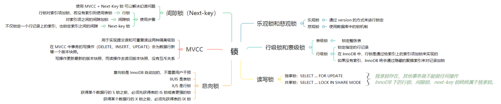
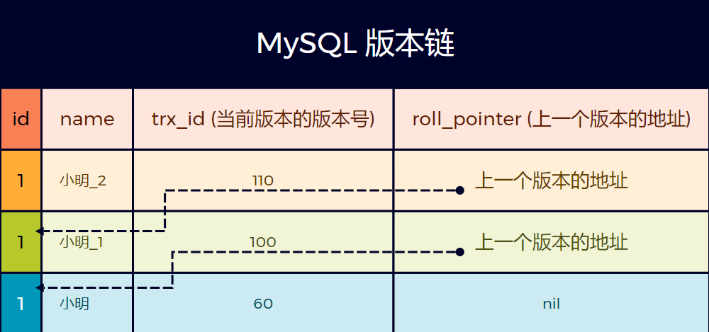
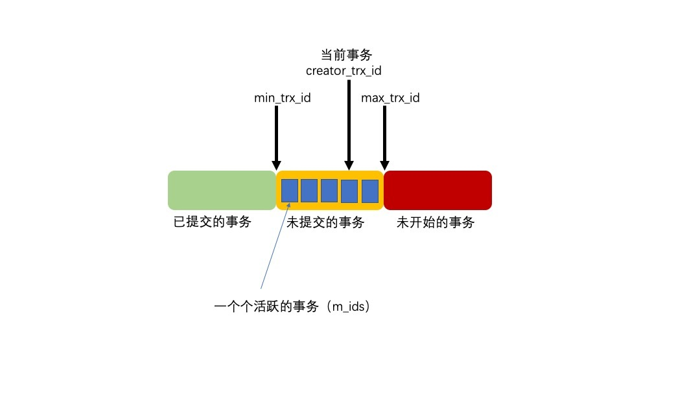
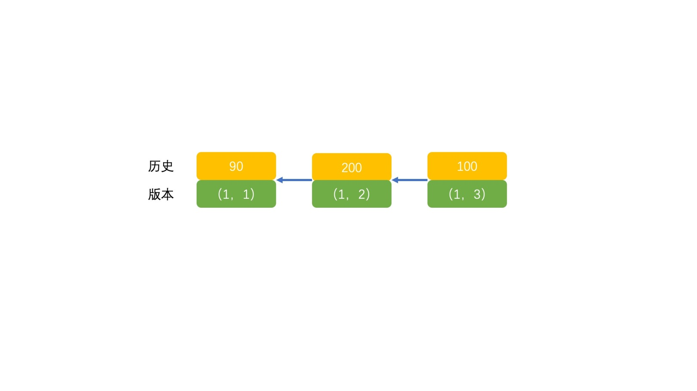

# MySQL 锁



## 1. 悲观锁和乐观锁

确保在多个事务同时存取数据库中同一数据时不破坏事务的隔离性和统一性以及数据库的统一性，**乐观锁和悲观锁是并发控制主要采用的技术手段。**

- **`悲观锁`** - 假定会发生并发冲突，屏蔽一切可能违反数据完整性的操作
  - 在查询完数据的时候就把事务锁起来，直到提交事务（`COMMIT`）
  - 实现方式：**使用数据库中的锁机制**。
- **`乐观锁`** - 假设不会发生并发冲突，只在提交操作时检查是否违反数据完整性。
  - 在修改数据的时候把事务锁起来，通过 version 的方式来进行锁定
  - 实现方式：**使用 version 版本或者时间戳**。

【示例】乐观锁示例

商品 goods 表中有一个字段 status，status 为 1 代表商品未被下单，status 为 2 代表商品已经被下单，那么我们对某个商品下单时必须确保该商品 status 为 1。假设商品的 id 为 1。

```sql
select (status,status,version) from t_goods where id=#{id}

update t_goods
set status=2,version=version+1
where id=#{id} and version=#{version};
```

> 更详细的乐观锁说可以参考：[使用 mysql 乐观锁解决并发问题(opens new window)](https://www.cnblogs.com/laoyeye/p/8097684.html)

## 2. 表级锁和行级锁

从数据库的锁粒度来看，MySQL 中提供了两种封锁粒度：行级锁和表级锁。

- **表级锁（table lock）** - 锁定整张表。用户对表进行写操作前，需要先获得写锁，这会阻塞其他用户对该表的所有读写操作。只有没有写锁时，其他用户才能获得读锁，读锁之间不会相互阻塞。
- **行级锁（row lock）** - 锁定指定的行记录。这样其它进程还是可以对同一个表中的其它记录进行操作。

应该尽量只锁定需要修改的那部分数据，而不是所有的资源。**锁定的数据量越少，锁竞争的发生频率就越小，系统的并发程度就越高**。但是加锁需要消耗资源，锁的各种操作（包括获取锁、释放锁、以及检查锁状态）都会增加系统开销。因此**锁粒度越小，系统开销就越大**。

在选择锁粒度时，需要在锁开销和并发程度之间做一个权衡。

在 `InnoDB` 中，**行锁是通过给索引上的索引项加锁来实现的**。**如果没有索引，`InnoDB` 将会通过隐藏的聚簇索引来对记录加锁**。

## 3. 读写锁

- 独享锁（Exclusive），简写为 X 锁，又称写锁。使用方式：`SELECT ... FOR UPDATE;`
- 共享锁（Shared），简写为 S 锁，又称读锁。使用方式：`SELECT ... LOCK IN SHARE MODE;`

写锁和读锁的关系，简言之：**独享锁存在，其他事务就不能做任何操作**。

**`InnoDB` 下的行锁、间隙锁、next-key 锁统统属于独享锁**。

## 4. 意向锁

**当存在表级锁和行级锁的情况下，必须先申请意向锁（表级锁，但不是真的加锁），再获取行级锁**。使用意向锁（Intention Locks）可以更容易地支持多粒度封锁。

**意向锁是 `InnoDB` 自动加的，不需要用户干预**。

在存在行级锁和表级锁的情况下，事务 T 想要对表 A 加 X 锁，就需要先检测是否有其它事务对表 A 或者表 A 中的任意一行加了锁，那么就需要对表 A 的每一行都检测一次，这是非常耗时的。

意向锁规定：

- IX/IS 是表锁；
- X/S 是行锁。
- 一个事务在获得某个数据行的 S 锁之前，必须先获得表的 IS 锁或者更强的锁；
- 一个事务在获得某个数据行的 X 锁之前，必须先获得表的 IX 锁。

通过引入意向锁，事务 T 想要对表 A 加 X 锁，只需要先检测是否有其它事务对表 A 加了 X/IX/S/IS 锁，如果加了就表示有其它事务正在使用这个表或者表中某一行的锁，因此事务 T 加 X 锁失败。

各种锁的兼容关系如下：

| -   | X   | IX  | S   | IS  |
| --- | --- | --- | --- | --- |
| X   | ❌   | ❌   | ❌   | ❌   |
| IX  | ❌   | ✔️  | ❌   | ✔️  |
| S   | ❌   | ❌   | ✔️  | ✔️  |
| IS  | ❌   | ✔️  | ✔️  | ✔️  |

解释如下：

- 任意 IS/IX 锁之间都是兼容的，因为它们只表示想要对表加锁，而不是真正加锁；
- 这里兼容关系针对的是表级锁，而表级的 IX 锁和行级的 X 锁兼容，两个事务可以对两个数据行加 X 锁。（事务 T1 想要对数据行 R1 加 X 锁，事务 T2 想要对同一个表的数据行 R2 加 X 锁，两个事务都需要对该表加 IX 锁，但是 IX 锁是兼容的，并且 IX 锁与行级的 X 锁也是兼容的，因此两个事务都能加锁成功，对同一个表中的两个数据行做修改。）

## 5. MVCC

提到事务，你肯定会想到ACID（Atomicity、Consistency、Isolation、Durability，即原子性、一致性、隔离性、持久性），我们就来说说其中I，也就是“隔离性”。

### 5.1 MySQL中支持的四种隔离级别

当[数据库](https://cloud.tencent.com/solution/database?from=10680)上有多个事务同时执行的时候，就可能出现脏读（dirty read）、不可重复读（non-repeatable read）、幻读（phantom read）的问题，所以下面我们来说说隔离级别。

SQL标准的事务隔离级别包括：读未提交（read uncommitted）、读提交（read committed）、可重复读（repeatable read）、串行化（serializable）。

- 读未提交是指，一个事务还没提交时，它做的变更就能被别的事务看到。
- 读提交指，一个事务提交之后，它做的变更才会被其他事务看到。
- 可重复读指，一个事务执行过程中看到的数据，总是跟这个事务在启动时看到的数据时一致的。当然可重复读隔离级别下，未提交变更对其他事务也是不可见的。
- 串行化，顾名思义是对于同一行记录，“写”会加“写锁”，“读”会加“读锁”。当出现读写锁冲突的时候，后访问的事务必须等前一个事务执行完成，才能继续执行。

MySQL虽然支持4种隔离级别，但与SQL标准中所规定的各级隔离级别允许发生的问题却有些出入，MySQL在REPEATABLE READ隔离级别下，是可以禁止幻读问题的发生的。

我们可以通过：
 `SET [GLOBAL|SESSION] TRANSACTION ISOLATION LEVEL level;` 来设置隔离级别。

其中的level可选值有4个：

```sql
level: {
     REPEATABLE READ
   | READ COMMITTED
   | READ UNCOMMITTED
   | SERIALIZABLE
}
```

### 5.2 MVCC原理

#### 隐藏列

对于使用InnoDB存储引擎的表来说，它的聚簇索引记录中都包含必要的隐藏列. 每开始一个新事务，系统版本号会自动递增，事务开始时刻的系统版本号会作为事务的版本号，用来和查询到的每行记录的版本号进行比较。

* trx_id这个id用来存储的每次对某条聚簇索引记录进行修改的时候的事务id。

* roll_pointer每次对哪条聚簇索引记录有修改的时候，都会把老版本写入undo日志中。这个roll_pointer就是存了一个指针，它指向这条聚簇索引记录的上一个版本的位置，通过它来获得上一个版本的记录信息。(注意插入操作的undo日志没有这个属性，因为它没有老版本)

#### 版本链



查询值是先从最新到最旧查询, 看与是否满足ReadView条件. 如果满足了, 就返回当前查到的值; 如果没满足, 那么继续查找上一个版本.

每一个事务在开启的时候就会写入版本链中, 版本链总是从高版本到低版本, 但是各个事务提交时间不一定.

#### ReadView (只是一个列表)

ReadView所解决的问题是使用READ COMMITTED和REPEATABLE READ隔离级别的事务中，不能读到未提交的记录，这需要判断一下版本链中的哪个版本是当前事务可见的。

ReadView中主要包含4个比较重要的内容：

- m_ids：表示在生成ReadView时当前系统中 **活跃的读写事务** 的 **事务id列表** 。
- min_trx_id：表示在生成ReadView时当前系统中活跃的读写事务中最小的事务id，也就是m_ids中的最小值。
- max_trx_id：表示生成ReadView时系统中应该分配给下一个事务的id值。
- creator_trx_id：表示生成该ReadView的事务的事务id。



#### ReadView是如何工作的？

有了这些信息，这样在访问某条记录时，只需要按照下边的步骤判断记录的某个版本是否可见：

- 如果被访问版本的trx_id属性值与ReadView中的creator_trx_id值相同，意味着当前事务在访问它自己修改过的记录，所以该版本可以被当前事务访问。
- 如果被访问版本的trx_id属性值小于ReadView中的min_trx_id值，表明生成该版本的事务在当前事务生成ReadView前已经提交，所以该版本可以被当前事务访问。
- 如果被访问版本的trx_id属性值大于ReadView中的max_trx_id值，表明生成该版本的事务在当前事务生成ReadView后才开启，所以该版本不可以被当前事务访问。
- 如果被访问版本的trx_id属性值在ReadView的min_trx_id和max_trx_id之间，那就需要判断一下trx_id属性值是不是在m_ids列表中，如果在，说明创建ReadView时生成该版本的事务还是活跃的，该版本不可以被访问；如果不在，说明创建ReadView时生成该版本的事务已经被提交，该版本可以被访问。(因为可能后开始的事务先做完, 导致min~max中有事务已经完成)

如果某个版本的数据对当前事务不可见的话，那就顺着版本链找到下一个版本的数据，继续按照上边的步骤判断可见性，依此类推，直到版本链中的最后一个版本。如果最后一个版本也不可见的话，那么就意味着该条记录对该事务完全不可见，查询结果就不包含该记录。

在MySQL中，READ COMMITTED和REPEATABLE READ隔离级别的的一个非常大的区别就是它们**生成ReadView的时机**不同

* READ COMMITTED: 当前事务每次select都新生成一个ReadView.

* REPEATABLE READ: 当前事务只有第一次select的时候生成ReadView, 以后的select用的是第一次生成的ReadView.

---

我们这里使用一个示例来解释：

```sql
mysql> CREATE TABLE `t` (
  `id` int(11) NOT NULL,
  `k` int(11) DEFAULT NULL,
  PRIMARY KEY (`id`)
) ENGINE=InnoDB;
insert into t(id, k) values(1,1);
```

| 事务A                              | 事务B                             |
| -------------------------------- | ------------------------------- |
| begin                            |                                 |
|                                  | begin                           |
|                                  | update t set k= k+1 where id=1; |
|                                  | commit；                         |
| update t set k = k+1 where id=1; |                                 |
| select k from t where id =1;     |                                 |
| commit;                          |                                 |

在这个例子中，我们做如下假设:

1. 事务A、B的版本号分别是100、200，且当前系统里只有这3个事务；
2. 三个事务开始前，(1,1）这一行数据的row trx_id是90。



**READ COMMITTED —— 每次读取数据前都生成一个ReadView**

继续上面的例子，假设现在有一个使用READ COMMITTED隔离级别的事务开始执行：

```sql
# 使用READ COMMITTED隔离级别的事务
BEGIN;

# SELECT1：Transaction 100、200未提交
select k from t where id = 1 ; # 得到值为1
```

这个SELECT1的执行过程如下：

- 在执行SELECT语句时会先生成一个ReadView，ReadView的m_ids列表的内容就是[100, 200]，min_trx_id为100，max_trx_id为201，creator_trx_id为0。
- 然后从版本链中挑选可见的记录，最新的版本trx_id值为200，在m_ids列表内，所以不符合可见性要求
- 下一个版本的trx_id值也为100，也在m_ids列表内，所以也不符合要求，继续跳到下一个版本。
- 下一个版本的trx_id值为90，小于ReadView中的min_trx_id值100，所以这个版本是符合要求的。

之后，我们把事务B的事务提交一下，然后再到刚才使用READ COMMITTED隔离级别的事务中继续查找，如下：

```sql
# 使用READ COMMITTED隔离级别的事务
BEGIN;

# SELECT1：Transaction 100、200均未提交
SELECT * FROM hero WHERE number = 1; # 得到值为1

# SELECT2：Transaction 200提交，Transaction 100未提交
SELECT * FROM hero WHERE number = 1; # 得到值为2
```

这个SELECT2的执行过程如下：

- 在执行SELECT语句时会又会单独生成一个ReadView，该ReadView的m_ids列表的内容就是[100]（事务id为200的那个事务已经提交了，所以再次生成快照时就没有它了），min_trx_id为100，max_trx_id为201，creator_trx_id为0。
- 然后从版本链中挑选可见的记录，从图中可以看出，最新版本trx_id值为100，在m_ids列表内，所以不符合可见性要求
- 下一个版本的trx_id值为200,小于max_trx_id，并且不在m_ids列表中，所以可见，返回的值为2

**REPEATABLE READ —— 在第一次读取数据时生成一个ReadView** 假设现在有一个使用REPEATABLE READ隔离级别的事务开始执行：

```sql
# 使用REPEATABLE READ隔离级别的事务
BEGIN;

# SELECT1：Transaction 100、200未提交
SELECT * FROM hero WHERE number = 1; # 得到值为1
```

这个SELECT1的执行过程如下：

- 在执行SELECT语句时会先生成一个ReadView，ReadView的m_ids列表的内容就是[100, 200]，min_trx_id为100，max_trx_id为201，creator_trx_id为0。
- 然后从版本链中挑选可见的记录，该版本的trx_id值为100，在m_ids列表内，所以不符合可见性要求
- 下一个版本该版本的trx_id值为200，也在m_ids列表内，所以也不符合要求，继续跳到下一个版本。
- 下一个版本的trx_id值为90，小于ReadView中的min_trx_id值100，所以这个版本是符合要求的。

之后，我们把事务B的事务提交一下
 然后再到刚才使用REPEATABLE READ隔离级别的事务中继续查找:

```sql
# 使用REPEATABLE READ隔离级别的事务
BEGIN;

# SELECT1：Transaction 100、200均未提交
SELECT * FROM hero WHERE number = 1; # 得到值为1

# SELECT2：Transaction 200提交，Transaction 100未提交
SELECT * FROM hero WHERE number = 1; # 得到值为1
```

这个SELECT2的执行过程如下：

- 因为当前事务的隔离级别为REPEATABLE READ，而之前在执行SELECT1时已经生成过ReadView了，所以此时直接复用之前的ReadView，之前的ReadView的m_ids列表的内容就是[100, 200]，min_trx_id为100，max_trx_id为201，creator_trx_id为0。
- 然后从版本链中挑选可见的记录，该版本的trx_id值为100，在m_ids列表内，所以不符合可见性要求
- 下一个版本该版本的trx_id值为200，也在m_ids列表内，所以也不符合要求，继续跳到下一个版本。
- 下一个版本的trx_id值为90，小于ReadView中的min_trx_id值100，所以这个版本是符合要求的。

## 6. 行锁

行锁的具体实现算法有三种：record lock、gap lock 以及 next-key lock。

- `Record Lock` - **行锁对索引项加锁，若没有索引则使用表锁**。
- `Gap Lock` - **对索引项之间的间隙加锁**。锁定索引之间的间隙，但是不包含索引本身。例如当一个事务执行以下语句，其它事务就不能在 t.c 中插入 15：`SELECT c FROM t WHERE c BETWEEN 10 and 20 FOR UPDATE;`。在 MySQL 中，gap lock 默认是开启的，即 `innodb_locks_unsafe_for_binlog` 参数值是 disable 的，且 MySQL 中默认的是 RR 事务隔离级别。
- `Next-key lock` -它是 `Record Lock` 和 `Gap Lock` 的结合，不仅锁定一个记录上的索引，也锁定索引之间的间隙。它锁定一个前开后闭区间。

只在可重复读或以上隔离级别下的特定操作才会取得 gap lock 或 next-key lock。在 `Select`、`Update` 和 `Delete` 时，除了基于唯一索引的查询之外，其它索引查询时都会获取 gap lock 或 next-key lock，即锁住其扫描的范围。主键索引也属于唯一索引，所以主键索引是不会使用 gap lock 或 next-key lock。

MVCC 不能解决幻读问题，**Next-Key 锁就是为了解决幻读问题**。在可重复读（`REPEATABLE READ`）隔离级别下，使用 **MVCC + Next-Key 锁** 可以解决幻读问题。

索引分为主键索引和非主键索引两种，如果一条 SQL 语句操作了主键索引，MySQL 就会锁定这条主键索引；如果一条语句操作了非主键索引，MySQL 会先锁定该非主键索引，再锁定相关的主键索引。在 `UPDATE`、`DELETE` 操作时，MySQL 不仅锁定 `WHERE` 条件扫描过的所有索引记录，而且会锁定相邻的键值，即所谓的 `next-key lock`。

当两个事务同时执行，一个锁住了主键索引，在等待其他相关索引。另一个锁定了非主键索引，在等待主键索引。这样就会发生死锁。发生死锁后，`InnoDB` 一般都可以检测到，并使一个事务释放锁回退，另一个获取锁完成事务。
