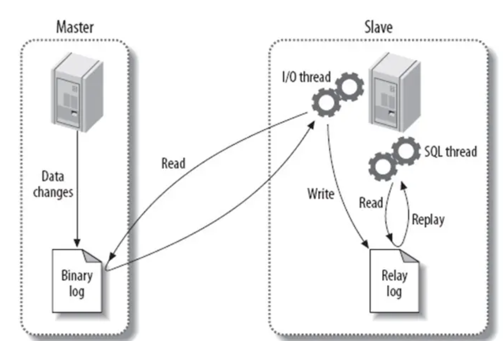

## 1 数据库基础知识

### 1.1 数据库三大范式

* 第一范式：每一个列都不可拆分

* 第二范式：在第一范式的基础上，非主键完全依赖于主键，而不能是依赖于主键的一部分。

* 第三范式：在第二范式的基础上，非主键完全直接依赖于主键，而不能传递依赖于主键。

### 1.2 MySQL 的 binlog 有几种录入格式

- statement模式下，每一条会修改数据的sql都会记录在binlog中。不需要记录每一行的变化，减少了binlog日志量，节约了IO，提高性能。由于sql的执行是有上下文的，因此在保存的时候需要保存相关的信息，同时还有一些使用了函数之类的语句无法被记录复制。
- row级别下，不记录sql语句上下文相关信息，仅保存哪条记录被修改。记录单元为每一行的改动，基本是可以全部记下来但是由于很多操作，会导致大量行的改动(比如alter table)，因此这种模式的文件保存的信息太多，日志量太大。
- mixed，一种折中的方案，普通操作使用statement记录，当无法使用statement的时候使用row。

### 1.3 数据库经常使用的函数

- count(*/column)：返回行数

- sum(column)： 返回指定列中唯一值的和

- max(column)：返回指定列或表达式中的数值最大值

- min(column)：返回指定列或表达式中的数值最小值

- avg(column)：返回指定列或表达式中的数值平均值

- date（Expression）: 返回指定表达式代表的日期值

### 1.4 MySQL 数据类型

> | 分类       | 类型名称         | 说明                                                               |
> | -------- | ------------ | ---------------------------------------------------------------- |
> | 整数类型     | tinyInt      | 很小的整数(8位二进制)                                                     |
> | 整数类型     | smallint     | 小的整数(16位二进制)                                                     |
> | 整数类型     | mediumint    | 中等大小的整数(24位二进制)                                                  |
> | 整数类型     | int(integer) | 普通大小的整数(32位二进制)                                                  |
> | 小数类型     | float        | 单精度浮点数                                                           |
> | 小数类型     | double       | 双精度浮点数                                                           |
> | 小数类型     | decimal(m,d) | 压缩严格的定点数                                                         |
> | 日期类型     | year         | YYYY 1901~2155                                                   |
> | 日期类型     | time         | HH:MM:SS -838:59:59~838:59:59                                    |
> | 日期类型     | date         | YYYY-MM-DD 1000-01-01~9999-12-3                                  |
> | 日期类型     | datetime     | YYYY-MM-DD HH:MM:SS 1000-01-01 00:00:00~ 9999-12-31 23:59:59     |
> | 日期类型     | timestamp    | YYYY-MM-DD HH:MM:SS 19700101 00:00:01 UTC~2038-01-19 03:14:07UTC |
> | 文本、二进制类型 | CHAR(M)      | M为0~255之间的整数                                                     |
> | 文本、二进制类型 | VARCHAR(M)   | M为0~65535之间的整数                                                   |
> | 文本、二进制类型 | TINYBLOB     | 允许长度0~255字节                                                      |
> | 文本、二进制类型 | BLOB         | 允许长度0~65535字节                                                    |
> | 文本、二进制类型 | MEDIUMBLOB   | 允许长度0~167772150字节                                                |
> | 文本、二进制类型 | LONGBLOB     | 允许长度0~4294967295字节                                               |
> | 文本、二进制类型 | TINYTEXT     | 允许长度0~255字节                                                      |
> | 文本、二进制类型 | TEXT         | 允许长度0~65535字节                                                    |
> | 文本、二进制类型 | MEDIUMTEXT   | 允许长度0~167772150字节                                                |
> | 文本、二进制类型 | LONGTEXT     | 允许长度0~4294967295字节                                               |
> | 文本、二进制类型 | VARBINARY(M) | 允许长度0~M个字节的变长字节字符串                                               |
> | 文本、二进制类型 | BINARY(M)    | 允许长度0~M个字节的定长字节字符串                                               |

**MyISAM与InnoDB区别**

> | 比较                                 | MyISAM                                                    | Innodb                                                                |
> | ---------------------------------- | --------------------------------------------------------- | --------------------------------------------------------------------- |
> | 存储结构                               | 每张表被存放在三个文件：frm-表格定义、MYD(MYData)-数据文件、MYI(MYIndex)-索引文件   | 所有的表都保存在同一个数据文件中（也可能是多个文件，或者是独立的表空间文件），InnoDB表的大小只受限于操作系统文件的大小，一般为2GB |
> | 存储空间                               | MyISAM可被压缩，存储空间较小                                         | InnoDB的表需要更多的内存和存储，它会在主内存中建立其专用的缓冲池用于高速缓冲数据和索引                        |
> | 可移植性、备份及恢复                         | 由于MyISAM的数据是以文件的形式存储，所以在跨平台的数据转移中会很方便。在备份和恢复时可单独针对某个表进行操作 | 免费的方案可以是拷贝数据文件、备份 binlog，或者用 mysqldump，在数据量达到几十G的时候就相对痛苦了             |
> | 文件格式                               | 数据和索引是分别存储的，数据`.MYD`，索引`.MYI`                             | 数据和索引是集中存储的，`.ibd`                                                    |
> | 记录存储顺序                             | 按记录插入顺序保存                                                 | 按主键大小有序插入                                                             |
> | 外键                                 | 不支持                                                       | 支持                                                                    |
> | 事务                                 | 不支持                                                       | 支持                                                                    |
> | 锁支持（锁是避免资源争用的一个机制，MySQL锁对用户几乎是透明的） | 表级锁定                                                      | 行级锁定、表级锁定，锁定力度小并发能力高                                                  |
> | SELECT                             | MyISAM更优                                                  | --                                                                    |
> | INSERT、UPDATE、DELETE               | --                                                        | InnoDB更优                                                              |
> | select count(*)                    | myisam更快，因为myisam内部维护了一个计数器，可以直接调取。                       |                                                                       |
> | 索引的实现方式                            | B+树索引，myisam 是堆表                                          | B+树索引，Innodb 是索引组织表                                                   |
> | 哈希索引                               | 不支持                                                       | 支持                                                                    |
> | 全文索引                               | 支持                                                        | 不支持                                                                   |

## 2 引擎

### 2.1 MyISAM 和 InnoDB

> | 比较                                 | MyISAM                                                    | Innodb                                                                |
> | ---------------------------------- | --------------------------------------------------------- | --------------------------------------------------------------------- |
> | 存储结构                               | 每张表被存放在三个文件：frm-表格定义、MYD(MYData)-数据文件、MYI(MYIndex)-索引文件   | 所有的表都保存在同一个数据文件中（也可能是多个文件，或者是独立的表空间文件），InnoDB表的大小只受限于操作系统文件的大小，一般为2GB |
> | 存储空间                               | MyISAM可被压缩，存储空间较小                                         | InnoDB的表需要更多的内存和存储，它会在主内存中建立其专用的缓冲池用于高速缓冲数据和索引                        |
> | 可移植性、备份及恢复                         | 由于MyISAM的数据是以文件的形式存储，所以在跨平台的数据转移中会很方便。在备份和恢复时可单独针对某个表进行操作 | 免费的方案可以是拷贝数据文件、备份 binlog，或者用 mysqldump，在数据量达到几十G的时候就相对痛苦了             |
> | 文件格式                               | 数据和索引是分别存储的，数据`.MYD`，索引`.MYI`                             | 数据和索引是集中存储的，`.ibd`                                                    |
> | 记录存储顺序                             | 按记录插入顺序保存                                                 | 按主键大小有序插入                                                             |
> | 外键                                 | 不支持                                                       | 支持                                                                    |
> | 事务                                 | 不支持                                                       | 支持                                                                    |
> | 锁支持（锁是避免资源争用的一个机制，MySQL锁对用户几乎是透明的） | 表级锁定                                                      | 行级锁定、表级锁定，锁定力度小并发能力高                                                  |
> | SELECT                             | MyISAM更优                                                  | --                                                                    |
> | INSERT、UPDATE、DELETE               | --                                                        | InnoDB更优                                                              |
> | select count(*)                    | myisam更快，因为myisam内部维护了一个计数器，可以直接调取。                       |                                                                       |
> | 索引的实现方式                            | B+树索引，myisam 是堆表                                          | B+树索引，Innodb 是索引组织表                                                   |
> | 哈希索引                               | 不支持                                                       | 支持                                                                    |
> | 全文索引                               | 支持                                                        | 不支持                                                                   |

## 3 索引

### 3.1 索引的优点和缺点

* 优点
  
  * 加快数据的检索速度

* 缺点
  
  * 时间上：创建和维护索引需要耗费额外的时间
  
  * 空间上：索引需要占用额外的物理空间

### 3.2 索引的分类

索引包括聚簇索引和非聚簇索引（辅助索引）

聚簇索引：主键 Primary Key

非聚簇索引（辅助索引）：唯一索引 unique，普通索引 index，全局索引 fulltext

### 3.3 索引的数据结构

B+树的特点:

- 所有关键字都在叶子节点出现
- 所有的关键字都出现在叶子节点的链表中，且链表中的关键字是有序的。
- 搜索只在叶子节点命中。
- 非叶子节点相当于是叶子节点的索引层，叶子节点是存储关键字数据的数据层。

相对于红黑树，B树，使用B+树做索引的优势:

- 由于B+树的内部节点只存放键，不存放值，因此，一次读取，可以在内存页中获取更多的键，有利于更快地缩小查找范围。
- 树的查询效率更加稳定。B+树所有数据都存在于叶子节点，所有关键字查询的路径长度相同，每次数据的查询效率相当。
- B+树只需要去遍历叶子节点的链表就可以实现整棵树的遍历。而B树需要进行中序遍历。

聚簇索引（主键）的叶子节点中包含了一行的值，非聚簇索引的叶子节点中包含主键值和索引列的值。如果要查找的值不完全在索引中，需要通过回表的方式来查找。即通过非聚簇索引的叶子节点存放的主键值来查找聚簇索引。

### 3.4 创建索引的原则

* 较频繁的作为查询条件的字段才能设置索引

* 更新较频繁的字段不适合设置索引（B+树的插入、删除、更新需要合并节点和分裂节点，消耗时间）

* 索引的列最好为非空字段，如果为空可以使用一个符号来代替，含有空字段的列很难进行查询、优化

* 索引字段要尽可能小，使用短索引而不是长索引，如果字段过长，那么应该指定一个前缀长度。

### 3.5 索引语句

用来创建普通索引，唯一索引，主键索引

```sql
alter table table_name add index index_name (column_list)
```

删除普通索引，唯一索引，全文索引

```sql
alter table table_name drop key index_name
```

### 3.6 百万以上数据如何删除

1. 先删除索引

2. 再删除数据

3. 最后重新创建索引

### 3.7 前缀索引

语法：index(field(10))  意思是使用字段值的前10个字符来建立索引，而索引默认使用字段的全部字符来建立索引。短索引优于长索引，占用空间小，查询效率高。

### 3.8 什么是最左匹配原则

在创建多列索引时，要根据业务需要，where 子句中使用最频繁的一列放在最左面。

最左前缀匹配原则，非常重要的原则，mysql会一直向右匹配直到遇到范围查询(>、<、between、like)就停止匹配，然后遍历叶子节点的链表，比如a = 1 and b = 2 and c > 3 and d = 4 如果建立(a,b,c,d)顺序的索引，d是用不到索引的，如果建立(a,b,d,c)的索引则都可以用到，a,b,d的顺序可以任意调整。

=和in可以乱序，比如a = 1 and b = 2 and c = 3 建立(a,b,c)索引可以任意顺序，mysql的查询优化器会帮你优化成索引可以识别的形式

### 3.9 非聚簇索引一定要回表查询吗

不一定，这涉及到查询语句所要求的字段是否全部命中了索引，如果全部命中了索引，那么就不必再进行回表查询。

举个简单的例子，假设我们在员工表的年龄上建立了索引，那么当进行`select age from employee where age < 20`的查询时，在索引的叶子节点上，已经包含了age信息，不会再次进行回表查询。

## 4 事务

### 4.1 ACID

- **原子性：** 事务是最小的执行单位，不允许分割。事务的原子性确保动作要么全部完成，要么完全不起作用；
- **一致性：** 执行事务前后，数据保持一致，多个事务对同一个数据读取的结果是相同的；
- **隔离性：** 并发访问数据库时，一个用户的事务不被其他事务所干扰，各并发事务之间数据库是独立的；
- **持久性：** 一个事务被提交之后。它对数据库中数据的改变是持久的，即使数据库发生故障也不应该对其有任何影响。

### 4.2 什么是脏读、幻读、不可重复读

- 脏读(Drity Read)：一个事务读取了另一个事务没有提交的数据
- 不可重复读(Non-repeatable read)：在一个事务的两次查询之中数据不一致，这可能是两次查询过程中间插入了一个事务更新的原有的数据。
- 幻读(Phantom Read)：在一个事务的两次查询中数据数量不一致，例如有一个事务查询了几列(Row)数据，而另一个事务却在此时插入了新的几列数据，先前的事务在接下来的查询中，就会发现有几列数据是它先前所没有的。

### 4.3 数据库隔离级别

| 隔离级别 | 脏读  | 不可重复读 | 幻读  |
| ---- | --- | ----- | --- |
| 读未提交 | √   | √     | √   |
| 读提交  | ×   | √     | √   |
| 可重复读 | ×   | ×     | √   |
| 串行化  | ×   | ×     | ×   |

InnoDB 默认采用可重复读隔离级别。

### 4.4 MVCC

MVCC 通过 ReadView 和 Undo Log 来实现的

Undo log 如下：


ReadView 如下：


一个事务只能访问已提交事务，如果当前数据行的trx_id号码不是已启动但是未提交的事务，且trx_id<max_trx_id，则可以修改或者写入当前数据行的事务已经结束，那么可以访问数据。

如果当前数据行的 trx_id 号码是已启动但是未提交的事务，或者 trx_id 大于 max_trx_id，那么就不能访问这个数据，两者可能是有事务对其进行更改中，不能访问。

如果判断当前数据行不能访问，那么就使用版本链来找到下一行的数据。

> 读提交 & 可重复读

对于「读提交」和「可重复读」隔离级别的事务来说，它们的快照读（普通 select 语句）是通过 Read View + undo log 来实现的，它们的区别在于创建 Read View 的时机不同：

- 「读提交」隔离级别是在每个 select 都会生成一个新的 Read View，也意味着，事务期间的多次读取同一条数据，前后两次读的数据可能会出现不一致，因为可能这期间另外一个事务修改了该记录，并提交了事务。
- 「可重复读」隔离级别是启动事务时生成一个 Read View，然后整个事务期间都在用这个 Read View，这样就保证了在事务期间读到的数据都是事务启动前的记录。

## 5 锁

### 5.1 锁的类别

* 共享锁： 又叫做读锁。 当用户要进行数据的读取时，对数据加上共享锁。共享锁就是让多个线程同时获取一个锁。

* 排他锁： 又叫做写锁。 当用户要进行数据的写入时，对数据加上排他锁。排它锁也称作独占锁，一个锁在某一时刻只能被一个线程占有，其它线程必须等待锁被释放之后才可能获取到锁。排他锁只可以加一个，他和其他的排他锁，共享锁都相斥。

### 5.2 按照粒度分类锁

* 行级锁：InnoDB 支持。行级锁是Mysql中锁定粒度最细的一种锁，对行加锁。行级锁分为 共享锁 和 排他锁。

* 表级锁：InnoDB 和 MyISAM 支持，对表加锁。表级锁分为 共享锁 和 排他锁。

* 页级锁：一次锁定相邻的一组记录。

### 5.3 悲观锁和乐观锁是什么，怎么实现

悲观锁：假定会发生并发冲突，屏蔽一切可能违反数据完整性的操作。在查询完数据的时候就把事务锁起来，直到提交事务。实现方式：使用数据库中的锁机制

for update 是一种行级排他锁。

```sql
//核心SQL,主要靠for update
select status from t_goods where id=1 for update;
```

乐观锁：假设不会发生并发冲突，只在提交操作时检查是否违反数据完整性。在修改数据的时候把事务锁起来，通过version的方式来进行锁定。实现方式：乐一般会使用版本号机制或CAS算法实现。如果操作失败则重试。

```sql
//核心SQL
update table set x=x+1, version=version+1 where id=#{id} and version=#{version};
```

悲观锁使用在写多读少的场景，乐观锁使用在读多写少的场景。悲观锁缺点就是读数据需要等待锁的释放，耗时；乐观锁的缺点就是写数据线程多了，就会频繁发生重试。

## 6 日志

- **undo log（回滚日志）**：是 Innodb 存储引擎层生成的日志，实现了事务中的**原子性**，主要**用于事务回滚和 MVCC**。
- **redo log（重做日志）**：是 Innodb 存储引擎层生成的日志，实现了事务中的**持久性**，主要**用于掉电等故障恢复**；
- **binlog （归档日志）**：是 Server 层生成的日志，主要**用于数据备份和主从复制**；

### 6.1 Undo log

Undo log 不会被持久化。

undo log 记录数据修改前的值，undo log 在 MySQL 中的样子是这样的：


一条记录的每一次更新操作产生的 undo log 格式都有一个 roll_pointer 指针和一个 trx_id 事务id：

- 通过 trx_id 可以知道该记录是被哪个事务修改的；
- 通过 roll_pointer 指针可以将这些 undo log 串成一个链表，这个链表就被称为版本链；

对于「读提交」和「可重复读」隔离级别的事务来说，它们的快照读（普通 select 语句）是通过 Read View + undo log 来实现的，它们的区别在于创建 Read View 的时机不同：

- 「读提交」隔离级别是在每个 select 都会生成一个新的 Read View，也意味着，事务期间的多次读取同一条数据，前后两次读的数据可能会出现不一致，因为可能这期间另外一个事务修改了该记录，并提交了事务。
- 「可重复读」隔离级别是启动事务时生成一个 Read View，然后整个事务期间都在用这个 Read View，这样就保证了在事务期间读到的数据都是事务启动前的记录。

### 6.2 Redo log

redo log 是 Innodb 存储引擎实现的日志。

记录了某个数据页做了什么修改，用于宕机恢复。

Redo log 刷盘策略：

- InnoDB 的后台线程每隔 1 秒，将 redo log buffer 持久化到磁盘。
- 每次事务提交时都将缓存在 redo log buffer 里的 redo log 直接持久化到磁盘（这个策略可由 innodb_flush_log_at_trx_commit 参数控制）。

innodb_flush_log_at_trx_commit 参数：

- 当设置该**参数为 0 时**，表示每次事务提交时 ，还是**将 redo log 留在 redo log buffer 中** ，该模式下在事务提交时不会主动触发写入磁盘的操作。
- 当设置该**参数为 1 时**，表示每次事务提交时，都**将缓存在 redo log buffer 里的 redo log 直接持久化到磁盘**，这样可以保证 MySQL 异常重启之后数据不会丢失。
- 当设置该**参数为 2 时**，表示每次事务提交时，都只是缓存在 redo log buffer 里的 redo log **写到 redo log 文件****，注意写入到「 redo log 文件」并不意味着写入到了磁盘**，因为操作系统的文件系统中有个 Page Cache（如果你想了解 Page Cache，可以看[这篇 (opens new window)](https://xiaolincoding.com/os/6_file_system/pagecache.html)），Page Cache 是专门用来缓存文件数据的，所以写入「 redo log文件」意味着写入到了操作系统的文件缓存。


InnoDB 的后台线程每隔 1 秒：

- 针对参数 0 ：会把缓存在 redo log buffer 中的 redo log ，通过调用 `write()` 写到操作系统的 Page Cache，然后调用 `fsync()` 持久化到磁盘。**所以参数为 0 的策略，MySQL 进程的崩溃会导致上一秒钟所有事务数据的丢失**;
- 针对参数 2 ：调用 fsync，将缓存在操作系统中 Page Cache 里的 redo log 持久化到磁盘。**所以参数为 2 的策略，较取值为 0 情况下更安全，因为 MySQL 进程的崩溃并不会丢失数据，只有在操作系统崩溃或者系统断电的情况下，上一秒钟所有事务数据才可能丢失**。


- write pos 和 checkpoint 的移动都是顺时针方向；
- write pos ～ checkpoint 之间的部分（图中的红色部分），用来记录新的更新操作；
- check point ～ write pos 之间的部分（图中蓝色部分）：待落盘的脏数据页记录；

### 6.3 Bin log

binlog 是 MySQL 的 Server 层实现的日志，所有存储引擎都可以使用。

binlog 用于备份恢复、主从复制。

MySQL 在完成一条更新操作后，Server 层还会生成一条 binlog，等之后事务提交的时候，会将该事物执行过程中产生的所有 binlog 统一写 入 binlog 文件。

binlog 文件是记录了所有数据库表结构变更和表数据修改的日志，不会记录查询类的操作，比如 SELECT 和 SHOW 操作。

### 6.4 为什么需要两阶段提交

防止数据库因为宕机，Redo log 和 Bin log 内容不一致。


可以看到，**对于处于 prepare 阶段的 redo log，即可以提交事务，也可以回滚事务，这取决于是否能在 binlog 中查找到与 redo log 相同的 XID**，如果有就提交事务，如果没有就回滚事务。这样就可以保证 redo log 和 binlog 这两份日志的一致性了。

所以说，**两阶段提交是以 binlog 写成功为事务提交成功的标识**，因为 binlog 写成功了，就意味着能在 binlog 中查找到与 redo log 相同的 XID。

## 7 视图

### 7.1 视图特点

* 视图中的列可以来自于不同的表

* 如果视图中的表来自于单个表，那么对于视图添加、删除、修改数据会影响基本表。

* 如果视图中的表来自于多个表，那么不允许对视图进行数据的添加、删除。可以修改。

## 8 常用 SQL 语句

### 8.1 语法顺序

1. SELECT
2. FROM
3. JOIN
4. ON
5. WHERE
6. GROUP BY
7. HAVING
8. UNION
9. ORDER BY
10. LIMIT

### 8.2 SQL 约束有哪些

- NOT NULL: 用于控制字段的内容一定不能为空（NULL）。
- UNIQUE: 控件字段内容不能重复，一个表允许有多个 Unique 约束。
- PRIMARY KEY: 也是用于控件字段内容不能重复，但它在一个表只允许出现一个。
- FOREIGN KEY: 用于预防破坏表之间连接的动作，也能防止非法数据插入外键列，因为它必须是它指向的那个表中的值之一。
- CHECK: 用于控制字段的值范围。

### 8.3 六种关联查询及例子

- 交叉连接（CROSS JOIN）

- 内连接（INNER JOIN）

- 外连接（LEFT JOIN/RIGHT JOIN）

- 联合查询（UNION与UNION ALL）

- 全连接（FULL JOIN）

- 交叉连接（CROSS JOIN）

> **例子**

有两张表，1张R、1张S，R表有ABC三列，S表有CD两列，表中各有三条记录。

**R表**

| A   | B   | C   |
| --- | --- | --- |
| a1  | b1  | c1  |
| a2  | b2  | c2  |
| a3  | b3  | c3  |

**S表**

| C   | D   |
| --- | --- |
| c1  | d1  |
| c2  | d2  |
| c4  | d3  |

##### 1、交叉连接(笛卡尔积)

```sql
select r.*,s.* from r,s
```

| A   | B   | C   | C   | D   |
| --- | --- | --- | --- | --- |
| a1  | b1  | c1  | c1  | d1  |
| a2  | b2  | c2  | c1  | d1  |
| a3  | b3  | c3  | c1  | d1  |
| a1  | b1  | c1  | c2  | d2  |
| a2  | b2  | c2  | c2  | d2  |
| a3  | b3  | c3  | c2  | d2  |
| a1  | b1  | c1  | c4  | d3  |
| a2  | b2  | c2  | c4  | d3  |
| a3  | b3  | c3  | c4  | d3  |

##### 2、内连接

```sql
select r.*,s.* from r inner join s on r.c=s.c
```

| A   | B   | C   | C   | D   |
| --- | --- | --- | --- | --- |
| a1  | b1  | c1  | c1  | d1  |
| a2  | b2  | c2  | c2  | d2  |

##### 3、左连接

```sql
select r.*,s.* from r left join s on r.c=s.c
```

| A   | B   | C   | C   | D   |
| --- | --- | --- | --- | --- |
| a1  | b1  | c1  | c1  | d1  |
| a2  | b2  | c2  | c2  | d2  |
| a3  | b3  | c3  |     |     |

##### 4、右连接

```sql
select r.*,s.* from r right join s on r.c=s.c
```

| A   | B   | C   | C   | D   |
| --- | --- | --- | --- | --- |
| a1  | b1  | c1  | c1  | d1  |
| a2  | b2  | c2  | c2  | d2  |
|     |     |     | c4  | d3  |

## 9 优化

### 9.1 大表怎么优化

* 限定数据的范围： 务必禁止不带任何限制数据范围条件的查询语句。比如：我们当用户在查询订单历史的时候，我们可以控制在一个月的范围内。

* 读写分离：主库负责写，从库负责读

* 通过分库分表的方式进行优化：垂直分表，水平分表。

#### 1. 垂直分表

把主键和一些列放在一个表，然后把主键和另外的列放在另一个表中。

适用场景：一个表中某些列常用，某些列不常用，就可以将不常用的列与常用的列分开。

缺点：垂直分表会改变逻辑算法，增加开发成本。


#### 2. 水平分表


优点：降低索引的层数。

水平分表的方案：在应用和数据之间增加一个代理，分片逻辑统一维护在代理中。

ID 问题：一旦数据库被切分到多个物理结点上，我们将不能再依赖数据库自身的主键生成机制。所以需要分布式全局唯一ID的方案。**Twitter的分布式自增ID算法Snowflake** 在分布式系统中，需要生成全局UID的场合还是比较多的，twitter的snowflake解决了这种需求，实现也还是很简单的，除去配置信息，核心代码就是毫秒级时间41位 机器ID 10位 毫秒内序列12位。

### 9.2 主从复制

复制过程：

- **主**：binlog线程——记录下所有改变了数据库数据的语句，放进master上的binlog中；

- **从**：io线程——在使用start slave 之后，负责从master上拉取 binlog 内容，放进自己的relay log中；

- **从**：sql执行线程——执行relay log中的语句；



Binary log：主数据库的二进制日志；Relay log：从服务器的中继日志

1. master在每个事务更新数据完成之前，将该操作记录串行地写入到binlog文件中。
2. salve开启一个I/O Thread，该线程在master打开一个普通连接，主要工作是binlog dump process。如果读取的进度已经跟上了master，就进入睡眠状态并等待master产生新的事件。I/O线程最终的目的是将这些事件写入到中继日志中。
3. SQL Thread会读取中继日志，并顺序执行该日志中的SQL事件，从而与主数据库中的数据保持一致。

### 9.3 优化 SQL 语句

1. 经常用于 where 和 order by 查询列的可以考虑在列上建立索引

2. 索引字段不要为空，要用一个符号来代替空值

3. where 子句中如果使用 or 作为连接条件，会导致引擎放弃索引而选择全表搜索。

SQL 执行顺序：

- FROM：将数据从硬盘加载到数据缓冲区，方便对接下来的数据进行操作。
- WHERE：从基表或视图中选择满足条件的元组。（不能使用聚合函数）
- JOIN（如right left 右连接-------从右边表中读取某个元组，并且找到该元组在左边表中对应的元组或元组集）
- ON：join on实现多表连接查询，推荐该种方式进行多表查询，不使用子查询。
- GROUP BY：分组，一般和聚合函数一起使用。
- HAVING：在元组的基础上进行筛选，选出符合条件的元组。（一般与GROUP BY进行连用）
- SELECT：查询到得所有元组需要罗列的哪些列。
- DISTINCT：去重的功能。
- UNION：将多个查询结果合并（默认去掉重复的记录）。
- ORDER BY：进行相应的排序。
- LIMIT 1：显示输出一条数据记录（元组）

## 10 其他问题

* utf8 和 utf8mb4：

`mysql`中`utf8`实际上是`utf8mb3`(最大存储3字节)，`utf8mb4`最大可以存储4字节（大部分表情都要占用4字节，所以需要选择`utf8mb4`）
