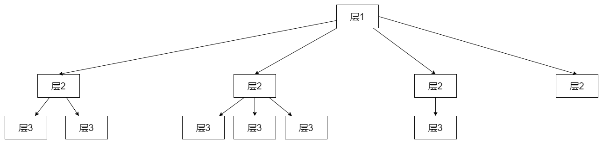

## 层级结构的表设计

如图所示：（每一层的元素个数都不确定，但是能确定最多只有三层）

想将这个层级结构设计到一个表中，怎么设计？

| 主键  | 层1的ID | 层2的ID | 层3的ID |
|:--- | ----- | ----- | ----- |
| 1   | 1     | 1     | 1     |
| 2   | 1     | 1     | 2     |
| 3   | 1     | 2     | 1     |
| 4   | 1     | 2     | 2     |
| 5   | 1     | 2     | 3     |
| 6   | 1     | 3     | 1     |
| 7   | 1     | 4     | 0     |

实际场景：哔哩哔哩的用户收藏夹，里面有子收藏夹和视频。

用户的收藏夹就是层1，子收藏夹或者视频就是层2，视频就是层3。可能有的子收藏夹里面无视频，如主键7的情况，也可能层2里面就有视频，可以用层3的ID=-1表示层2是视频而不是收藏夹。
