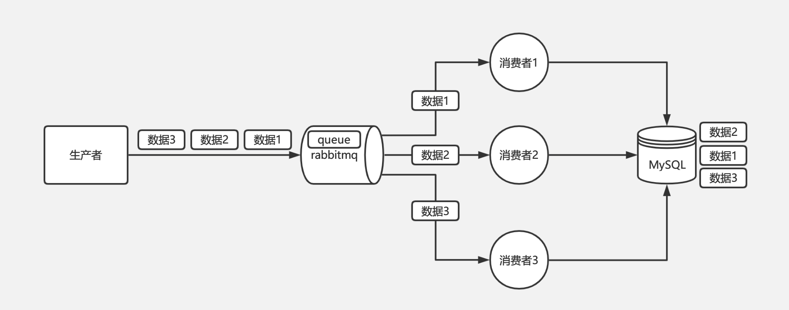
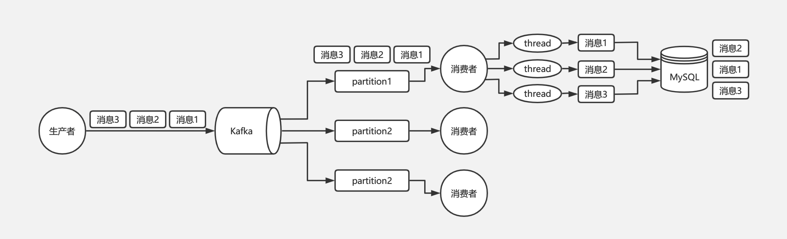
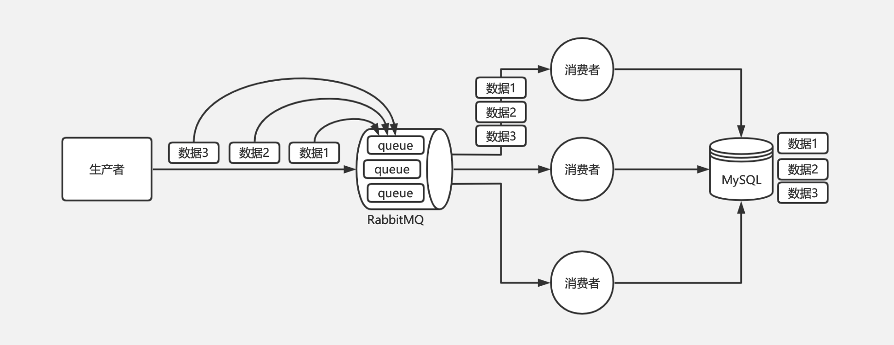
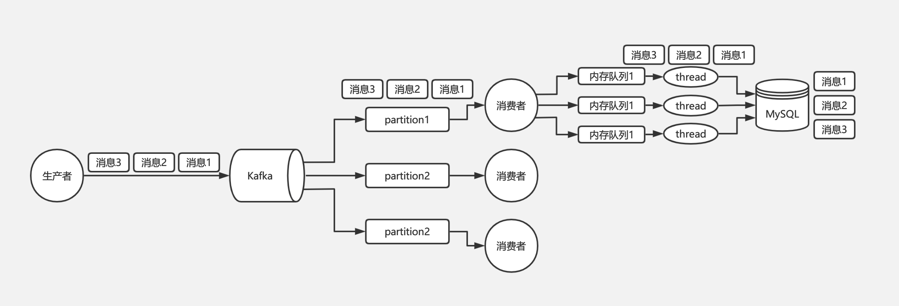
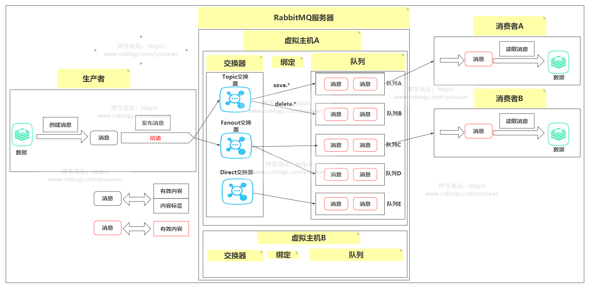
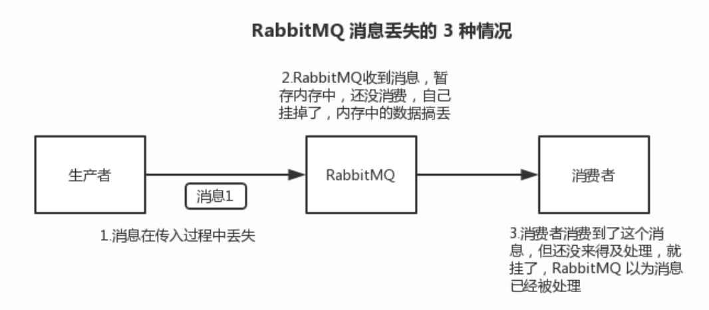
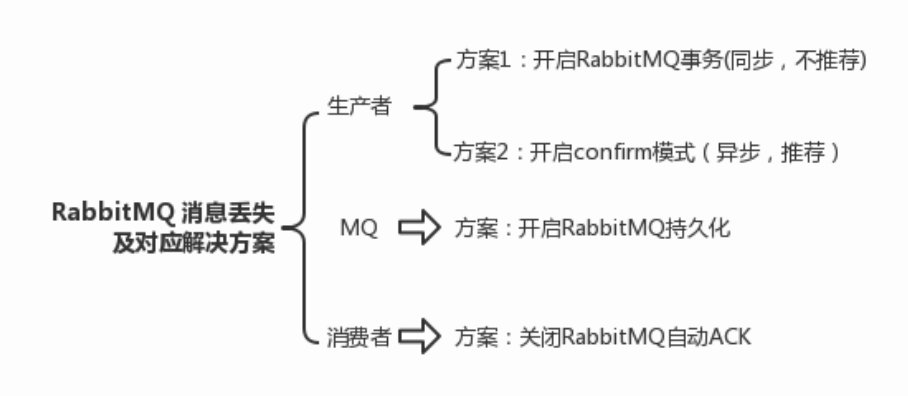
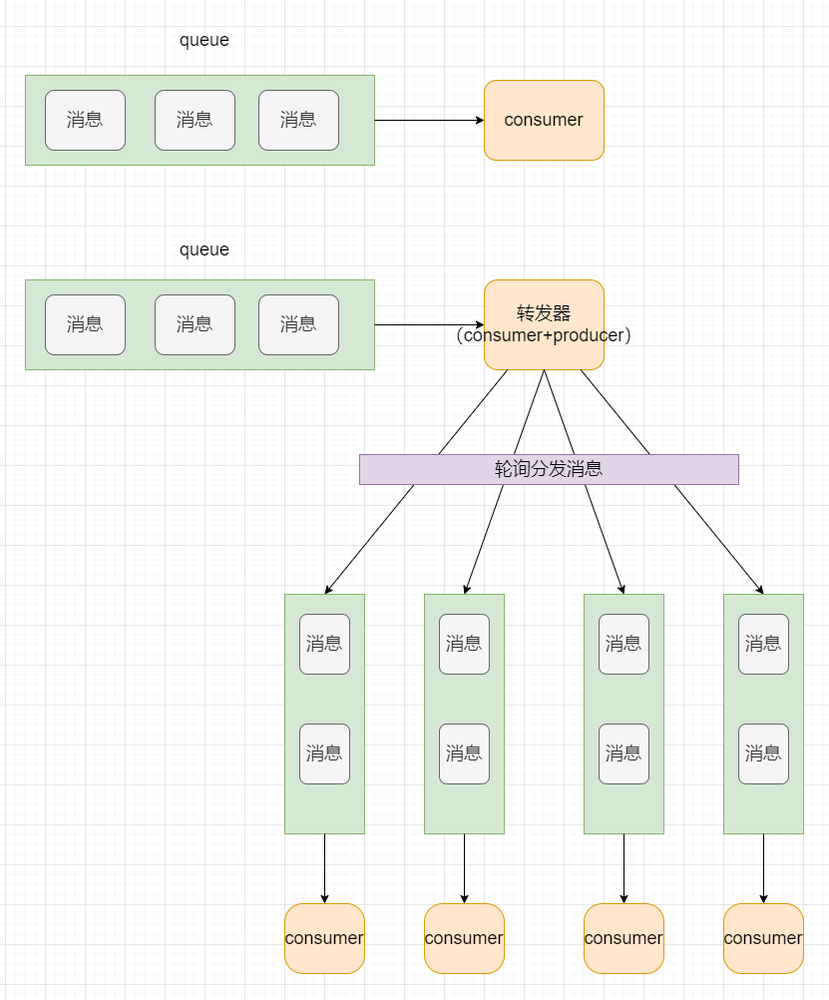

## 1 基本的知识

* queue 绑定 exchange 有三种模式
  
  * fanout -- exchange 将消息发送到所有的 queue。
  
  * direct -- exchange 根据消息的 routing key，选择 routing key 相同的 queue，将消息发送到符合条件的 queue 中，假如有多个 queue 符合条件，也全部发送。
  
  * topic -- exchange 根据消息的 routing key，选择能够匹配上的 queue，这里的匹配有两种：* 只能代表一个词语，# 能代表零个或者多个词语。

* 就是一个系统或者一个模块，调用了多个系统或者模块，互相之间的调用很复杂，维护起来很麻烦。但是其实这个调用是不需要直接同步调用接口的，如果用 MQ 给它异步化解耦。

## 2 MQ的常见问题--消息顺序问题

消息的顺序问题：要严格按照消息发送顺序来进行消费。

在生产中经常会有一些类似报表系统这样的系统，需要做 MySQL 的 binlog 同步。比如订单系统要同步订单表的数据到大数据部门的 MySQL 库中用于报表统计分析，通常的做法是基于 Canal 这样的中间件去监听订单数据库的 binlog，然后把这些 binlog 发送到 MQ 中，再由消费者从 MQ 中获取 binlog 落地到大数据部门的 MySQL 中。

在这个过程中，可能会有对某个订单的增删改操作，比如有三条 binlog 执行顺序是增加、修改、删除；消费者愣是换了顺序给执行成删除、修改、增加，这样能行吗？肯定是不行的。

* RabbitMQ 消息顺序错乱

对于 RabbitMQ 来说，导致上面顺序错乱的原因通常是消费者是集群部署，不同的消费者消费到了同一订单的不同的消息，如消费者 A 执行了增加，消费者 B 执行了修改，消费者 C 执行了删除，但是消费者 C 执行比消费者 B 快，消费者 B 又比消费者 A 快，就会导致消费 binlog 执行到数据库的时候顺序错乱，本该顺序是增加、修改、删除，变成了删除、修改、增加。

如下图是 RabbitMQ 可能出现顺序错乱的问题示意图：

* Kafka 消息顺序错乱

对于 Kafka 来说，一个 topic 下同一个 partition 中的消息肯定是有序的，生产者在写的时候可以指定一个 key，通过我们会用订单号作为 key，这个 key 对应的消息都会发送到同一个 partition 中，所以消费者消费到的消息也一定是有序的。

那么为什么 Kafka 还会存在消息错乱的问题呢？问题就出在消费者身上。通常我们消费到同一个 key 的多条消息后，会使用多线程技术去并发处理来提高消息处理速度，否则一条消息的处理需要耗时几十 ms，1 秒也就只能处理几十条消息，吞吐量就太低了。而多线程并发处理的话，binlog 执行到数据库的时候就不一定还是原来的顺序了。

如下图是 Kafka 可能出现乱序现象的示意图：

* RabbitMQ 保证消息的顺序性

RabbitMQ 的问题是由于不同的消息都发送到了同一个 queue 中，多个消费者都消费同一个 queue 的消息。解决这个问题，我们可以给 RabbitMQ 创建多个 queue，每个消费者固定消费一个 queue 的消息，生产者发送消息的时候，同一个订单号的消息发送到同一个 queue 中，由于同一个 queue 的消息是一定会保证有序的，那么同一个订单号的消息就只会被一个消费者顺序消费，从而保证了消息的顺序性。

如下图是 RabbitMQ 保证消息顺序性的方案：

* Kafka 保证消息的顺序性

Kafka 从生产者到消费者消费消息这一整个过程其实都是可以保证有序的，导致最终乱序是由于消费者端需要使用多线程并发处理消息来提高吞吐量，比如消费者消费到了消息以后，开启 32 个线程处理消息，每个线程线程处理消息的快慢是不一致的，所以才会导致最终消息有可能不一致。

所以对于 Kafka 的消息顺序性保证，其实我们只需要保证同一个订单号的消息只被同一个线程处理的就可以了。由此我们可以在线程处理前增加个内存队列，每个线程只负责处理其中一个内存队列的消息，同一个订单号的消息发送到同一个内存队列中即可。

如下图是 Kafka 保证消息顺序性的方案：

* 总结

消息的顺序性其实是 MQ 中比较值得注意的一个常见问题，特别是对于同一订单存在多条消息的这种情况，不同的执行顺序可能导致完全不同的结果，顺序的错乱可能会导致业务上的很多问题，而且往往这些问题还是比较难排查的。不过也不是所有消息都需要考虑它的全局顺序性，不相关的消息就算顺序错乱对业务也是毫无影响的，需要根据具体问题来看。

## 3 MQ的常见问题 -- 消息的重复问题

先说为什么会重复消费：正常情况下，消费者在消费消息的时候，消费完毕后，会发送一个确认消息给消息队列，消息队列就知道该消息被消费了，就会将该消息从消息队列中删除；

但是因为网络传输等等故障，确认信息没有传送到消息队列，导致消息队列不知道自己已经消费过该消息了，再次将消息分发给其他的消费者。

所以解决这个问题的办法就是绕过这个问题。那么问题就变成了：如果消费端收到两条一样的消息，应该怎样处理？

消费端处理消息的业务逻辑保持幂等性。只要保持幂等性，不管来多少条重复消息，最后处理的结果都一样。

- 比如：在写入消息队列的数据做唯一标示，消费消息时，根据唯一标识判断是否消费过；

- 假设你有个系统，消费一条消息就往数据库里插入一条数据，要是你一个消息重复两次，你不就插入了两条，这数据不就错了？但是你要是消费到第二次的时候，自己判断一下是否已经消费过了，若是就直接扔了，这样不就保留了一条数据，从而保证了数据的正确性。

## 4 消息如何分发

如果一个 queue 有多个消费者订阅，那么有两种方式进行调度，一种是使用循环调度的方式，将 queue 中的消息轮询的发送给消费者。另一种是使用公平调度和手动消息确认，在消费者明确确认上一条消息已经消费完之前，不要向这个消费者发送消息。

## 5 消息怎么路由

生产者 --> Exchange --> queues --> 消费者

消息提供方发送消息的时候，消息带着一个 routing key（路由键）。通过  队列路由键，将消息发送给路由键匹配的队列。

常用的交换器主要分为以下三种：

* fanout 广播到所有队列

* direct 消息被投递到路由键完全匹配的队列

* topic 消息被投递到通配符匹配的队列

## 6 RabbitMQ 消息基于什么传输

由于 TCP 连接建立和销毁开销巨大，且并发数受系统资源限制，会造成性能瓶颈。RabbitMQ 使用信道的方式来传输数据。信道是建立在真实的 TCP 连接内的虚拟连接，且每条 TCP 连接上的信道数量没有限制。

RabbitMQ 消息格式：

这里的消息分为两部分：**有效内容和内容标签。**

生产者产生了消息，然后发布到 RabbitMQ 服务器，发布之前肯定要先连接上服务器，也就是要在应用程序和rabbitmq 服务器之间建立一条 TCP 连接，一旦连接建立，应用程序就可以创建一条 AMQP 信道。

信道是建立在“真实的”TCP 连接内的虚拟连接，AMQP 命令都是通过信道发送出去的，每条信道都会被指派一个唯一的ID（AMQP库会帮你记住ID的），不论是发布消息、订阅队列或者接收消息，这些动作都是通过信道来完成的。

这里原因是效率问题，因为对于操作系统来说，每次建立和销毁 TCP 会话是非常昂贵的开销，而实际系统中，比如电商双十一，每秒钟高峰期成千上万条连接，一般来说操作系统建立TCP连接是有数量限制的，那么这就会遇到瓶颈。

## 7 如何保证消息的可靠性传输

这个是肯定的，用 MQ 有个基本原则，就是**数据不能多一条，也不能少一条**，不能多，就是前面说的重复消费和幂等性问题。不能少，就是说这数据别搞丢了。那这个问题你必须得考虑一下。

如果说你这个是用 MQ 来传递非常核心的消息，比如说计费、扣费的一些消息，那必须确保这个 MQ 传递过程中**绝对不会把计费消息给弄丢**。

### 保证消息在生产者传入的过程中不丢失

使用生产者确认模式：

如果你要确保说写 RabbitMQ 的消息别丢，可以开启 `confirm` 模式，在生产者那里设置开启`confirm`模式之后，你每次写的消息都会分配一个唯一的 id，然后如果写入了 RabbitMQ 中，RabbitMQ 会给你回传一个`ack`消息，告诉你说这个消息 ok 了。如果 RabbitMQ 没能处理这个消息，会回调你一个`nack`接口，告诉你这个消息接收失败，你可以重试。而且你可以结合这个机制自己在内存里维护每个消息 id 的状态，如果超过一定时间还没接收到这个消息的回调，那么你可以重发。

`confirm` 机制是异步的，你发送个消息之后就可以发送下一个消息，然后那个消息RabbitMQ 接收了之后会异步回调你一个接口通知你这个消息接收到了。

### 保证 RabbitMQ 不会弄丢数据

为了防止 RabbitMQ 弄丢数据，必须开启 RabbitMQ 持久化，就是在消息写入之后会持久化到磁盘，哪怕是 RabbitMQ 挂了，恢复之后会自动读取之前存储的数据，一般数据不会丢失。

设置持久化有两个步骤：

* 创建 queue 的时候将其设置为持久化，这样就可以保证 RabbitMQ 持久化 queue 的元数据，但是不会持久化 queue 里的数据。

* 第二个是在发送消息的时候，将消息的 deliveryMode 设置为 2。

持久化可以跟生产者那边的`confirm`机制配合起来，只有消息被持久化到磁盘之后，才会通知生产者`ack`了，所以哪怕是在持久化到磁盘之前，RabbitMQ 挂了，数据丢了，生产者收不到`ack`，你也是可以自己重发的。注意，哪怕是你给 RabbitMQ 开启了持久化机制，也有一种可能，就是这个消息写到了 RabbitMQ 中，但是还没来得及持久化到磁盘上，结果不巧，此时 RabbitMQ 挂了，就会导致内存里的一点点数据丢失。

### 保证消费者消费完成之前数据还在

RabbitMQ 如果丢失了数据，主要是因为你消费的时候，**刚消费到，还没处理，结果进程挂了**，比如重启了，那么就尴尬了，RabbitMQ 认为你都消费了，这数据就丢了。

这个时候得用 RabbitMQ 提供的`ack`机制，简单来说，就是你关闭 RabbitMQ 的自动`ack`，可以通过一个 api 来调用就行，然后每次你自己代码里确保处理完的时候，再在程序里`ack`一把。这样的话，如果你还没处理完，不就没有`ack`？那 RabbitMQ 就认为你还没处理完，这个时候 RabbitMQ 会把这个消费分配给别的 consumer 去处理，消息是不会丢的。

## 8 为什么不应该对所有的 message 都使用持久化机制

是否要对 message 进行持久化，需要综合考虑性能需要，以及可能遇到的问题。若想达到 100,000 条/秒以上的消息吞吐量（单 RabbitMQ 服务器），要么使用可靠性传输的方式来，要么使用非常快速的存储系统以支持全持久化（例如使用 SSD）。另外一种处理原则是：仅对关键消息作持久化处理（根据业务重要程度），且应该保证关键消息的量不会导致性能瓶颈。

## 9 如何保证高可用 -- RabbitMQ 集群

RabbitMQ 有三种模式：单机模式，普通集群模式，镜像集群模式。

* 单机模式：就是 Demo 级别的，用于测试

* 普通集群模式：

创建的 queue 只会在一个 RabbitMQ 实例上，每个实例都同步 queue 的元数据（元数据可以被认为是一些配置信息，通过元数据，可以找到 queue 实例的位置）。如果消费的 queue 所在的实例是 A，而客户端连接的实例是 B，那么 B 就会从 A 的 queue 拉取数据到 B，这样可以提高吞吐量。

* 镜像集群模式：

在镜像集群模式下，你创建的 queue，无论元数据还是 queue 里的消息都会存在于多个实例上。可以指定这个 queue 存在于哪些节点上。每次写消息到 queue 的时候，都会自动把消息同步到多个实例的 queue 上。

## 10 如何处理消息积压问题

先向现有的 consumer 都停掉，临时建好原来 10 倍的 queue 的数量。然后写一个临时的分发数据的 consumer 程序，然后消费积压的数据，消费之后不做耗时处理，直接轮询写入到 10 倍数量的 queue 队列中。接着征用 10 倍的机器来部署 consumer，每一批 consumer 消费一个临时 queue 数据。

这种做法相当于临时将 queue 资源和 consumer 资源扩大 10 倍，以正常 10 倍的速度来消费数据。

