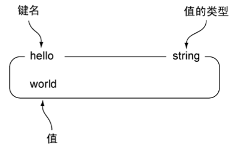
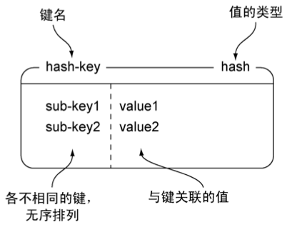
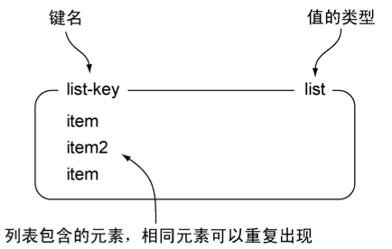
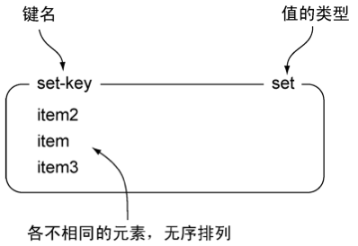
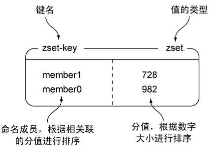

# Redis 数据类型

> * String
> 
> * Hash
> 
> * List
> 
> * Set
> 
> * Zset
> 
> Redis高级数据类型
> 
> * BitMap
> 
> * HyperLogLog
> 
> * GEO

## String



适用场景：**缓存、计数器、共享 Session**

* 可以储存的值：字符串、整数或者浮点数

* 操作：
  
  * 对整个字符串或者字符串的其中一部分执行操作；
  
  * 对整数和浮点数执行自增或者自减操作

* 命令：
  
  * get：获取存储在给定键中的值。
  
  * set：设置存储在给定键中的值。
  
  * del：删除存储在给定键中的值（这个命令可以用于所有类型）。
  
  * incr：为键 `key` 储存的数字值加一
  
  * decr：为键 `key` 储存的数字值减一

* 更多命令：[Redis String 类型命令](https://redis.io/commands#string)

```bash
127.0.0.1:6379> set hello world
OK
127.0.0.1:6379> get hello
"world"
127.0.0.1:6379> del hello
(integer) 1
127.0.0.1:6379> get hello
(nil)
```

**常见命令用法**

**SET**

- `EX` *seconds* -- Set the specified expire time, in seconds.
- `PX` *milliseconds* -- Set the specified expire time, in milliseconds.
- `NX` -- Only set the key if it does not already exist.
- `XX` -- Only set the key if it already exist.

```bash
> set <key> <value> [PX|EX] <ttl> [NX|XX]
```

## Hash



适用场景：对象缓存

* 命令：
  
  * hset：在散列里面关联起给定的键值对
  
  * hget：获取指定散列健的值
  
  * hgetall：获取散列包含的所有键值对
  
  * hdel：如果给定的健存在于散列中，那么移除这个健

* 更多命令：[Redis Hash 类型命令](https://redis.io/commands#hash)

```bash
127.0.0.1:6379> hset hash-key sub-key1 value1
(integer) 1
127.0.0.1:6379> hset hash-key sub-key2 value2
(integer) 1
127.0.0.1:6379> hset hash-key sub-key1 value1
(integer) 0
127.0.0.1:6379> hset hash-key sub-key3 value2
(integer) 0
127.0.0.1:6379> hgetall hash-key
1) "sub-key1"
2) "value1"
3) "sub-key2"
4) "value2"
127.0.0.1:6379> hdel hash-key sub-key2
(integer) 1
127.0.0.1:6379> hdel hash-key sub-key2
(integer) 0
127.0.0.1:6379> hget hash-key sub-key1
"value1"
127.0.0.1:6379> hgetall hash-key
1) "sub-key1"
2) "value1"
```

## List



适用场景：**用于存储列表型数据**。如：粉丝列表、商品列表等

* 命令：
  
  * lpush：将给定值推入列表的前端。
  
  * rpush：将给定值推入列表的后端。
  
  * lpop：从列表的前端弹出一个值，并返回被弹出的值。
  
  * rpop：从列表的后端弹出一个值，并返回被弹出的值。
  
  * lrange：获取列表在给定范围上的所有值。
  
  * lindex：获取列表在给定位置上的单个元素。
  
  * lrem：从列表去掉特定的值的个数

* 更多命令：[Redis List 类型命令](https://redis.io/commands#list)

```bash
127.0.0.1:6379> rpush list-key item
(integer) 1
127.0.0.1:6379> rpush list-key item2
(integer) 2
127.0.0.1:6379> rpush list-key item
(integer) 3
127.0.0.1:6379> lrange list-key 0 -1
1) "item"
2) "item2"
3) "item"
127.0.0.1:6379> lindex list-key 1
"item2"
127.0.0.1:6379> lpop list-key
"item"
127.0.0.1:6379> lrange list-key 0 -1
1) "item2"
2) "item"
```

## Set



**适用场景：用于存储去重的列表型数据**。

* 命令：
  
  * sadd：将给定元素添加到集合。
  
  * smembers：返回集合包含的所有元素。
  
  * sismember检查给定元素是否存在于集合中。
  
  * srem：如果给定的元素存在于集合中，那么移除这个元素。

* 更多命令：[Redis Set 类型命令](https://redis.io/commands#set)

```bash
127.0.0.1:6379> sadd set-key item
(integer) 1
127.0.0.1:6379> sadd set-key item2
(integer) 1
127.0.0.1:6379> sadd set-key item3
(integer) 1
127.0.0.1:6379> sadd set-key item
(integer) 0
127.0.0.1:6379> smembers set-key
1) "item"
2) "item2"
3) "item3"
127.0.0.1:6379> sismember set-key item4
(integer) 0
127.0.0.1:6379> sismember set-key item
(integer) 1
127.0.0.1:6379> srem set-key item2
(integer) 1
127.0.0.1:6379> srem set-key item2
(integer) 0
127.0.0.1:6379> smembers set-key
1) "item"
2) "item3"
```

## Zset



适用场景：由于可以设置 score，且不重复。**适合用于存储各种排行数据**，如：按评分排序的有序商品集合、按时间排序的有序文章集合。

* 命令：
  
  * zadd：将一个带有给定分值的成员添加到有序集合里面。
  
  * zrange：根据元素在有序排列中所处的位置，从有序集合里面获取多个元素。
  
  * zrangebyscore：获取有序集合在给定分值范围内的所有元素。
  
  * zrem：获取有序集合在给定分值范围内的所有元素。

* 更多命令：[Redis ZSet 类型命令](https://redis.io/commands/?group=sorted-set)

```bash
127.0.0.1:6379> zadd zset-key 728 member1
(integer) 1
127.0.0.1:6379> zadd zset-key 982 member0
(integer) 1
127.0.0.1:6379> zadd zset-key 982 member0
(integer) 0
127.0.0.1:6379> zrange zset-key 0 -1 withscores
1) "member1"
2) "728"
3) "member0"
4) "982"
127.0.0.1:6379> zrangebyscore zset-key 0 800 withscores
1) "member1"
2) "728"
127.0.0.1:6379> zrem zset-key member1
(integer) 1
127.0.0.1:6379> zrem zset-key member1
(integer) 0
127.0.0.1:6379> zrange zset-key 0 -1 withscores
1) "member0"
2) "982"
```

**常见命令用法**

* zunionstore

计算`numkeys`由指定键给定的排序集的并集，并将结果存储在`destination`. `numkeys`在传递输入键和其他（可选）参数之前，必须提供输入键的数量 ( )。

默认情况下，一个元素的结果分数是它在它所在的排序集中的分数的总和。

使用该`WEIGHTS`选项，可以为每个输入排序集指定一个乘法因子。这意味着在传递给聚合函数之前，每个输入排序集中的每个元素的分数都乘以该因子。如果`WEIGHTS`未给出，则乘法因子默认为`1`。

使用该`AGGREGATE`选项，可以指定联合结果的聚合方式。此选项默认为`SUM`，其中元素的分数在其存在的输入中求和。当此选项设置为`MIN`或`MAX`时，结果集将包含元素在其存在的输入中的最小或最大分数。

如果`destination`已经存在，则将其覆盖。

`destination`是目的集合的名称

```bash
redis:6379> ZADD zset1 1 "one"
(integer) 1
redis:6379> ZADD zset1 2 "two"
(integer) 1
redis:6379> ZADD zset2 1 "one"
(integer) 1
redis:6379> ZADD zset2 2 "two"
(integer) 1
redis:6379> ZADD zset2 3 "three"
(integer) 1
redis:6379> ZUNIONSTORE out 2 zset1 zset2 WEIGHTS 2 3
(integer) 3
redis:6379> ZRANGE out 0 -1 WITHSCORES
1) "one"
2) "5"
3) "three"
4) "9"
5) "two"
6) "10"
```

* zinterstore

计算`numkeys`由指定键给定的排序集的交集，并将结果存储在`destination`. `numkeys`在传递输入键和其他（可选）参数之前，必须提供输入键的数量 ( )。

默认情况下，一个元素的结果分数是它在它所在的排序集中的分数的总和。因为交集要求元素是每个给定排序集的成员，所以结果排序集中每个元素的分数等于输入排序集的数量。

有关`WEIGHTS`和`AGGREGATE`选项的说明，请参阅[`ZUNIONSTORE`](https://redis.io/commands/zunionstore)。

如果`destination`已经存在，则将其覆盖。

`destination`是目的集合的名称

```bash
redis:6379> ZADD zset1 1 "one"
(integer) 1
redis:6379> ZADD zset1 2 "two"
(integer) 1
redis:6379> ZADD zset2 1 "one"
(integer) 1
redis:6379> ZADD zset2 2 "two"
(integer) 1
redis:6379> ZADD zset2 3 "three"
(integer) 1
redis:6379> ZINTERSTORE out 2 zset1 zset2 WEIGHTS 2 3
(integer) 2
redis:6379> ZRANGE out 0 -1 WITHSCORES
1) "one"
2) "5"
3) "two"
4) "10"
```

* zrangebyscore

```bash
redis:6379> ZADD myzset 1 "one"
(integer) 1
redis:6379> ZADD myzset 2 "two"
(integer) 1
redis:6379> ZADD myzset 3 "three"
(integer) 1
redis:6379> ZRANGEBYSCORE myzset -inf +inf
1) "one"
2) "two"
3) "three"
redis:6379> ZRANGEBYSCORE myzset 1 2
1) "one"
2) "two"
redis:6379> ZRANGEBYSCORE myzset (1 2
1) "two"
redis:6379> ZRANGEBYSCORE myzset (1 (2
(empty array)
redis:6379> zadd myzset 4 "four"
(integer) 1
redis:6379> zadd myzset 5 "five"
(integer) 1
redis:6379> zadd myzset 6 "six"
(integer) 1
redis:6379> zadd myzset 7 "seven"
(integer) 1
redis:6379> zrangebyscore myzset 1 7 
1) "one"
2) "two"
3) "three"
4) "four"
5) "five"
6) "six"
7) "seven"
redis:6379> zrangebyscore myzset 1 7 limit 1 -1
1) "two"
2) "three"
3) "four"
4) "five"
5) "six"
6) "seven"
redis:6379> zrangebyscore myzset 1 7 limit 1 5
1) "two"
2) "three"
3) "four"
4) "five"
5) "six"
redis:6379> zrangebyscore myzset 1 7 limit 1 2
1) "two"
2) "three"
redis:6379> zrangebyscore myzset 1 7 limit 1 12
1) "two"
2) "three"
3) "four"
4) "five"
5) "six"
6) "seven"
```

## BitMap

BitMap 即位图。BitMap 不是一个真实的数据结构。而是 STRING 类型上的一组面向 bit 操作的集合。由于 STRING 是二进制安全的 blob，并且它们的最大长度是 512m，所以 BitMap 能最大设置 $$2^{32}$$ 个不同的 bit。

Bitmaps 的最大优点就是存储信息时可以节省大量的空间。例如在一个系统中，不同的用户被一个增长的用户 ID 表示。40 亿（$$2^{32}$$ = $$4*1024*1024*1024$$ ≈ 40 亿）用户只需要 512M 内存就能记住某种信息，例如用户是否登录过。

**BitMap命令**

- [SETBIT](http://redisdoc.com/bitmap/setbit.html)- 对 `key` 所储存的字符串值，设置或清除指定偏移量上的位(bit)。
- [GETBIT ](http://redisdoc.com/bitmap/getbit.html)- 对 `key` 所储存的字符串值，获取指定偏移量上的位(bit)。
- [BITCOUNT ](http://redisdoc.com/bitmap/bitcount.html)- 计算给定字符串中，被设置为 `1` 的比特位的数量。
- [BITPOS](http://redisdoc.com/bitmap/bitpos.html)
- [BITOP](http://redisdoc.com/bitmap/bitop.html)
- [BITFIELD](http://redisdoc.com/bitmap/bitfield.html)

**BitMap示例**

```bash
# 对不存在的 key 或者不存在的 offset 进行 GETBIT， 返回 0
redis> EXISTS bit
(integer) 0

redis> GETBIT bit 10086
(integer) 0

# 对已存在的 offset 进行 GETBIT
redis> SETBIT bit 10086 1
(integer) 0

redis> GETBIT bit 10086
(integer) 1

redis> BITCOUNT bit
(integer) 1
```

**BitMap应用** 

Bitmap 对于一些特定类型的计算非常有效。例如：使用 bitmap 实现用户上线次数统计。

假设现在我们希望记录自己网站上的用户的上线频率，比如说，计算用户 A 上线了多少天，用户 B 上线了多少天，诸如此类，以此作为数据，从而决定让哪些用户参加 beta 测试等活动 —— 这个模式可以使用 [SETBIT key offset value ](http://redisdoc.com/bitmap/setbit.html#setbit)和 [BITCOUNT key [start] [end] ](http://redisdoc.com/bitmap/bitcount.html#bitcount)来实现。

比如说，每当用户在某一天上线的时候，我们就使用 [SETBIT key offset value ](http://redisdoc.com/bitmap/setbit.html#setbit)，以用户名作为 `key`，将那天所代表的网站的上线日作为 `offset` 参数，并将这个 `offset` 上的为设置为 `1` 。

> 更详细的实现可以参考：
> 
> [一看就懂系列之 详解 redis 的 bitmap 在亿级项目中的应用](https://blog.csdn.net/u011957758/article/details/74783347)
> 
> [Fast, easy, realtime metrics using Redis bitmaps](http://blog.getspool.com/2011/11/29/fast-easy-realtime-metrics-using-redis-bitmaps/)

## HyperLogLog

HyperLogLog 是用于计算唯一事物的概率数据结构（从技术上讲，这被称为估计集合的基数）。如果统计唯一项，项目越多，需要的内存就越多。因为需要记住过去已经看过的项，从而避免多次统计这些项。

**HyperLogLog 命令**

- [PFADD ](http://redisdoc.com/hyperloglog/pfadd.html)- 将任意数量的元素添加到指定的 HyperLogLog 里面。
- [PFCOUNT ](http://redisdoc.com/hyperloglog/pfcount.html)- 返回 HyperLogLog 包含的唯一元素的近似数量。
- [PFMERGE ](http://redisdoc.com/hyperloglog/pfmerge.html)- 将多个 HyperLogLog 合并（merge）为一个 HyperLogLog ， 合并后的 HyperLogLog 的基数接近于所有输入 HyperLogLog 的可见集合（observed set）的并集。合并得出的 HyperLogLog 会被储存在 `destkey` 键里面， 如果该键并不存在， 那么命令在执行之前， 会先为该键创建一个空的 HyperLogLog 。

**HyperLogLog 示例**

```bash
redis> PFADD  databases  "Redis"  "MongoDB"  "MySQL"
(integer) 1

redis> PFCOUNT  databases
(integer) 3

redis> PFADD  databases  "Redis"    
# Redis 已经存在，不必对估计数量进行更新
(integer) 0

redis> PFCOUNT  databases    # 元素估计数量没有变化
(integer) 3

redis> PFADD  databases  "PostgreSQL"    
# 添加一个不存在的元素
(integer) 1

redis> PFCOUNT  databases    # 估计数量增一
4
```

## GEO

这个功能可以将用户给定的地理位置（经度和纬度）信息储存起来，并对这些信息进行操作。

**GEO 命令**

- [GEOADD](http://redisdoc.com/geo/geoadd.html)- 将指定的地理空间位置（纬度、经度、名称）添加到指定的 key 中。
- [GEOPOS ](http://redisdoc.com/geo/geopos.html)- 从 key 里返回所有给定位置元素的位置（经度和纬度）。
- [GEODIST ](http://redisdoc.com/geo/geodist.html)- 返回两个给定位置之间的距离。
- [GEOHASH ](http://redisdoc.com/geo/geohash.html)- 回一个或多个位置元素的标准 Geohash 值，它可以在http://geohash.org/使用。
- [GEORADIUS](http://redisdoc.com/geo/georadius.html)
- [GEORADIUSBYMEMBER](http://redisdoc.com/geo/georadiusbymember.html)

## 参考

* [Redis 命令参考](http://redisdoc.com/index.html)
