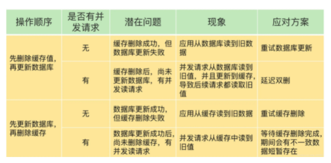
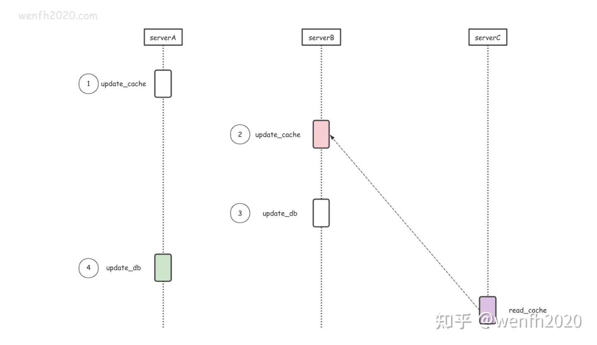
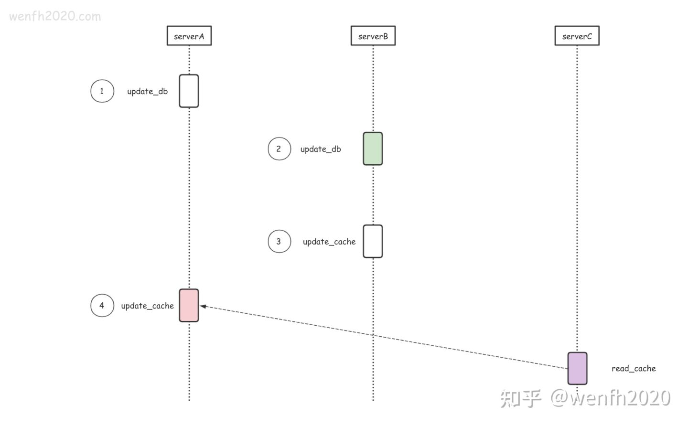
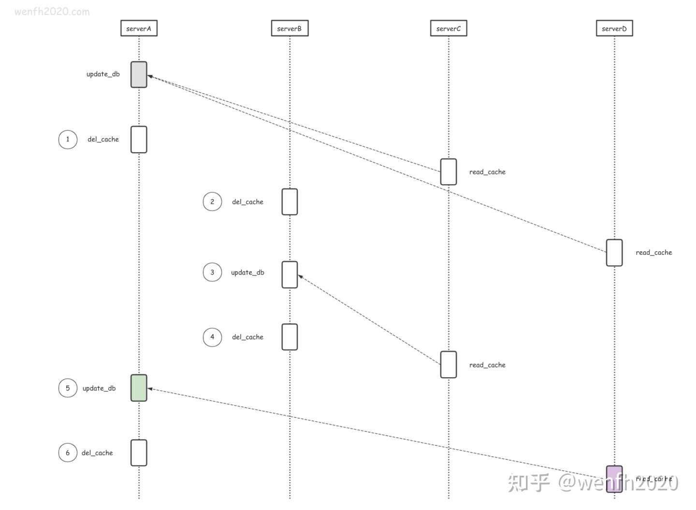

# 延迟双删策略：

写DB前后都执行redis.del(key), 并设置合理的超时时间。

 执行流程：

```
def update_data(key, obj):
    del_cache(key)     # 删除 redis 缓存数据。
    update_db(obj)     # 更新数据库数据。
    logic_sleep(_time) # 当前逻辑延时执行。
    del_cache(key)     # 删除 redis 缓存数据。
```

## 1 问题

1. 为什么要删除缓存数据，而不是修改？
2. 为什么要睡眠一段时间再进行第二次删除数据？

## 2 缓存处理

### 2.1 更新缓存

为什么要删除缓存呢，更新缓存不行吗？

看看下面两种场景，不同服务节点修改存储数据，都可能出现 redis 和 mysql 出现数据不一致问题。

* 先改缓存再改数据库。



1. 线程A更新缓存

2. 线程B更新缓存

3. 线程B更新数据库

4. 线程A更新数据库

此时，数据库中的值是线程A执行的结果，缓存中的值是线程B执行的结果，发生了数据不一致。

* 先改数据库再改缓存



1. 线程A更新数据库

2. 线程B更新数据库

3. 线程B更新缓存

4. 线程A更新缓存

此时，数据库中的值是线程B执行的结果，缓存中的值是线程A执行的结果，发生了数据不一致。

归根结底，不管是先更新数据库再更新缓存，还是先更新缓存再更新数据库。5本身并不满足原子性，所以不能保证数据库与缓存的数据一致性。

### 2.2 删除缓存

双删缓存，理论上，mysql 与 redis 的数据是比较一致的。



#### 问题：如果最后一步不删除缓存会怎么样？

答：在高并发的条件下，可能会出现：A 线程执行执行完del_cache后，B 线程执行del_cache，update_db. 然后C线程读取数据库字段值，发现缓存中没有，就去数据库中读取，读取之后将该值加入缓存中，此时缓存中的值是B线程执行的值。接着A线程继续执行update_db. 此时就出现了数据库和缓存数据不一致的情况。

#### 问题：为什么要延迟？

因为 mysql 和 redis 主从节点数据不是实时同步的，同步数据需要时间。

数据工作的大致流程：

1. 服务节点删除 redis 主库数据。
2. 服务节点修改 mysql 主库数据。
3. 服务节点使得当前业务处理 `等待一段时间`，等 redis 和 mysql 主从节点数据同步成功。
4. 服务节点从 redis 主库删除数据。
5. 当前或其它服务节点读取 redis 从库数据，发现 redis 从库没有数据，从 mysql 从库读取数据，并写入 redis 主库。

## 3 缺点

1. 延时双删，有等待环节，如果系统要求低延时，这种场景就不合适了。
2. 延时双删，不适合“秒杀”这种频繁修改数据和要求数据强一致的场景。
3. 延时双删，延时时间是一个预估值，不能确保 mysql 和 redis 数据在这个时间段内都实时同步或持久化成功了。

## 4 小结

1. 延时双删用比较简洁的方式实现 mysql 和 redis 数据最终一致性，但它不是强一致。
2. 延时，是因为 mysql 和 redis 主从节点数据同步不是实时的，所以需要等待一段时间，去增强它们的数据一致性。
3. `延时` 是指当前请求逻辑处理延时，而不是当前线程或进程睡眠延时。
4. mysql 和 redis 数据一致性是一个复杂的课题，通常是多种策略同时使用，例如：延时双删、redis 过期淘汰、通过路由策略串行处理同类型数据、分布式锁等等。 
