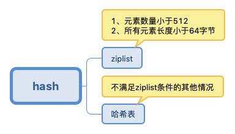
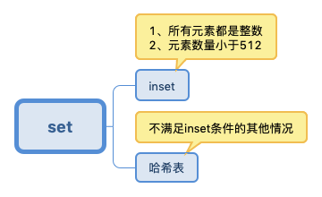
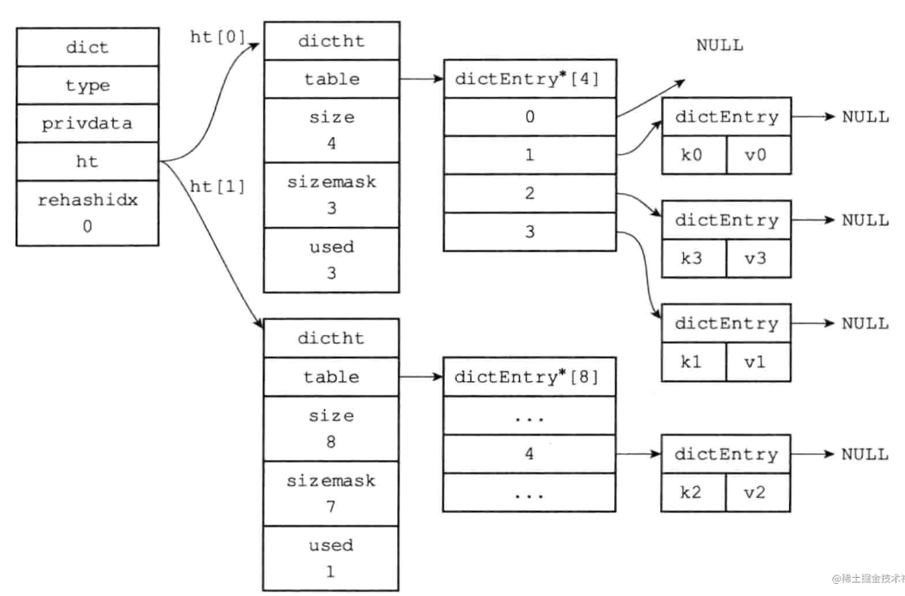

## 1 持久化

### 1.1 RDB

fork 一个子线程来将数据进行持久化，使用写时复制的技术，如果主线程要对数据进行修改，那么就复制一份，交给主线程修改，原来的那一份交给子线程来复制到 RDB 文件中。

也可以直接使用主进程来进行持久化，在持久化期间 Redis 挂起。

优点：数据集较大时，启动效率比 AOF 高。

缺点：持久化之间发生故障，导致数据丢失。

### 1.2 AOF

将 Redis 写命令追加到 AOF 文件中，写命令先保存到 AOF 缓冲区中，然后再被写入文件中。

AOF 缓冲区刷盘策略：

* 每个命令都刷盘
* 每秒刷盘一次
* 让操作系统决定刷盘时间

AOF 可以被后台重写。

### 1.3 选择最合适的持久化方式

同时使用两种持久化功能。在这种情况下，当 Redis 重启的时候会优先载入AOF文件来恢复原始的数据，因为在通常情况下AOF文件保存的数据集要比RDB文件保存的数据集要完整。

## 2 Redis 过期键删除策略

- 惰性过期：只有当访问一个key时，才会判断该key是否已过期，过期则清除。该策略可以最大化地节省CPU资源，却对内存非常不友好。极端情况可能出现大量的过期key没有再次被访问，从而不会被清除，占用大量内存。

- 定期过期：每隔一定的时间，会扫描一定数量的数据库的expires字典中一定数量的key，并清除其中已过期的key。该策略是前两者的一个折中方案。通过调整定时扫描的时间间隔和每次扫描的限定耗时，可以在不同情况下使得CPU和内存资源达到最优的平衡效果。
  (expires字典会保存所有设置了过期时间的key的过期时间数据，其中，key是指向键空间中的某个键的指针，value是该键的毫秒精度的UNIX时间戳表示的过期时间。键空间是指该Redis集群中保存的所有键。)

**Redis 同时使用了定时过期和惰性过期两种策略**

## 3 Redis 内存淘汰策略

* 从全局的键空间选择
  
  * 当内存不够时，会报错
  
  * LRU：移除最久未使用的 key
  
  * 随机移除 key

* 从设置过期时间的键空间选择
  
  * LRU：移除最久未使用的 key
  
  * 随机移除 key
  
  * 移除最早过期的 key

Redis的内存淘汰策略的选取并不会影响过期的key的处理。内存淘汰策略用于处理内存不足时的需要申请额外空间的数据；过期策略用于处理过期的缓存数据。

## 4 Redis 为什么这么快

* 完全基于内存，使用 HashMap，操作时间复杂度为 O(1)

* 使用 I/O 多路复用模型，阻塞 I/O

* 使用单线程，避免了上下文切换和竞争条件，也不存在因为多线程导致的切换而消耗 CPU。

## 5 Redis 应用场景

- Redis主要有5种数据类型，包括String，List，Set，Zset，Hash，满足大部分的使用要求

| 数据类型   | 可以存储的值      | 操作                                                          | 应用场景                              |
| ------ | ----------- | ----------------------------------------------------------- | --------------------------------- |
| String | 字符串、整数或者浮点数 | 对整个字符串或者字符串的其中一部分执行操作<br>对整数和浮点数执行自增或者自减操作                  | 做简单的键值对缓存                         |
| List   | 列表          | 从两端压入或者弹出元素<br>对单个或者多个元素进行修剪，<br>只保留一个范围内的元素                | 存储一些列表型的数据结构，类似粉丝列表、文章的评论列表之类的数据  |
| Set    | 无序集合        | 添加、获取、移除单个元素<br>检查一个元素是否存在于集合中<br>计算交集、并集、差集<br>从集合里面随机获取元素 | 交集、并集、差集的操作，比如交集，可以把两个人的粉丝列表整一个交集 |
| Hash   | 包含键值对的无序散列表 | 添加、获取、移除单个键值对<br>获取所有键值对<br>检查某个键是否存在                       | 结构化的数据，比如一个对象                     |
| ZSet   | 有序集合        | 添加、获取、删除元素<br>根据分值范围或者成员来获取元素<br>计算一个键的排名                   | 去重但可以排序，如获取排名前几名的用户               |

## 6 Redis 线程模型

Redis基于Reactor模式开发了网络事件处理器，这个处理器被称为文件事件处理器（file event handler）。它的组成结构为4部分：多个套接字、IO多路复用程序、文件事件分派器、事件处理器。因为文件事件分派器队列的消费是单线程的，所以Redis才叫单线程模型。

- 文件事件处理器使用 I/O 多路复用（multiplexing）程序来同时监听多个套接字， 并根据套接字目前执行的任务来为套接字关联不同的事件处理器。
- 当被监听的套接字准备好执行连接应答（accept）、读取（read）、写入（write）、关闭（close）等操作时， 与操作相对应的文件事件就会产生， 这时文件事件处理器就会调用套接字之前关联好的事件处理器来处理这些事件。

虽然文件事件处理器以单线程方式运行， 但通过使用 I/O 多路复用程序来监听多个套接字， 文件事件处理器既实现了高性能的网络通信模型， 又可以很好地与 redis 服务器中其他同样以单线程方式运行的模块进行对接， 这保持了 Redis 内部单线程设计的简单性。

## 7 Redis 事务

1. 事务开始 Multi

2. 事务监听键值是否被修改 Watch

3. 命令入队

4. 事务执行 Exec（事务终止Discard）

Redis 不支持事务的回滚，Redis 在事务执行失败时不进行回滚，而是继续执行余下的命令。如果在一个事务中的命令语法出现错误，那么所有的命令都不会执行。如果一个事务在运行中出现错误，那么正确的命令会被执行。

- WATCH 命令是一个乐观锁，可以为 Redis 事务提供 check-and-set （CAS）行为。 可以监控一个或多个键，一旦其中有一个键被修改（或删除），之后的事务就不会执行，监控一直持续到EXEC命令。
- MULTI命令用于开启一个事务，它总是返回OK。 MULTI执行之后，客户端可以继续向服务器发送任意多条命令，这些命令不会立即被执行，而是被放到一个队列中，当EXEC命令被调用时，所有队列中的命令才会被执行。
- EXEC：执行所有事务块内的命令。返回事务块内所有命令的返回值，按命令执行的先后顺序排列。 当操作被打断时，返回空值 nil 。
- 通过调用DISCARD，客户端可以清空事务队列，并放弃执行事务， 并且客户端会从事务状态中退出。
- UNWATCH命令可以取消watch对所有key的监控。

### 7.1 Redis 事务具有隔离性吗

Redis 是单进程程序，并且它保证在执行事务时，不会对事务进行中断，事务可以运行直到执行完所有事务队列中的命令为止。因此，**Redis 的事务是总是带有隔离性的**。

### 7.2 Redis 事务保证原子性吗，支持回滚吗

Redis中，单条命令是原子性执行的，但**事务不保证原子性，且没有回滚**。事务中任意命令执行失败，其余的命令仍会被执行。

### 7.3 Redis 事务其他实现

基于Lua脚本，Redis可以保证脚本内的命令一次性、按顺序地执行，其同时也不提供事务运行错误的回滚，执行过程中如果部分命令运行错误，剩下的命令还是会继续运行完。

## 8 集群方案


Redis Cluster 没有使用一致性hash算法，而是采用槽（slot）的概念，一共分为 16384 个槽。将请求发送到任意节点，接收到请求的节点会将查询请求发送到正确的节点上执行。

**每个key通过CRC16校验后对16384取模来决定放置哪个槽，集群的每个节点负责一部分hash槽。**

> 方案说明：

- 通过哈希的方式，将数据分片，每个节点均分存储一定哈希槽(哈希值)区间的数据，默认分配了16384 个槽位
- 每份数据分片会存储在多个互为主从的多节点上
- 数据写入先写主节点，再同步到从节点(支持配置为阻塞同步)
- 同一分片多个节点间的数据不保持一致性
- 读取数据时，当客户端操作的key没有分配在该节点上时，redis会返回转向指令，指向正确的节点
- 扩容时时需要需要把旧节点的数据迁移一部分到新节点

在 redis cluster 架构下，每个 redis 要放开两个端口号，比如一个是 6379，另外一个就是 加1w 的端口号，比如 16379。

16379 端口号是用来进行节点间通信的，也就是 cluster bus 的东西，cluster bus 的通信，用来进行故障检测、配置更新、故障转移授权。cluster bus 用了另外一种二进制的协议，`gossip` 协议，用于节点间进行高效的数据交换，占用更少的网络带宽和处理时间。

### 8.1 节点内部通信机制：

集群元数据的维护：redis cluster 节点间采用 gossip 协议进行通信。

### 8.2 Redis 集群如何选择数据库？

Redis集群目前无法做数据库选择，默认在0数据库。

### 8.3 Redis集群最大节点个数是多少？

16384

### 8.4 Redis集群会有写操作丢失吗？为什么？

Redis并不能保证数据的强一致性，这意味这在实际中集群在特定的条件下可能会丢失写操作。

## 9 Redis 主从架构

单机的 redis，能够承载的 QPS 大概就在上万到几万不等。对于缓存来说，一般都是用来支撑**读高并发**的。因此架构做成主从(master-slave)架构，一主多从，主负责写，并且将数据复制到其它的 slave 节点，从节点负责读。所有的**读请求全部走从节点**。这样也可以很轻松实现水平扩容，**支撑读高并发**。

### 9.1 Redis 主从复制核心原理

- 当启动一个 slave node 的时候，它会发送一个 `PSYNC` 命令给 master node。

- 如果这是 slave node 初次连接到 master node，那么会触发一次 `full resynchronization` 全量复制。此时 master 会启动一个后台线程，开始生成一份 `RDB` 快照文件，

- 同时还会将从客户端 client 新收到的所有写命令缓存在内存中。`RDB` 文件生成完毕后， master 会将这个 `RDB` 发送给 slave，slave 会先**写入本地磁盘，然后再从本地磁盘加载到内存**中，

- 接着 master 会将内存中缓存的写命令发送到 slave，slave 也会同步这些数据。

- slave node 如果跟 master node 有网络故障，断开了连接，会自动重连，连接之后 master node 仅会复制给 slave 部分缺少的数据。

### 9.2 Redis 常见性能问题以及解决方案

1. Master最好不要做任何持久化工作，包括内存快照和AOF日志文件，特别是不要启用内存快照做持久化。
2. 如果数据比较关键，某个Slave开启AOF备份数据，策略为每秒同步一次。
3. 为了主从复制的速度和连接的稳定性，Slave和Master最好在同一个局域网内。
4. 尽量避免在压力较大的主库上增加从库。
5. Master调用BGREWRITEAOF重写AOF文件，AOF在重写的时候会占大量的CPU和内存资源，导致服务load过高，出现短暂服务暂停现象。
6. 为了Master的稳定性，主从复制不要用图状结构，用单向链表结构更稳定，即主从关系为：Master<–Slave1<–Slave2<–Slave3…，这样的结构也方便解决单点故障问题，实现Slave对Master的替换，也即，如果Master挂了，可以立马启用Slave1做Master，其他不变。

## 10 分区

### 10.1 Redis是单线程的，如何提高多核CPU的利用率？

可以在同一个服务器部署多个Redis的实例，并把他们当作不同的服务器来使用，在某些时候，无论如何一个服务器是不够的， 所以，如果你想使用多个CPU，你可以考虑一下分片（shard）。

### 10.2 有哪些 Redis 分区实现方案？

客户端分区就是在客户端就已经决定数据会被存储到哪个redis节点或者从哪个redis节点读取。大多数客户端已经实现了客户端分区。

代理分区 意味着客户端将请求发送给代理，然后代理决定去哪个节点写数据或者读数据。代理根据分区规则决定请求哪些Redis实例，然后根据Redis的响应结果返回给客户端。redis和memcached的一种代理实现就是Twemproxy

查询路由(Query routing) 的意思是客户端随机地请求任意一个redis实例，然后由Redis将请求转发给正确的Redis节点。Redis Cluster实现了一种混合形式的查询路由，但并不是直接将请求从一个redis节点转发到另一个redis节点，而是在客户端的帮助下直接redirected到正确的redis节点。

### 10.3 Redis 分区有什么缺点？

涉及多个key的操作通常不会被支持。例如你不能对两个集合求交集，因为他们可能被存储到不同的Redis实例（实际上这种情况也有办法，但是不能直接使用交集指令）。

同时操作多个key,则不能使用Redis事务.

分区使用的粒度是key，不能使用一个非常长的排序key存储一个数据集（The partitioning granularity is the key, so it is not possible to shard a dataset with a single huge key like a very big sorted set）

当使用分区的时候，数据处理会非常复杂，例如为了备份你必须从不同的Redis实例和主机同时收集RDB / AOF文件。

分区时动态扩容或缩容可能非常复杂。Redis集群在运行时增加或者删除Redis节点，能做到最大程度对用户透明地数据再平衡，但其他一些客户端分区或者代理分区方法则不支持这种特性。然而，有一种预分片的技术也可以较好的解决这个问题。

## 11 分布式

### 11.1 Redis 实现分布式锁

> 单实例：

* Redis为单进程单线程模式，采用队列模式将并发访问变成串行访问，且多客户端对Redis的连接并不存在竞争关系Redis中可以使用setNx命令实现分布式锁。
- 当且仅当 key 不存在，将 key 的值设为 value。 若给定的 key 已经存在，则 setNx不做任何动作

- SETNX 是『SET if Not eXists』(如果不存在，则 SET)的简写。

- 返回值：设置成功，返回 1 。设置失败，返回 0 。

> 使用setNx完成同步锁的流程及事项如下：

- 使用SETNX命令获取锁，若返回0（key已存在，锁已存在）则获取失败，反之获取成功

- 为了防止获取锁后程序出现异常，导致其他线程/进程调用setNx命令总是返回0而进入死锁状态，需要为该key设置一个“合理”的过期时间释放锁，使用DEL命令将锁数据删除

> 多实例：Red Lock

基本思路：2N+1个Redis Master，这些节点完全独立，都是主节点。

获取锁：

1. 以毫秒为单位获取当前时间。

2. 尝试顺序获取N个实例中的锁，SET key value NX PX 30000

3. 当能从大于等于N+1个节点中获取锁时，就可以认为已经获取。

4. 如果不能从大于等于N+1个节点获取锁，则将解锁所有已经获得的锁。

> 主从分布式锁存在的问题

Redis Master 宕机：

1. 客户端 A 获取主机中的锁；

2. 主服务器在对密钥的写入传输到副本之前崩溃；

3. 副本被提升为主；此时副本中的锁没有被客户端 A 持有；

### 11.2 如何解决 Redis 并发竞争 key 问题

- 所谓 Redis 的并发竞争 Key 的问题也就是多个系统同时对一个 key 进行操作，但是最后执行的顺序和我们期望的顺序不同，这样也就导致了结果的不同！

- 推荐一种方案：分布式锁（zookeeper 和 redis 都可以实现分布式锁）。（如果不存在 Redis 的并发竞争 Key 问题，不要使用分布式锁，这样会影响性能）

- 基于zookeeper临时有序节点可以实现的分布式锁。大致思想为：每个客户端对某个方法加锁时，在zookeeper上的与该方法对应的指定节点的目录下，生成一个唯一的瞬时有序节点。 判断是否获取锁的方式很简单，只需要判断有序节点中序号最小的一个。 当释放锁的时候，只需将这个瞬时节点删除即可。同时，其可以避免服务宕机导致的锁无法释放，而产生的死锁问题。完成业务流程后，删除对应的子节点释放锁。

## 12 缓存

### 12.0 布隆过滤器

布隆过滤器的原理是，当一个元素被加入集合时，通过K个散列函数将这个元素映射成一个位数组中的K个点，把它们置为1。检索时，我们只要看看这些点是不是都是1就（大约）知道集合中有没有它了：如果这些点有任何一个0，则被检元素一定不在；如果都是1，则被检元素很可能在。这就是布隆过滤器的基本思想。

Bloom Filter跟单哈希函数Bit-Map不同之处在于：**Bloom Filter使用了k个哈希函数，每个字符串跟k个bit对应**。从而降低了冲突的概率。

首先将数据库中的所有元素都加载到过滤器中！

> 布隆过滤器的缺点

* 可能存在误判，要查的元素没有在数据库中，但是经过 k 个 hash 函数 hash 后得到的位置上值都是1。可以通过建立一个额外的名单来存放不存在的值。

* 删除困难。一个放入容器的元素映射到 bitmap 的 k 个位置的值是1，删除的时候不能简单的直接置为0，可能会影响其他元素的判断。可以采用 Counting Bloom Filter。

### 12.1 什么是缓存穿透？

用户大量请求并不存在的数据，数据库没有这个数据，所以缓存中也不会存在。缓存没有命中，就持续不断的向数据库请求不存在的数据，导致数据库崩溃。

解决方法：

* 布隆过滤器

* 将不存在的元素也在缓存中体现出来。

### 12.2 什么是缓存雪崩？

Redis 服务由于负载过多而宕机，导致 MySQL 流量爆发也宕机。

解决方法：

* Redis 集群 + Redis 主从

* 缓存预热

* 数据不要设置相同的过期时间，要有随机性

### 12.3 什么是缓存击穿？

大量相同的请求涌入，恰好缓存又没有命中，大量相同的请求就涌入了数据库，导致数据库宕机。

解决方法：

* Redis 收到大量相同请求，缓存又没命中时，只让一个线程去数据库查值，其他请求线程阻塞，查完值写入缓存中，然后唤醒其他阻塞的线程。

### 12.4 缓存预热

系统上线之前，先将一部分可能的热点数据装入缓存。

### 12.5 缓存降级

Redis 流量过大时，有些非核心业务，可以不去数据库查询，直接放回默认值，保护缓存和数据库。

## 13 其他问题

### 假如 Redis 中有1亿个key，其中 10 w个是以某个固定的已知的前缀开头，如何将它们全部找出来

- 使用keys指令可以扫出指定模式的key列表。
- 对方接着追问：如果这个redis正在给线上的业务提供服务，那使用keys指令会有什么问题？ 这个时候你要回答redis关键的一个特性：redis的单线程的。keys指令会导致线程阻塞一段时间，线上服务会停顿，直到指令执行完毕，服务才能恢复。这个时候可以使用scan指令，scan指令可以无阻塞的提取出指定模式的key列表，但是会有一定的重复概率，在客户端做一次去重就可以了，但是整体所花费的时间会比直接用keys指令长。

### Redis 做过异步队列吗，如何实现的

使用list保存消息，rpush生产消息，lpop消费消息。当lpop没有消息的时候，可以sleep一段时间，然后再检查有没有信息，如果不想sleep的话，可以使用blpop, 在没有信息的时候，会一直阻塞，直到信息的到来。redis可以通过pub/sub主题订阅模式实现一个生产者，多个消费者，当然也存在一定的缺点，当消费者下线时，生产的消息会丢失。

### Redis 如何实现延时队列

使用sortedset，使用时间戳做score, 消息内容作为key,调用zadd来生产消息，消费者使用zrangbyscore min max 获取n秒之前的数据做轮询处理。

### Redis 回收进程如何工作

1. 一个客户端运行了新的命令，添加了新的数据。
2. Redis检查内存使用情况，如果大于maxmemory的限制， 则根据设定好的策略进行回收。
3. 一个新的命令被执行，等等。
4. 所以我们不断地穿越内存限制的边界，通过不断达到边界然后不断地回收回到边界以下。

回收使用 LRU 算法。

## 14 数据结构

* String


* List


* Hash



* Set



* ZSet


### 14.1 哈希表

```c
typedef struct dictEntry {
    void *key;            // 键
    union {
        void *val;
        uint64_t u64;
        int64_t s64;
    } v;                     // 值
    struct dictEntry *next; // 指向下个哈希表节点，形成链表
} dictEntry;

typedef struct dictht {
    dictEntry **table;        // 数组指针，每个元素都是指向dictEntry的指针
    unsigned long size;        // 这个dictht分配的元素个数 2^n
    unsigned long sizemask; // 用来求hash的掩码，sizemask = size - 1 即 2^n-1
    unsigned long used;        // 已经使用的元素个数
} dictht;

typedef struct dict {
    dictType *type;        // 方法的指针
    void *privdata;        // 可以传给这个dict的私有数据
    dictht ht[2];        // 包含两个dictht的数组
    int rehashidx;         // 是否在进行rehash的标志位
    int iterators;         // 迭代器
} dict;
```

dict 持有两个 dictht，两个可以分别互相 rehash。每个 dictht 持有一个 dicEntry 的二维数组。二维数组是存放 dicEntry 散列表（二维）+ 结构体（一维）

Rehash 的过程：



步骤：

- 为ht[1]分配空间，让字典同时持有ht[0]和ht[1]两个hash表
- 在rehash进行期间，每次对字典执行**添加，删除，查找或者更新**操作时，程序除了执行特定的操作以外，还会顺带将ht[0]哈希表在rehashidx索引上的所有键值移动对rehash到ht[1]。（两个ht的意义就在于可以互相 rehash）

**如果不进行散列，查询时间复杂度为O(1)**

### 14.2 跳表

一个链表，通过随机算法决定这个节点是否上浮。

这里是隔一个节点上浮一个，实际上上浮的节点应该随机取得。

将上浮的节点也相连。

* 上浮一层


* 上浮两层


如何查找：

找 key 为 5 的节点：1-->7-->4-->5

找 key 为 10 的节点：1-->7-->9-->10

也就是从最上层开始寻找，一层一层向下寻找。

**查询时间复杂度：O(logn)**

插入数据时，先插入原始链表，然后利用随机算法决定是否上浮。

为了满足自身的功能需要， Redis 基于 William Pugh 论文中描述的跳跃表进行了以下修改：

1. 允许重复的 `score` 值：多个不同的 `member` 的 `score` 值可以相同。
2. 进行对比操作时，不仅要检查 `score` 值，还要检查 `member` ：当 `score` 值可以重复时，单靠 `score` 值无法判断一个元素的身份，所以需要连 `member` 域都一并检查才行。
3. 每个节点都带有一个高度为 1 层的后退指针，用于从表尾方向向表头方向迭代：当执行 [ZREVRANGE](http://redis.readthedocs.org/en/latest/sorted_set/zrevrange.html#zrevrange "(in Redis 命令参考 v2.8)") 或 [ZREVRANGEBYSCORE](http://redis.readthedocs.org/en/latest/sorted_set/zrevrangebyscore.html#zrevrangebyscore "(in Redis 命令参考 v2.8)") 这类以逆序处理有序集的命令时，就会用到这个属性。

这个修改版的跳跃表由 `redis.h/zskiplist` 结构定义：

```cpp
typedef struct zskiplist {
    // 头节点，尾节点
    struct zskiplistNode *header, *tail;

    // 节点数量
    unsigned long length;

    // 目前表内节点的最大层数
    int level;
} zskiplist;
```

跳跃表的节点由 `redis.h/zskiplistNode` 定义：

```cpp
typedef struct zskiplistNode {    
    // member 对象
    robj *obj;

    // 分值
    double score;

    // 后退指针
    struct zskiplistNode *backward;

    // 层
    struct zskiplistLevel {

        // 前进指针
        struct zskiplistNode *forward;

        // 这个层跨越的节点数量
        unsigned int span;
    } level[];

} zskiplistNode;
```

怎么确定应该插入到第几层呢？

```cpp
// 该 randomLevel 方法会随机生成 1~MAX_LEVEL 之间的数，且 ：
//        1/2 的概率返回 1
//        1/4 的概率返回 2
//        1/8 的概率返回 3 以此类推
private int randomLevel() {
  int level = 1;
  // 当 level < MAX_LEVEL，且随机数小于设定的晋升概率时，level + 1
  while (Math.random() < SKIPLIST_P && level < MAX_LEVEL)
    level += 1;
  return level;
}
```

返回1就插入到第一层，返回2就插入到第二层，以此类推。
